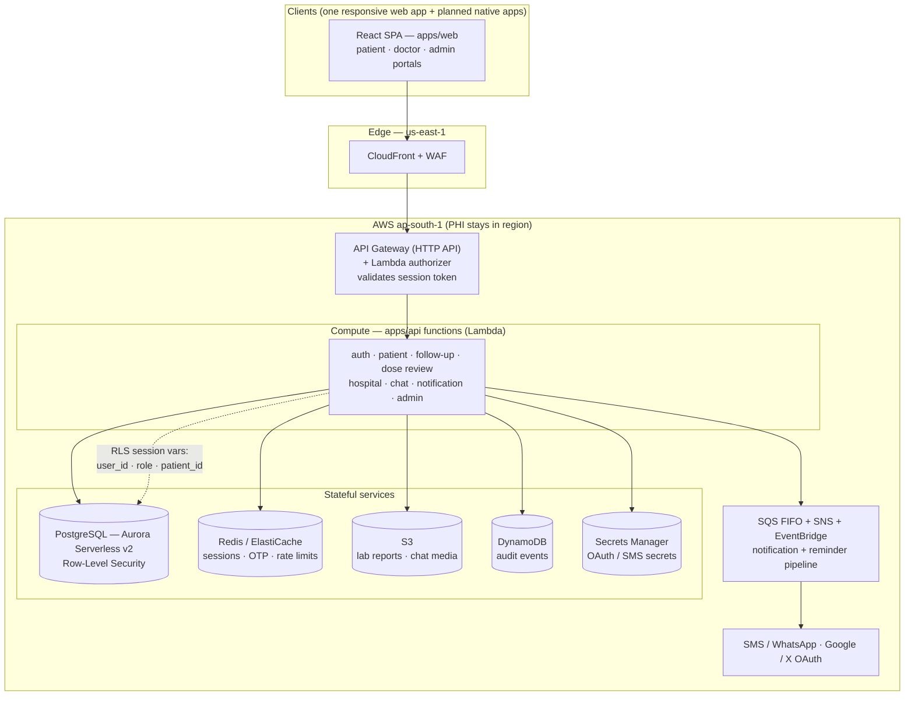

# HealthTracker

A digital replacement for the paper flowchart that post-operative transplant
patients use to track lab results and immunosuppressant doses. It closes the
loop between patients and their care team, adds secure clinical chat, and ties
every follow-up to a hospital.

## What it does

**For patients and caregivers.** After surgery, a patient records each dated
follow-up — lab values, drug levels, current doses, weight, and lab-report
uploads — straight from their phone or the web, instead of carrying a paper
chart between visits. They pick the hospital for each engagement, submit the
entry for review, and see the doctor's response: adjusted doses (clearly marked
when changed), additional tests requested, and clinical remarks. Between
submissions, patients and their care team stay in touch through an integrated,
immutable chat thread, and automated SMS/WhatsApp reminders keep follow-ups on
schedule.

**For doctors.** A clinician sees each assigned patient's history as a
longitudinal flow chart — parameters down the side, submission dates across the
top, with out-of-range values highlighted — so trends are obvious at a glance.
From there a doctor reviews a pending submission, prescribes or adjusts doses
(every change is logged to an immutable audit trail), requests further tests,
and replies. Any doctor can onboard, affiliate with one or more hospitals, and
stay connected to their patients; multiple doctors can collaborate on a case,
and primary ownership can be formally transferred with a full audit trail.

Access is least-privilege and enforced at both the API and the database, so a
clinician only ever sees the patients they are authorized for, and a patient
only ever sees their own record.

## High-level architecture

HealthTracker is a TypeScript monorepo (npm workspaces):

- **`apps/web`** — a React single-page app (Vite) serving the patient, doctor,
  and admin experiences. It is a single responsive website: a mobile layout
  with a bottom-tab nav and a desktop layout with a sidebar. Branding (name,
  colors, logo) is config-driven, not hardcoded.
- **`apps/api`** — the backend as per-domain functions (auth, patient,
  follow-up, dose review, hospital, chat, notifications, …) designed to run as
  AWS Lambda behind API Gateway. Each function is written against clean
  **ports** (DB, cache, storage, secrets) with the real adapters injected at
  deploy time, so the business logic is unit-tested in isolation with in-memory
  fakes.
- **`infra`** — AWS CDK (TypeScript) describing the target cloud: PostgreSQL
  (Aurora Serverless v2) with Row-Level Security, Redis for sessions/OTP/rate
  limits, S3 for uploads, SQS/SNS/EventBridge for the notification pipeline, and
  a CloudFront/WAF edge. PHI data stays in region (ap-south-1).
- **`db`** — Flyway SQL migrations (the schema + RLS policies).

**Auth** is identity-first: Google / X OAuth or SMS OTP issues an opaque session
token validated at the API Gateway authorizer, and the resolved role drives
which portal and data the user can reach. Every response uses one envelope
(`{ success, data, error }`).

### Running the demo

A single Node process can serve the built SPA plus a **seeded in-memory API**
from one origin — no AWS, no database — for sharing and review. See
[`DEMO.md`](./DEMO.md) for one-command local run and one-click deploy (Render).
Demo data resets on restart.

## References

Key documents for understanding the app, grouped by what you're trying to
learn. If you're new, read them roughly in this order: **product spec →
development guidance → HLD → LLD**.

### Product & requirements

- [`docs/application-specification.md`](./docs/application-specification.md) —
  the authoritative product spec (v1.7): users, the clinical flowchart and full
  field catalog, hospital registry, chat, care-team/case-transfer, and
  acceptance criteria. Start here for _what_ the product does.
- [`docs/older-versions/`](./docs/older-versions/) — earlier spec revisions, for
  history/context only.

### Architecture & design

- [`docs/HLD-AWS-Architecture.md`](./docs/HLD-AWS-Architecture.md) — High-Level
  Design: the AWS architecture, data residency, and how the pieces fit (the
  diagram above summarizes it).
- [`docs/LLD-Technical-Design.md`](./docs/LLD-Technical-Design.md) — Low-Level
  Design: database schema + RLS, the API contract and error model, and
  per-domain pseudocode. The deepest technical reference.

### Build, deploy & operations

- [`docs/development-guidance.md`](./docs/development-guidance.md) — the phased
  development plan: how work is broken into packages, the validation/gating
  approach, and current build status.
- [`DEMO.md`](./DEMO.md) — run the single-process CX demo locally or deploy it
  (Render), with the demo sign-in credentials.
- [`docs/deploy-runbook.md`](./docs/deploy-runbook.md) — bringing the real AWS
  infrastructure up in a sandbox account (⚠️ provisions real, billing,
  PHI-capable resources).
- [`db/README.md`](./db/README.md) — the Flyway migration workflow (schema +
  RLS policies for PostgreSQL 16 / Aurora).
- [`apps/api/harness/README.md`](./apps/api/harness/README.md) — the local HTTP
  harness that runs the real handlers over in-memory fakes (what powers the
  demo and the smoke tests).

### Security

- [`docs/security/rls-authz-signoff-V3-V10.md`](./docs/security/rls-authz-signoff-V3-V10.md)
  — the Row-Level Security / authorization decisions across migrations V3–V10
  and their human sign-off status.

### Conventions (for contributors)

- [`.kiro/steering/`](./.kiro/steering/) — the always-on project rules: product
  summary, repo structure, tech stack + commands, and coding/security
  conventions (no PHI in logs, RLS enforcement, the response envelope, naming).
