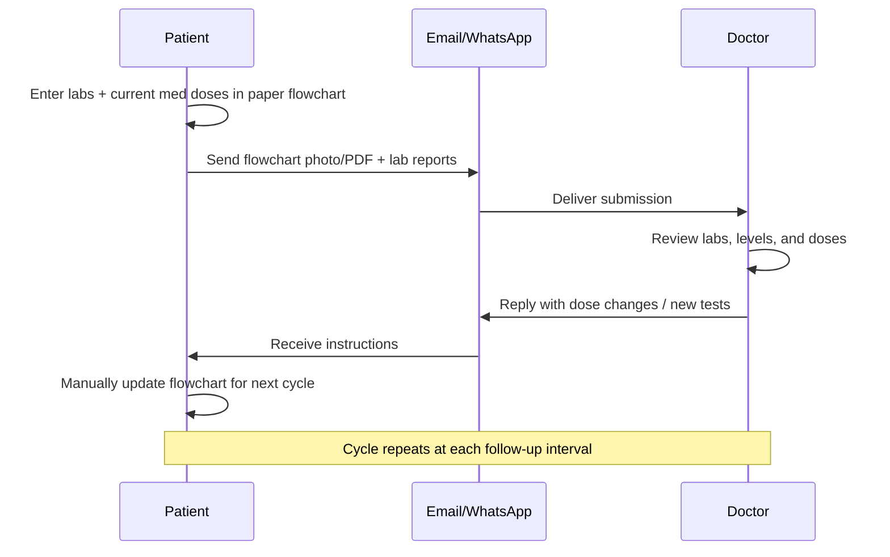
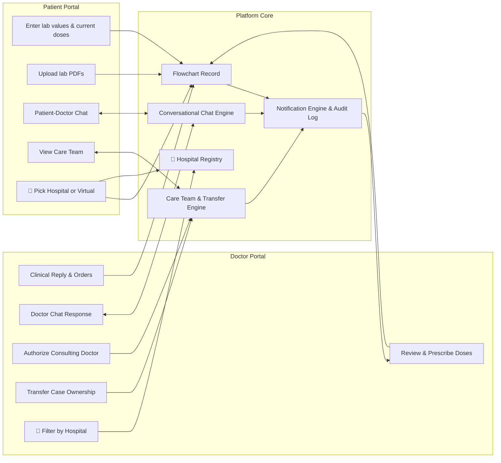
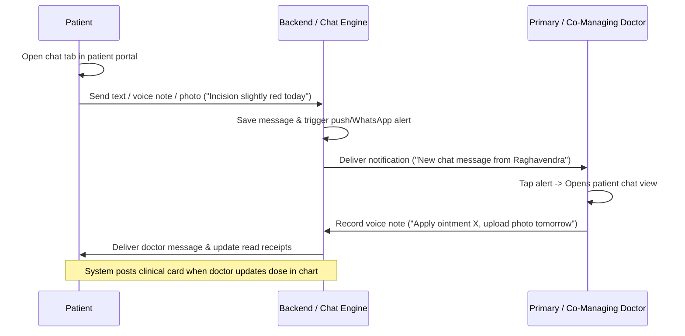
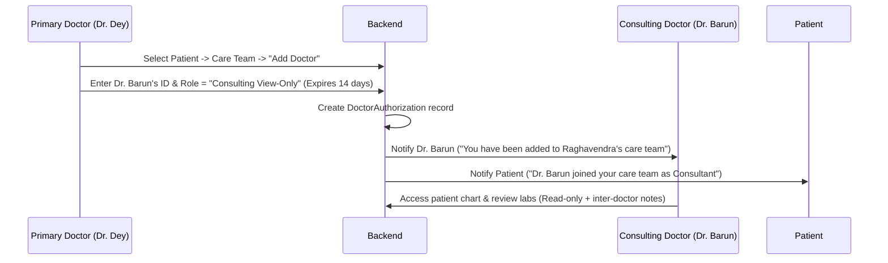
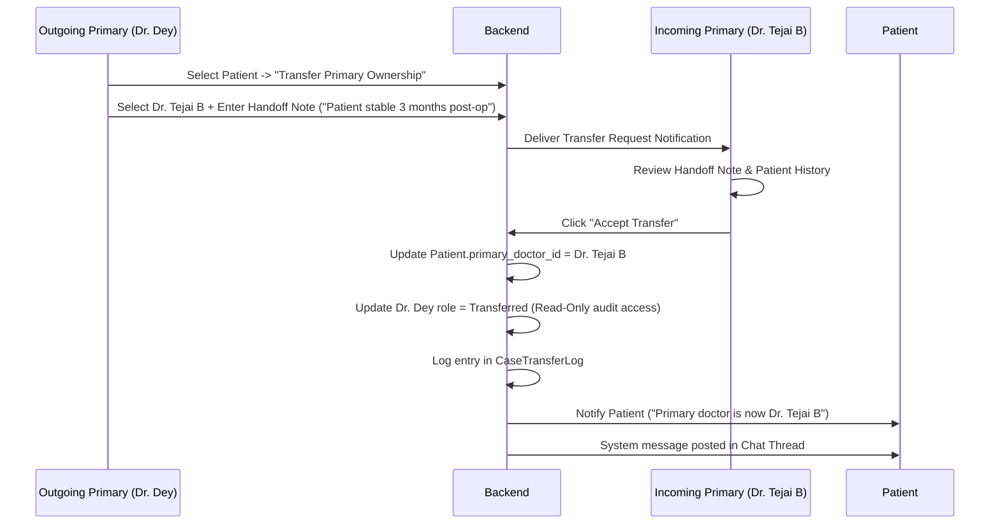
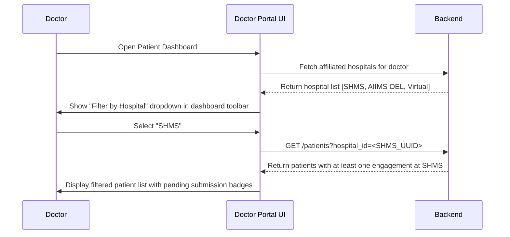

# Application Specification: Post-Operative Investigation Follow-Up Platform

## 1. Document Overview

| Field              | Value                                                                                                                                                                                                                                                    |
| ------------------ | -------------------------------------------------------------------------------------------------------------------------------------------------------------------------------------------------------------------------------------------------------- |
| **Document title** | Post-Operative Investigation Flow Chart — Digital Follow-Up Platform                                                                                                                                                                                     |
| **Version**        | 1.7 (Draft)                                                                                                                                                                                                                                              |
| **Date**           | August 29, 2026                                                                                                                                                                                                                                          |
| **Source inputs**  | Google Doc ("Automate follow up"), sample flowchart (pediatric post-op liver patient), Requirement Update: Conversational Chat & Multi-Doctor Collaboration/Case Transfer, Requirement Update: Hospital Registry & Engagement-Level Hospital Association |

> **What changed from v1.6 → v1.7**
> This version introduces:
>
> 1. A **Hospital Registry** and the concept of an **engagement-level hospital association**. Every new interaction between a patient and doctor — whether a post-operative consultation, a procedure, or a follow-up submission — must now be linked to a registered hospital or to the system-level **Virtual Hospital** record (used when the engagement takes place outside any physical facility, e.g. a remote video/chat consultation). These additions are marked with 🏥 for traceability.
> 2. **📱 Multi-surface delivery** — the platform must ship as **native iOS and Android mobile apps** and a **responsive website that works on both desktop and mobile web browsers**, all backed by the same API. These additions are marked with 📱.
> 3. **🎨 Configurable branding & naming** — the application name and the website name are **not yet decided**. The system must be designed so that all names, logos, colors, and other brand assets are driven by configuration/theming and can be changed without code changes. These additions are marked with 🎨.
>
> No content from v1.6 has been removed.

---

## 2. Problem Statement

Remote patients currently track post-operative lab results and immunosuppressant medication doses in a **paper flowchart**, then share updates with their doctor via **email or WhatsApp**. The doctor reviews the chart, adjusts medication doses (often annotating changes in a different color), and replies with instructions. The patient manually updates the chart and repeats the cycle at the next follow-up.

Furthermore, between periodic lab updates, patients lack a secure, audited channel to ask quick questions or report emerging symptoms, forcing reliance on unorganized WhatsApp chats. Additionally, post-operative transplant care frequently involves multiple clinicians (surgeons, hepatologists, pediatricians). Currently, there is no structured way for a primary doctor to grant secondary doctors access to a patient's chart or formally transfer primary case ownership when duty shifts or clinical handoffs occur.

🏥 **Hospital context gap (new in v1.7):** Doctors routinely practice across multiple hospitals, clinics, and outpatient facilities. Patients may also have had their original procedure performed at one institution and their follow-up care managed at another. The current workflow provides no structured way to record _which hospital or facility_ a given consultation, procedure, or follow-up engagement is associated with — making it impossible to filter records by facility, generate per-hospital reports, or honour facility-specific care protocols.

This workflow is error-prone, hard to audit, fragmented across un-encrypted channels, and inefficient for both patients and care teams. The goal is to **digitize the flowchart, automate the follow-up loop, provide integrated clinical chat, enable multi-doctor collaboration and case transfer, and associate every engagement with a hospital or virtual channel** while preserving the familiar tabular format and clinical semantics.

---

## 3. Goals & Success Criteria

### Primary goals

1. Replace the paper flowchart with a structured digital record.
2. Let patients enter lab values and current medication doses remotely.
3. Let doctors review entries, prescribe/adjust doses, and respond in one place.
4. Deliver doctor responses back to the patient automatically (replacing manual email/WhatsApp for the core loop).
5. **Provide secure, integrated conversational chat** between the patient/caregiver and authorized care team doctors, complete with media attachments, voice notes, and clinical event linking.
6. **Support multi-doctor participation**, enabling the primary doctor (or patient) to authorize secondary/consulting doctors with granular permissions (co-managing vs. view-only consult).
7. **Enable formal patient case transfer** allowing the primary doctor to transfer primary case ownership to another clinician with a full handoff audit trail.
8. Maintain a longitudinal history of labs, drug levels, doses, dose changes, chat logs, and doctor access grants.
9. Send automated **SMS and WhatsApp reminders** for upcoming follow-up milestones so patients do not miss lab submissions.
10. 🏥 **Associate every engagement with a hospital or virtual channel** so that consultations, procedures, and follow-up submissions are traceable to the facility where they occurred or, when remote, to the Virtual Hospital record.
11. 📱 **Deliver the experience across native iOS, native Android, and a responsive website that runs on both desktop and mobile web browsers**, all sharing one backend API and one clinical data model, so patients and doctors can use their preferred device — with or without installing an app.
12. 🎨 **Keep naming and branding fully configurable**, so the (as-yet-undecided) application name, website name, logos, colors, and copy can be set — and later changed — through configuration and theming rather than code changes.

### Success criteria

- A patient can submit a new follow-up row in under 5 minutes on mobile.
- A doctor can review a submission and send a dose adjustment in under 3 minutes.
- Every dose change, chat message, authorization grant, and case transfer is fully traceable (who, when, prior vs new state).
- Primary doctors can grant consulting access or transfer a patient case to another doctor in under 1 minute with instant permission updates.
- Patients and doctors can send and view contextual chat messages directly tied to flowchart submissions and lab trends.
- The digital chart mirrors the paper layout closely enough that existing users can adopt it without retraining.
- 🏥 Every new engagement (follow-up row, consultation, procedure) has a non-null hospital association — either a registered hospital or the Virtual Hospital — enforced at submission time.
- 🏥 A doctor can filter their patient dashboard by hospital in under 30 seconds.
- 📱 A patient can complete the core loop (submit a follow-up, read a doctor response, chat) on an iOS app, an Android app, a **desktop web browser**, and a **mobile web browser**, with feature parity for MVP flows.
- 🎨 The application name, website name, logo, and primary color can be changed by updating configuration/theming assets only — no source-code changes and no rebuild of business logic — and the change propagates to all surfaces.

---

## 4. Users & Personas

| Role                            | Description                                                                                          | Primary needs                                                                                                                                                                                                                                    |
| ------------------------------- | ---------------------------------------------------------------------------------------------------- | ------------------------------------------------------------------------------------------------------------------------------------------------------------------------------------------------------------------------------------------------ |
| **Patient / Caregiver**         | Remote post-op patient (or parent/guardian for pediatric cases)                                      | Simple data entry, view doctor instructions, upload lab reports, message care team, view active care team doctors, 🏥 select hospital for each new engagement                                                                                    |
| **Primary Doctor**              | Lead transplant/hepatology surgeon or consultant owning the case                                     | Review trends, enter/adjust doses, request tests, reply to patient, chat with patient, authorize co-managing/consulting doctors, transfer case ownership, 🏥 affiliated with one or more hospitals; sets or confirms hospital on each engagement |
| **Co-Managing Doctor**          | Authorized care team doctor (e.g. Dr. Rajesh Dey, Dr. Tejai B, Dr. Barun) with edit/prescribe access | Review patient chart, co-prescribe doses, participate in patient chat, enter clinical notes, 🏥 view hospital context of each engagement                                                                                                         |
| **Consulting Doctor**           | Specialist called in for specific advice (e.g. Nephrologist, Infectious Disease specialist)          | View-only chart access, review labs, add clinical recommendations/notes in consult thread, 🏥 view hospital context                                                                                                                              |
| **Transferred (Former) Doctor** | Doctor who previously owned the patient case                                                         | Read-only audit access to historical entries recorded during their tenure as primary doctor                                                                                                                                                      |
| **Admin**                       | Clinic/hospital staff                                                                                | Onboard patients, manage doctor accounts, execute administrative case transfers when required, 🏥 **manage hospital registry** (add, edit, deactivate hospitals; manage doctor-hospital affiliations)                                            |

---

## 5. Current Workflow (As-Is)



**Observed from sample flowchart:**

- Multiple dated rows track progress (e.g., 13/6/26 → 13/7/26).
- Lab columns cover hematology, liver function, renal function, electrolytes, and drug levels.
- Medication dose columns: **Neoral/Tac**, **Everolimus**, **Aza/MPA**, **Pred**.
- Drug level columns: **Tac level**, **EVO level** (Everolimus level).
- Dose adjustments are visually distinguished (e.g., red ink: `4/4` → `2/2`).
- Patient header includes diagnosis, surgery date, histopathology, and anastomosis details.
- Footer instructs: _"Enter further investigation reports in above table and send to drrajeshdey@gmail.com"_.
- 🏥 No facility or hospital context is captured anywhere on the paper form.

---

## 6. Proposed Solution (To-Be)

📱 A **multi-surface application** — delivered as a **native iOS app**, a **native Android app**, and a **responsive website that runs on both desktop and mobile web browsers** — all backed by a single shared API and clinical data model. Feature areas:

1. A **Patient portal** — digital flowchart, row entry, lab upload, conversational chat, care team view, 🏥 hospital picker on new engagements.
2. A **Doctor portal** — dashboard, chart review, dose entry, clinical reply, care team chat, authorization delegation, case transfer dialog, 🏥 hospital-filtered patient dashboard.
3. A **Conversational Chat Engine** — 1:1 and team messaging between patient and authorized doctors, complete with voice notes, attachments, and automated system event posts.
4. A **Care Team & Transfer Authorization Engine** — role-based access control for primary, co-managing, consulting, and transferred doctors.
5. A **Notification layer** — alerts for lab submissions, doctor replies, chat messages, consult invitations, and case transfers; on mobile this includes native push (APNs / FCM).
6. An **Audit trail** — immutable history of labs, dose edits, chat transcripts, permission grants, and case handovers.
7. 🏥 A **Hospital Registry** — admin-managed directory of registered hospitals and clinics; doctor-hospital affiliation management; system-level Virtual Hospital record for remote engagements.
8. 🎨 A **Branding & Theming layer** — a single source of truth for the application name, website name, logos, color palette, and key copy, consumed by all three surfaces so branding can be set and later changed without code changes.

> **📱 Platform surfaces at a glance**
>
> | Surface              | Users                                  | Notes                                                                                                                                                                                                                               |
> | -------------------- | -------------------------------------- | ----------------------------------------------------------------------------------------------------------------------------------------------------------------------------------------------------------------------------------- |
> | iOS app (native)     | Patient / Caregiver, Doctor            | App Store distribution; native push via APNs; camera for lab-photo/incision capture; voice-note recording                                                                                                                           |
> | Android app (native) | Patient / Caregiver, Doctor            | Play Store distribution; native push via FCM; camera; voice-note recording                                                                                                                                                          |
> | Website (responsive) | Patient / Caregiver, Doctor, **Admin** | Single responsive web app that runs on **desktop browsers** and **mobile web browsers** (phone/tablet); no install required. The **Admin console** (patient onboarding, hospital registry, doctor accounts) is website-only for MVP |
>
> 📱 **Note:** "Website" means one responsive web application serving both desktop and mobile browsers — it adapts its layout to the viewport rather than being a separate desktop-only site. This is distinct from the native iOS/Android apps, which are installed from the app stores.



---

## 7. Functional Requirements

### 🏥 7.0 Hospital Registry (new in v1.7)

The platform maintains a central directory of hospitals and clinics. Every physical facility where a doctor may conduct a consultation, perform a procedure, or review a patient must be registered here before it can be selected on an engagement. A special **Virtual Hospital** record is pre-seeded in the system to cover all remote, telehealth, or out-of-hospital interactions.

#### 7.0.1 Hospital Entity Fields

| Field            | Canonical key   | Type                | Required               | Notes                                                                                                      |
| ---------------- | --------------- | ------------------- | ---------------------- | ---------------------------------------------------------------------------------------------------------- |
| Hospital ID      | `hospital_id`   | UUID                | Yes (system-generated) | Immutable primary key                                                                                      |
| Short code       | `hospital_code` | String (≤ 20 chars) | Yes                    | Human-readable identifier, e.g. `SHMS`, `AIIMS-DEL`. `VIRTUAL` is reserved for the virtual hospital record |
| Name             | `hospital_name` | String              | Yes                    | Full official name                                                                                         |
| Type             | `hospital_type` | Enum                | Yes                    | `general` \| `specialty` \| `clinic` \| `daycare` \| `virtual`                                             |
| Address line 1   | `address_line1` | String              | Yes (except virtual)   | Street / building                                                                                          |
| Address line 2   | `address_line2` | String              | No                     | Area / locality                                                                                            |
| City             | `city`          | String              | Yes (except virtual)   |                                                                                                            |
| State / Province | `state`         | String              | No                     |                                                                                                            |
| Country          | `country`       | String              | Yes (except virtual)   | ISO 3166-1 alpha-2                                                                                         |
| Postal code      | `postal_code`   | String              | No                     |                                                                                                            |
| Phone            | `phone`         | String              | No                     | Main switchboard                                                                                           |
| Website          | `website_url`   | String              | No                     |                                                                                                            |
| Logo             | `logo_url`      | String              | No                     | Displayed in hospital picker and reports                                                                   |
| Status           | `status`        | Enum                | Yes                    | `active` \| `inactive`                                                                                     |
| Created by       | `created_by`    | FK → User           | Yes                    | Admin who registered the hospital                                                                          |
| Created at       | `created_at`    | Timestamp           | Yes                    |                                                                                                            |
| Updated at       | `updated_at`    | Timestamp           | Yes                    |                                                                                                            |

**Virtual Hospital record (system-seeded):**

| Field           | Value                                                    |
| --------------- | -------------------------------------------------------- |
| `hospital_id`   | `00000000-0000-0000-0000-000000000000` (well-known UUID) |
| `hospital_code` | `VIRTUAL`                                                |
| `hospital_name` | Virtual / Remote Consultation                            |
| `hospital_type` | `virtual`                                                |
| `status`        | `active`                                                 |

This record cannot be edited or deactivated by admins. It is always the first option in any hospital picker UI.

#### 7.0.2 Doctor–Hospital Affiliation

A doctor may practice at one or more registered hospitals. Affiliations are managed by Admin and optionally self-reported by doctors (see §17 open questions).

| Field               | Canonical key      | Notes                                                              |
| ------------------- | ------------------ | ------------------------------------------------------------------ |
| Affiliation ID      | `affiliation_id`   | UUID                                                               |
| Doctor              | `doctor_id`        | FK → User (role = doctor)                                          |
| Hospital            | `hospital_id`      | FK → Hospital                                                      |
| Role at hospital    | `role_at_hospital` | Free text, e.g. "Transplant Surgeon", "Visiting Consultant"        |
| Primary affiliation | `is_primary`       | Boolean — one hospital may be flagged as the doctor's primary base |
| Status              | `status`           | `active` \| `inactive`                                             |
| Granted by          | `granted_by`       | FK → User (Admin)                                                  |
| Granted at          | `granted_at`       | Timestamp                                                          |

**Business rules:**

- When a doctor logs in, the hospital picker for a new engagement shows only hospitals where they have an `active` affiliation, plus the Virtual Hospital record.
- A doctor with no hospital affiliations can still create engagements, but only against the Virtual Hospital until an Admin adds an affiliation.
- Deactivating a hospital affiliation does not retroactively change the `engagement_hospital_id` on existing follow-up rows; historical records are preserved as-is.

#### 7.0.3 Hospital Registry Requirements

| ID   | Requirement                                                                                                                                                                                                                    | Priority |
| ---- | ------------------------------------------------------------------------------------------------------------------------------------------------------------------------------------------------------------------------------ | -------- |
| H-01 | **Admin: Create Hospital** — Admin can register a new hospital by filling the entity fields in §7.0.1.                                                                                                                         | Must     |
| H-02 | **Admin: Edit Hospital** — Admin can update hospital details (name, address, logo, contact). Hospital ID and code are immutable after creation.                                                                                | Must     |
| H-03 | **Admin: Deactivate Hospital** — Admin can mark a hospital as `inactive`; it no longer appears in hospital pickers but historical records referencing it are unchanged.                                                        | Must     |
| H-04 | **Admin: Manage Affiliations** — Admin can add, modify, or deactivate a doctor's affiliation with a hospital.                                                                                                                  | Must     |
| H-05 | **Doctor: View Own Affiliations** — Doctor can view the list of hospitals they are affiliated with in their profile settings.                                                                                                  | Must     |
| H-06 | **Doctor: Request Affiliation** — Doctor can submit a request to be affiliated with a registered hospital; Admin approves or rejects.                                                                                          | Should   |
| H-07 | **Hospital Picker** — Any screen requiring hospital selection shows an inline search-enabled dropdown listing the doctor's affiliated active hospitals plus "Virtual / Remote Consultation" pinned at the top.                 | Must     |
| H-08 | **Patient Hospital View** — Patient can view which hospital is associated with each of their follow-up engagements in the flowchart.                                                                                           | Must     |
| H-09 | **Hospital Search (Admin)** — Admin hospital management screen supports search by name, code, city, and type.                                                                                                                  | Should   |
| H-10 | **Virtual Hospital Auto-Select** — If a follow-up engagement is initiated via the chat thread (no physical appointment context), the system pre-selects Virtual Hospital but allows the doctor to change it before finalizing. | Should   |

---

### 7.1 Patient profile & chart header

Each patient chart stores static header fields matching the paper form:

| Field                         | Example from sample                                                                                           | Required                                       |
| ----------------------------- | ------------------------------------------------------------------------------------------------------------- | ---------------------------------------------- |
| Patient name                  | Raghavendra S. Dyk                                                                                            | Yes                                            |
| Age / sex                     | 4.5 yrs / M                                                                                                   | Yes                                            |
| Hospital / Max ID             | SHMS.750590                                                                                                   | Yes                                            |
| Date of operation             | 26/05/2026                                                                                                    | Yes                                            |
| Diagnosis                     | DCLD - ? AIH                                                                                                  | Yes                                            |
| Histopathology                | Biliary Cirrhosis (PBC)                                                                                       | Yes                                            |
| Type of biliary anastomosis   | Free text                                                                                                     | Yes                                            |
| Patient photo                 | Passport-size image                                                                                           | Optional                                       |
| Primary Doctor                | Dr. Rajesh Dey                                                                                                | Yes                                            |
| Authorized Care Team          | Dr. Tejai B (Co-Managing), Dr. Barun (Consultant)                                                             | Yes                                            |
| Primary reporting email       | drrajeshdey@gmail.com                                                                                         | Yes                                            |
| 🏥 Procedure Hospital         | Hospital where the original operation was performed (FK → Hospital)                                           | Yes                                            |
| 🏥 Default Follow-Up Hospital | Patient's usual follow-up facility; pre-fills hospital picker on new engagements (FK → Hospital or `VIRTUAL`) | No (defaults to procedure hospital if not set) |

**Business rules (hospital fields):**

- `procedure_hospital_id` is set at patient onboarding and reflects where the index operation occurred. It is displayed prominently in the chart header.
- `default_followup_hospital_id` is optional; when set it pre-populates the hospital picker when the patient initiates a new engagement. The patient or doctor can override it per engagement.
- Both fields accept the Virtual Hospital ID if the procedure or follow-up context is remote (rare but valid, e.g. telemedicine-only second opinion cases).

---

### 7.2 Follow-up row (investigation table)

Each follow-up is one **dated row** in the flowchart. All columns below are captured on every submission unless marked optional.

#### 7.2.1 Complete field catalog

The following table is the **authoritative list** of flowchart fields. UI labels may use clinic-preferred abbreviations; the system stores values using the canonical field key.

| #   | UI label                    | Canonical key              | Category        | Type                  | Unit / format             | Required   |
| --- | --------------------------- | -------------------------- | --------------- | --------------------- | ------------------------- | ---------- |
| —   | PP Date                     | `pp_date`                  | Meta            | Date                  | DD/MM/YYYY                | Yes        |
| —   | 🏥 Hospital                 | `engagement_hospital_id`   | Meta            | FK → Hospital         | UUID or `VIRTUAL`         | Yes        |
| —   | 🏥 Hospital Name (snapshot) | `engagement_hospital_name` | Meta            | String                | Stored at submission time | Yes (auto) |
| 1   | Hb                          | `hb`                       | Lab             | Numeric               | g/dL                      | No         |
| 2   | TLC                         | `tlc`                      | Lab             | Numeric               | ×10³/µL                   | No         |
| 3   | PLT                         | `plt`                      | Lab             | Numeric               | ×10³/µL                   | No         |
| 4   | AFP                         | `afp`                      | Lab             | Numeric               | ng/mL                     | No         |
| 5   | INR                         | `inr`                      | Lab             | Numeric               | ratio                     | No         |
| 6   | PTT                         | `ptt`                      | Lab             | Numeric               | seconds                   | No         |
| 7   | Bilirubin Total             | `bilirubin_total`          | Lab             | Numeric               | mg/dL                     | No         |
| 8   | Bilirubin Direct            | `bilirubin_direct`         | Lab             | Numeric               | mg/dL                     | No         |
| 9   | SGOT                        | `sgot`                     | Lab             | Numeric               | U/L                       | No         |
| 10  | SGPT                        | `sgpt`                     | Lab             | Numeric               | U/L                       | No         |
| 11  | ALK PHOS                    | `alk_phos`                 | Lab             | Numeric               | U/L                       | No         |
| 12  | GGT                         | `ggt`                      | Lab             | Numeric               | U/L                       | No         |
| 13  | Albumin                     | `albumin`                  | Lab             | Numeric               | g/dL                      | No         |
| 14  | Na/K                        | `na_k`                     | Lab             | Text or split numeric | e.g. `136/4.2`            | No         |
| 15  | Urea                        | `urea`                     | Lab             | Numeric               | mg/dL                     | No         |
| 16  | Creatinine                  | `creatinine`               | Lab             | Numeric               | mg/dL                     | No         |
| 17  | HbA1c                       | `hba1c`                    | Lab             | Numeric               | %                         | No         |
| 18  | Tac Level                   | `tac_level`                | Drug level      | Numeric               | ng/mL (trough C0)         | No         |
| 19  | EVO level                   | `evo_level`                | Drug level      | Numeric               | ng/mL                     | No         |
| 20  | Neoral/Tac                  | `neoral_tac`               | Medication dose | Dose notation         | e.g. `4/4`                | No         |
| 21  | Everolimus                  | `everolimus`               | Medication dose | Dose notation         | e.g. `1/0`                | No         |
| 22  | Aza/MPA                     | `aza_mpa`                  | Medication dose | Dose notation         | e.g. `1/1`                | No         |
| 23  | Pred                        | `pred`                     | Medication dose | Dose notation         | e.g. `5` or `5/0`         | No         |
| 24  | Wt                          | `wt`                       | Clinical        | Numeric               | kg                        | No         |
| 25  | Comments                    | `comments`                 | Notes           | Text                  | Free text per row         | No         |

🏥 **Hospital field rules:**

- `engagement_hospital_id` is **required** on every new follow-up row. The submission form will not allow the patient to proceed without making a selection.
- The system automatically captures `engagement_hospital_name` as a denormalized snapshot at submission time, so that the chart remains readable even if the hospital record is later renamed or deactivated.
- The hospital picker pre-fills with `default_followup_hospital_id` from the patient profile (or the doctor's primary affiliation hospital if the doctor is initiating the engagement).
- The patient selects from the list of hospitals affiliated with their **primary doctor**. If the primary doctor changes (case transfer), the hospital list updates accordingly for future engagements; historical rows are unaffected.
- The doctor may override or correct the hospital selection during the review step, but a reason must be provided and the change is logged in the audit trail.

**Legacy / alias mapping** (paper form and earlier spec versions):

| Legacy label                               | Maps to                             |
| ------------------------------------------ | ----------------------------------- |
| Platelet count                             | PLT (`plt`)                         |
| Bil Total                                  | Bilirubin Total (`bilirubin_total`) |
| Alb                                        | Albumin (`albumin`)                 |
| Creat                                      | Creatinine (`creatinine`)           |
| Tac/C0 level, Tec Level                    | Tac Level (`tac_level`)             |
| Everolimus level                           | EVO level (`evo_level`)             |
| Tac/Cyclo, Neoral, Tacrolimus/Cyclosporine | Neoral/Tac (`neoral_tac`)           |
| Wys, Wysolone, Prednisolone                | Pred (`pred`)                       |

#### 7.2.2 Lab columns

All lab fields are optional on each row (partial entry allowed). Numeric validation applies where applicable.

| Column           | Canonical key      | Notes                                               |
| ---------------- | ------------------ | --------------------------------------------------- |
| Hb               | `hb`               | Hemoglobin                                          |
| TLC              | `tlc`              | Total leukocyte count                               |
| PLT              | `plt`              | Platelet count                                      |
| AFP              | `afp`              | Alpha-fetoprotein                                   |
| INR              | `inr`              | International normalized ratio                      |
| PTT              | `ptt`              | Partial thromboplastin time                         |
| Bilirubin Total  | `bilirubin_total`  | Total bilirubin                                     |
| Bilirubin Direct | `bilirubin_direct` | Direct (conjugated) bilirubin                       |
| SGOT             | `sgot`             | AST                                                 |
| SGPT             | `sgpt`             | ALT                                                 |
| ALK PHOS         | `alk_phos`         | Alkaline phosphatase                                |
| GGT              | `ggt`              | Gamma-glutamyl transferase                          |
| Albumin          | `albumin`          | Serum albumin                                       |
| Na/K             | `na_k`             | Sodium/potassium — single field or split `na` + `k` |
| Urea             | `urea`             | Blood urea                                          |
| Creatinine       | `creatinine`       | Serum creatinine                                    |
| HbA1c            | `hba1c`            | Glycated hemoglobin                                 |

#### 7.2.3 Drug level columns

| Column    | Canonical key | Notes                                                                    |
| --------- | ------------- | ------------------------------------------------------------------------ |
| Tac Level | `tac_level`   | Tacrolimus trough (C0); supersedes legacy labels Tac/C0 level, Tec Level |
| EVO level | `evo_level`   | Everolimus serum level; alias Everolimus level                           |

#### 7.2.4 Medication dose columns

Patient-entered on submit; doctor may override on review. Dose notation format to be confirmed with clinic (see §17 open questions).

| Column     | Canonical key | Notes                                                                  |
| ---------- | ------------- | ---------------------------------------------------------------------- |
| Neoral/Tac | `neoral_tac`  | Combined tacrolimus/cyclosporine (Neoral) dose; legacy label Tac/Cyclo |
| Everolimus | `everolimus`  | Everolimus **dose** (distinct from EVO level)                          |
| Aza/MPA    | `aza_mpa`     | Azathioprine or mycophenolate dose                                     |
| Pred       | `pred`        | Prednisolone / Wysolone dose; legacy label Wys                         |

#### 7.2.5 Weight, comments, and attachments

| Column      | Canonical key   | Notes                                                                                |
| ----------- | --------------- | ------------------------------------------------------------------------------------ |
| Wt          | `wt`            | Body weight in kg                                                                    |
| Comments    | `comments`      | Free-text notes for the row (patient or doctor); visible in chart and exports        |
| Attachments | `attachments[]` | Lab report PDFs/images (see §7.3 P-03); not a flowchart column but linked to the row |

**Business rules:**

- On **patient submission**, the patient fills lab values, drug levels, **current medication doses**, weight, optional **Comments**, and 🏥 **hospital selection**.
- On **doctor review**, medication dose columns may appear **blank** until the doctor enters **prescribed doses** for the next interval; doctor may add or amend **Comments**; doctor may correct hospital if incorrect.
- Doctor-entered doses must be visually distinct from patient-reported doses (replacing "red ink").
- Support **dose change history** per medication column (old value → new value, timestamp, prescribing doctor).
- **Comments** are append-only in the audit log when edited after review (original text retained).

---

### 7.3 Patient portal features

| ID   | Requirement                                                                                                                                                                                                                                                                  | Priority |
| ---- | ---------------------------------------------------------------------------------------------------------------------------------------------------------------------------------------------------------------------------------------------------------------------------- | -------- |
| P-01 | View full digital flowchart (read-only history + editable new row)                                                                                                                                                                                                           | Must     |
| P-02 | Add a new follow-up row supporting all lab, drug level, and medication dose fields                                                                                                                                                                                           | Must     |
| P-03 | Upload lab report files (PDF/image) linked to a follow-up date                                                                                                                                                                                                               | Must     |
| P-04 | Submit follow-up for doctor review                                                                                                                                                                                                                                           | Must     |
| P-05 | View doctor's latest response (prescribed doses, additional tests, notes)                                                                                                                                                                                                    | Must     |
| P-06 | Receive notifications when doctor responds or messages in chat                                                                                                                                                                                                               | Must     |
| P-07 | View dose change highlights on the chart                                                                                                                                                                                                                                     | Must     |
| P-08 | **Conversational Chat**: Send text, voice notes, and image attachments to care team                                                                                                                                                                                          | Must     |
| P-09 | **Care Team View**: View current primary doctor and authorized co-managing/consulting doctors                                                                                                                                                                                | Must     |
| P-10 | 🏥 **Hospital Selection**: When creating a new engagement (follow-up row), patient selects from the hospital picker showing hospitals affiliated with their primary doctor, with "Virtual / Remote Consultation" pinned at the top. Selection is required before submission. | Must     |
| P-11 | 🏥 **Hospital Badge on Chart**: Each row in the flowchart displays a hospital badge (short code + name) so the patient can see at a glance which facility each engagement was associated with.                                                                               | Must     |

---

### 7.4 Doctor portal features

| ID   | Requirement                                                                                                                                                                                                 | Priority |
| ---- | ----------------------------------------------------------------------------------------------------------------------------------------------------------------------------------------------------------- | -------- |
| D-01 | Dashboard of patients with pending submissions and unread chat messages                                                                                                                                     | Must     |
| D-02 | Open patient chart with tabular history and trend view                                                                                                                                                      | Must     |
| D-03 | Review patient-entered labs, drug levels, and current doses                                                                                                                                                 | Must     |
| D-04 | Enter prescribed doses in medication columns for the reviewed visit                                                                                                                                         | Must     |
| D-05 | Send structured response to patient                                                                                                                                                                         | Must     |
| D-06 | Free-text clinical reply (additional medications, lifestyle advice, etc.)                                                                                                                                   | Must     |
| D-07 | Request additional investigations (structured checklist + notes)                                                                                                                                            | Must     |
| D-08 | View uploaded lab reports inline or downloadable                                                                                                                                                            | Must     |
| D-09 | See prior dose changes and who made them                                                                                                                                                                    | Must     |
| D-10 | **Conversational Chat**: Reply to patient chat queries, send voice notes, attach files                                                                                                                      | Must     |
| D-11 | **Care Team Delegation**: Authorize secondary doctors with specific permission levels                                                                                                                       | Must     |
| D-12 | **Case Transfer**: Initiate and execute patient case transfer to another primary doctor                                                                                                                     | Must     |
| D-13 | 🏥 **Filter Dashboard by Hospital**: Doctor can filter their patient list by any of their affiliated hospitals (or "All Hospitals" / "Virtual") to focus on patients seen at a specific facility.           | Must     |
| D-14 | 🏥 **Confirm / Correct Engagement Hospital**: During the review step, the doctor can verify and, if needed, correct the hospital a patient selected. A correction is logged in the audit trail with reason. | Must     |
| D-15 | 🏥 **View Hospital Affiliations**: Doctor can see and manage their affiliated hospitals in profile settings; request affiliation with additional hospitals.                                                 | Should   |

---

### 7.5 Notifications & delivery

| Channel                     | Use case                                                                                                                       | Priority |
| --------------------------- | ------------------------------------------------------------------------------------------------------------------------------ | -------- |
| In-app                      | Submission received, doctor responded, new chat message, case transfer notification, 🏥 hospital affiliation approved/rejected | Must     |
| Email                       | Official record delivery, consult invitation, case handoff summaries                                                           | Must     |
| SMS                         | Milestone reminders, urgent chat alerts, OTP                                                                                   | Must     |
| WhatsApp                    | Milestone reminders, doctor responses, chat message alerts                                                                     | Must     |
| Push (mobile)               | Real-time chat messages, time-sensitive doctor replies                                                                         | Must     |
| 📱 Native push (APNs / FCM) | Delivery mechanism for mobile push on iOS (APNs) and Android (FCM); registered per device                                      | Must     |

---

### 7.6 Milestone reminders (SMS & WhatsApp)

_(Retained as specified in v1.6 Section 7.6.)_

---

### 7.7 Reporting & export

| ID   | Requirement                                                                                                                                                                                | Priority |
| ---- | ------------------------------------------------------------------------------------------------------------------------------------------------------------------------------------------ | -------- |
| R-01 | Export chart as PDF matching paper layout                                                                                                                                                  | Should   |
| R-02 | Print-friendly flowchart view                                                                                                                                                              | Should   |
| R-03 | Export audit log of dose changes, chat transcripts, and case transfer history                                                                                                              | Could    |
| R-04 | 🏥 **Per-Hospital Report**: Admin can generate a report of all engagements (follow-up rows) filtered by hospital and date range, showing patient count, submission count, and doctor list. | Should   |
| R-05 | 🏥 **Hospital column in flowchart export**: PDF/print export of the flowchart includes the hospital name for each engagement row.                                                          | Should   |

---

### 7.8 Conversational Chat (Doctor–Patient & Care Team)

The platform provides a secure, HIPAA/PHI-compliant messaging hub replacing informal WhatsApp/email communication.

#### 7.8.1 Chat Scope & Features

| ID   | Requirement                                                                                                                                                                                                                                                                                                           | Priority |
| ---- | --------------------------------------------------------------------------------------------------------------------------------------------------------------------------------------------------------------------------------------------------------------------------------------------------------------------- | -------- |
| C-01 | **Patient-Care Team Thread**: Each patient chart has an active main chat thread connecting the patient/caregiver with all authorized doctors on their care team.                                                                                                                                                      | Must     |
| C-02 | **Multi-Format Messages**: Support text messages, image attachments (photos of symptoms/incision), document attachments (PDFs), and recorded **voice notes**.                                                                                                                                                         | Must     |
| C-03 | **Automated Clinical System Messages**: System posts automated event cards into the chat thread when key actions occur (e.g. _"Patient submitted labs for 23/08/2026 at SHMS"_, _"Dr. Dey updated Pred dose to 2.5mg"_, _"Case transferred to Dr. Tejai B"_). 🏥 Hospital name is included in submission event cards. | Must     |
| C-04 | **Contextual Item Linking**: Users can quote or link a specific message to a follow-up row ID, lab value, or dose change for clinical context.                                                                                                                                                                        | Must     |
| C-05 | **Read Receipts & Status Indicators**: Show message status (Sent, Delivered, Read by Doctor / Read by Patient) with timestamps.                                                                                                                                                                                       | Must     |
| C-06 | **Non-Emergency Disclaimer Banner**: Permanent banner at top of chat: _"Chat is for non-urgent follow-up queries only. In case of medical emergency, contact ER immediately."_ 🎨 Any brand-name reference in this banner is sourced from the brand profile (§7.11).                                                  | Must     |
| C-07 | **Urgency Triage Flag**: Patient can mark a message as "Routine Query" or "Symptom Concern"; symptom concerns highlight in doctor dashboard.                                                                                                                                                                          | Should   |
| C-08 | **Doctor-to-Doctor Internal Notes / Consult Thread**: Secondary thread on the same patient chart visible ONLY to authorized doctors (hidden from patient) for inter-specialist case discussions.                                                                                                                      | Should   |
| C-09 | **Search & Filter**: Search chat history by key terms or filter by media/attachments.                                                                                                                                                                                                                                 | Could    |
| C-10 | **Immutable Audit Log**: Chat transcripts cannot be edited or deleted by users; retained as part of permanent electronic health record.                                                                                                                                                                               | Must     |

---

### 7.9 Multi-Doctor Participation, Authorization & Case Transfer

_(All requirements T-01 through T-14 retained from v1.6. No changes.)_

#### 7.9.1 Doctor Roles & Access Hierarchy

| Role                                    | Scope of Access & Permissions                                                                                                                                              |
| --------------------------------------- | -------------------------------------------------------------------------------------------------------------------------------------------------------------------------- |
| **Primary Doctor**                      | Full control: view chart, prescribe/adjust doses, order labs, reply & chat with patient, invite/authorize secondary doctors, modify access levels, initiate case transfer. |
| **Co-Managing Doctor**                  | Full clinical care access: view chart, prescribe/adjust doses, order labs, reply & chat with patient. _Cannot authorize new doctors or transfer case ownership._           |
| **Consulting Doctor (View & Note)**     | Specialist access: view chart, read patient chat, post clinical advice in inter-doctor consult thread. _Cannot adjust doses or prescribe directly unless authorized._      |
| **Transferred (Former) Primary Doctor** | Historical read-only access: view chart entries and chat logs recorded _up to the timestamp of transfer_. No access to post-transfer entries unless re-invited.            |

#### 7.9.2 Authorization & Delegation Requirements

| ID   | Requirement                                                                                                                                    | Priority |
| ---- | ---------------------------------------------------------------------------------------------------------------------------------------------- | -------- |
| T-01 | **Grant Doctor Access**: Primary Doctor (or Admin) can invite another registered doctor to join the patient's care team by email or doctor ID. | Must     |
| T-02 | **Access Level Specification**: Primary Doctor selects access role (`Co-Managing` vs `Consulting View-Only`) when adding a doctor.             | Must     |
| T-03 | **Time-Bound Access**: Primary Doctor can optionally set an expiration date for consulting access (e.g., 14-day consult).                      | Should   |
| T-04 | **Revoke / Modify Access**: Primary Doctor can revoke access or adjust permissions of any secondary doctor at any time.                        | Must     |
| T-05 | **Patient Care Team Visibility**: Patient portal displays active care team members with their names, photos, and clinical roles.               | Must     |
| T-06 | **Patient Notification**: Patient is notified via app/SMS/WhatsApp whenever a new doctor is authorized or added to their care team.            | Must     |

#### 7.9.3 Patient Case Transfer Requirements

| ID   | Requirement                                                                                                                                                                                     | Priority |
| ---- | ----------------------------------------------------------------------------------------------------------------------------------------------------------------------------------------------- | -------- |
| T-07 | **Initiate Transfer**: Primary Doctor can select a target doctor and initiate a primary ownership transfer request.                                                                             | Must     |
| T-08 | **Handoff Summary**: Transfer dialog requires a structured handoff note (reason for transfer, current clinical status, key warnings).                                                           | Must     |
| T-09 | **Transfer Acceptance Workflow**: Target doctor receives handoff notification and must accept (or decline with reason) to finalize transfer.                                                    | Must     |
| T-10 | **Admin Override Transfer**: Clinic Admin can execute an immediate transfer without target acceptance (e.g. emergency doctor unavailability).                                                   | Must     |
| T-11 | **Ownership Transition**: Upon transfer completion, target doctor becomes `Primary Doctor`; former doctor transitions to `Transferred (Read-Only)` or `Co-Managing` based on transfer settings. | Must     |
| T-12 | **Patient & Team Notification**: System broadcasts automated notifications to patient, incoming primary doctor, outgoing primary doctor, and care team.                                         | Must     |
| T-13 | **System Chat Post**: Automated system message posted into patient chat documenting transfer: _"Primary care transferred from Dr. Rajesh Dey to Dr. Tejai B on [date]"_.                        | Must     |
| T-14 | **Transfer Audit Trail**: Log full history of case transfers (from_doctor, to_doctor, initiated_by, handoff_note, accepted_at) in immutable audit log.                                          | Must     |

---

### 📱 7.10 Multi-Surface Delivery (iOS, Android, Website) (new in v1.7)

The platform is delivered on three client surfaces that share one backend API, one authentication model, and one clinical data model. There is no per-surface fork of business logic — surfaces differ only in presentation and platform-native capabilities.

| ID    | Requirement                                                                                                                                                                                                                                                                                                                                                                       | Priority |
| ----- | --------------------------------------------------------------------------------------------------------------------------------------------------------------------------------------------------------------------------------------------------------------------------------------------------------------------------------------------------------------------------------- | -------- |
| M-01  | **Native iOS App**: A native iOS application (App Store distributable) covering the Patient and Doctor portals.                                                                                                                                                                                                                                                                   | Must     |
| M-02  | **Native Android App**: A native Android application (Play Store distributable) covering the Patient and Doctor portals.                                                                                                                                                                                                                                                          | Must     |
| M-03  | **Responsive Website (desktop + mobile browsers)**: A single responsive web application covering the Patient, Doctor, and Admin portals that runs on **desktop browsers** (large-screen, keyboard/mouse) and **mobile web browsers** (touch, small-screen phone/tablet), adapting layout and interactions to the viewport. No app install required to use the browser experience. | Must     |
| M-03a | **Browser Support Matrix**: Support the current and one prior major version of Chrome, Safari, Edge, and Firefox on desktop, and Safari on iOS and Chrome on Android for mobile browsers.                                                                                                                                                                                         | Must     |
| M-03b | **Responsive Breakpoints & Touch**: The web UI uses responsive breakpoints so layouts reflow between desktop, tablet, and phone widths; all interactive elements meet touch-target sizing on small screens; no horizontal scrolling of primary content on phone widths.                                                                                                           | Must     |
| M-03c | **Mobile-Browser Media Capture**: On mobile browsers, lab-report/incision photo upload uses the device camera via the browser file/media capture API where supported, with graceful fallback to file selection.                                                                                                                                                                   | Should   |
| M-04  | **Shared Backend**: All three surfaces consume the same versioned REST/WebSocket API and enforce identical authorization rules server-side; clients never hold privileged logic.                                                                                                                                                                                                  | Must     |
| M-05  | **Feature Parity (MVP core loop)**: iOS app, Android app, and the website (on both desktop and mobile browsers) provide feature parity for the MVP patient/doctor core loop (submit follow-up, hospital selection, view doctor response, chat).                                                                                                                                   | Must     |
| M-06  | **Admin Console Placement**: The Admin console (patient onboarding, hospital registry, doctor account and affiliation management) is website-only for MVP; not required on mobile apps.                                                                                                                                                                                           | Must     |
| M-07  | **Native Push Notifications**: Mobile apps register for and receive push via **APNs (iOS)** and **FCM (Android)**; the notification layer treats these as an additional delivery channel alongside in-app/email/SMS/WhatsApp.                                                                                                                                                     | Must     |
| M-08  | **Device Capabilities**: Mobile apps use the device camera for lab-report/incision photo capture and the microphone for voice notes; the website uses browser file upload and, where supported, browser media capture.                                                                                                                                                            | Must     |
| M-09  | **Session Continuity**: A user can move between surfaces (e.g. start on web, continue on phone) with a consistent session/identity and no data divergence.                                                                                                                                                                                                                        | Should   |
| M-10  | **Offline Tolerance (mobile)**: Mobile apps gracefully handle intermittent connectivity for read (cached chart/chat) and queue a follow-up submission for retry when offline.                                                                                                                                                                                                     | Should   |
| M-11  | **Accessibility**: All surfaces meet accessibility guidelines (WCAG-aligned on web; platform accessibility APIs on iOS/Android).                                                                                                                                                                                                                                                  | Must     |
| M-12  | **App Store / Play Store Readiness**: Apps include the metadata, privacy disclosures, and PHI-handling declarations required for store review; branding assets (name, icon) are supplied from the branding layer (§7.11).                                                                                                                                                         | Must     |

> **Note on approach:** Whether the mobile apps are built with a cross-platform toolkit (e.g. React Native / Flutter) or fully separately per platform is an implementation decision (see §17 open questions). The requirement is native-quality iOS and Android apps plus a responsive website; the spec does not mandate the toolkit.

---

### 🎨 7.11 Configurable Branding, Naming & Theming (new in v1.7)

The application name and the website name are **not yet decided** and may change even after launch. The platform must therefore treat all brand identity as configuration/theming, never as hard-coded literals in business logic.

| ID   | Requirement                                                                                                                                                                                                                     | Priority |
| ---- | ------------------------------------------------------------------------------------------------------------------------------------------------------------------------------------------------------------------------------- | -------- |
| B-01 | **Single Branding Source**: Maintain one canonical branding configuration (a "brand profile") that defines the application name, website name, short name, tagline, support email, and legal entity.                            | Must     |
| B-02 | **No Hard-Coded Names**: No client or server code contains a hard-coded application/website name in user-facing strings; all such text is resolved from the brand profile or localization layer.                                | Must     |
| B-03 | **Themeable Visual Identity**: Logos (app icon, wordmark, favicon), primary/secondary colors, and typography are defined as theme tokens/assets and consumed by all surfaces.                                                   | Must     |
| B-04 | **Configurable Copy**: Key user-facing copy that references the brand (welcome text, email/SMS/WhatsApp/push templates, store descriptions, non-emergency chat banner) pulls the brand name from configuration.                 | Must     |
| B-05 | **Change Without Code**: Changing the application name, website name, logo, or primary color is achieved by updating the brand profile / theme assets and redeploying configuration — no changes to business-logic source code. | Must     |
| B-06 | **Propagation to All Surfaces**: A branding change propagates consistently to the iOS app, Android app, website, and all outbound message templates (subject to app-store re-submission for the mobile app display name/icon).  | Must     |
| B-07 | **Placeholder Until Decided**: Until the names are chosen, surfaces display a clearly-marked placeholder brand name sourced from the brand profile (e.g. `APP_NAME`), so no throwaway name leaks into code.                     | Must     |
| B-08 | **Multi-Brand Ready (future)**: The branding layer should not preclude a future white-label scenario where different hospitals present different brand profiles.                                                                | Could    |

> **🎨 Naming placeholders used in this document:** Where a product name would normally appear, this spec uses `«APP_NAME»` (mobile apps) and `«SITE_NAME»` (website). These are placeholders resolved from the brand profile at build/run time; the final names will be decided later and set in configuration.

---

## 8. User Flows

_(Flows 8.1 to 8.4 retained from previous spec.)_

### 8.5 Conversational Chat Flow



### 8.6 Multi-Doctor Authorization Flow



### 8.7 Patient Case Transfer Flow



### 🏥 8.8 Hospital Selection During Engagement Creation (new in v1.7)

```mermaid
sequenceDiagram
    participant P as Patient
    participant UI as Patient Portal UI
    participant B as Backend
    participant D as Primary Doctor

    P->>UI: Tap "Add New Follow-Up" on flowchart
    UI->>B: Fetch hospital list for patient's primary doctor
    B-->>UI: Return affiliated hospitals + Virtual Hospital (pinned first)
    UI->>P: Show Hospital Picker modal
    P->>UI: Select "Shri Mata Mandir Hospital (SHMS)" or "Virtual / Remote Consultation"
    UI->>UI: Pre-fill pp_date with today; store engagement_hospital_id
    P->>UI: Fill lab values, drug levels, doses, weight
    P->>UI: Tap "Submit Follow-Up"
    UI->>B: POST /follow-up { engagement_hospital_id, engagement_hospital_name, ...fields }
    B->>B: Validate engagement_hospital_id is non-null and active
    B->>B: Snapshot hospital name into engagement_hospital_name
    B->>B: Save FollowUpRow; trigger notification to doctor
    B->>D: Push notification ("New submission from Raghavendra — SHMS")
    D->>B: Open chart, review, optionally correct hospital (logged in audit)
    D->>B: Enter prescribed doses, send response
    B->>P: Notify patient of doctor response
```

### 🏥 8.9 Doctor Filters Dashboard by Hospital (new in v1.7)



---

## 9. Data Model (Conceptual)

```text
🏥 Hospital                                   [NEW in v1.7]
├── id (UUID, PK)
├── hospital_code (unique, e.g. "SHMS", "VIRTUAL")
├── hospital_name
├── hospital_type [general | specialty | clinic | daycare | virtual]
├── address_line1, address_line2, city, state, country, postal_code
├── phone, website_url, logo_url
├── status [active | inactive]
├── created_by (FK → User), created_at, updated_at
└── NOTE: The VIRTUAL record (id=00000000-…, code="VIRTUAL") is
         system-seeded and cannot be deactivated.

🏥 HospitalDoctorAffiliation                  [NEW in v1.7]
├── id (UUID, PK)
├── doctor_id (FK → User where role=doctor)
├── hospital_id (FK → Hospital)
├── role_at_hospital (free text, e.g. "Transplant Surgeon")
├── is_primary (boolean)
├── status [active | inactive]
├── granted_by (FK → User/Admin), granted_at
└── deactivated_at (nullable)

Patient
├── id, name, age, sex, max_id, photo_url
├── date_of_operation, diagnosis, histopathology, anastomosis_type
├── primary_doctor_id (FK → User where role=doctor)
├── assigned_doctors[] (computed list of active authorized doctors)
├── contact_email, phone_number, whatsapp_number
├── reminder_preferences { sms_enabled, whatsapp_enabled, timezone }
├── 🏥 procedure_hospital_id (FK → Hospital)        [NEW in v1.7]
└── 🏥 default_followup_hospital_id (FK → Hospital, nullable) [NEW in v1.7]

DoctorAuthorization
├── id, patient_id, primary_doctor_id
├── authorized_doctor_id (FK → User)
├── access_level [co_managing | consult_view]
├── granted_by (user_id), granted_at
├── expires_at (optional)
├── status [active | revoked | expired]
└── revoked_at, revoked_by

CaseTransferLog
├── id, patient_id
├── previous_primary_doctor_id
├── new_primary_doctor_id
├── initiated_by (user_id)
├── handoff_note (text)
├── status [pending | accepted | declined | admin_forced]
├── initiated_at, responded_at
└── decline_reason (optional)

ChatThread
├── id, patient_id
├── thread_type [patient_care_team | doctor_internal_consult]
├── title
├── created_at, updated_at
└── last_message_at

ChatMessage
├── id, thread_id, sender_id (user_id)
├── sender_role [patient | caregiver | primary_doctor | co_managing_doctor | consulting_doctor | system]
├── message_type [text | voice_note | attachment | clinical_event_card]
├── content (text body or transcribed voice note)
├── voice_note_url, voice_duration_seconds
├── linked_follow_up_row_id (optional FK)
├── linked_dose_change_id (optional FK)
├── urgency_flag [routine | symptom_concern]
├── read_by_user_ids[]
└── sent_at

ChatAttachment
├── id, message_id
├── file_url, file_type [image | pdf | audio]
├── file_name, file_size_bytes
└── uploaded_at

FollowUpRow
├── id, patient_id, pp_date, status [draft | pending | reviewed]
├── 🏥 engagement_hospital_id (FK → Hospital, NOT NULL)   [NEW in v1.7]
├── 🏥 engagement_hospital_name (String, snapshot)        [NEW in v1.7]
├── 🏥 hospital_corrected_by (FK → User, nullable)        [NEW in v1.7]
├── 🏥 hospital_corrected_at (Timestamp, nullable)        [NEW in v1.7]
├── 🏥 hospital_correction_reason (String, nullable)      [NEW in v1.7]
├── lab_values { hb, tlc, plt, afp, inr, ptt, bilirubin_total,
│               bilirubin_direct, sgot, sgpt, alk_phos, ggt,
│               albumin, na_k, urea, creatinine, hba1c }
├── drug_levels { tac_level, evo_level }
├── patient_reported_doses { neoral_tac, everolimus, aza_mpa, pred }
├── doctor_prescribed_doses { neoral_tac, everolimus, aza_mpa, pred }
├── wt, comments, attachments[]
├── submitted_at, reviewed_at
└── reviewed_by (doctor_id)

DoseChange
├── follow_up_row_id, field_name, old_value, new_value
├── changed_by (doctor_id), changed_at, reason

DoctorResponse
├── follow_up_row_id, doctor_id, additional_tests[],
│   additional_medications, clinical_notes, sent_at

User
├── id, role [patient | caregiver | doctor | admin]
├── display_name, email, phone, medical_license_number (for doctors),
│   profile_photo_url
└── status [active | disabled]

📱 DeviceRegistration                          [NEW in v1.7]
├── id (UUID, PK)
├── user_id (FK → User)
├── platform [ios | android | web]
├── push_token (APNs token | FCM token | web push subscription)
├── app_version, os_version, device_model
├── last_seen_at
└── status [active | revoked]

🎨 BrandProfile                                [NEW in v1.7]
├── id (UUID, PK)
├── key (e.g. "default"; supports future multi-brand / white-label)
├── app_name            (mobile app display name — «APP_NAME», TBD)
├── site_name           (website name — «SITE_NAME», TBD)
├── short_name, tagline
├── support_email, legal_entity_name
├── logo_app_icon_url, logo_wordmark_url, favicon_url
├── color_primary, color_secondary, color_accent
├── typography_tokens (font family / scale references)
├── copy_overrides { welcome, chat_disclaimer, email_footer, ... }
├── status [active | inactive]
└── updated_by, updated_at
  NOTE: Business logic and client code reference brand values via this
        profile (or a build-time export of it), never via hard-coded
        literals. Changing a value here changes branding on all surfaces
        (mobile display name/icon changes also require store re-submission).
```

---

## 10. UI/UX Requirements

### 📱 10.0 Responsive Web Design (desktop + mobile browsers)

- The website is a **single responsive application**: one codebase and one URL adapt between desktop, tablet, and phone browser widths using responsive breakpoints — there is no separate "mobile site."
- **Desktop browser**: multi-column/dense layouts (e.g. doctor chart + chat side-by-side, wide flowchart tables) optimized for keyboard/mouse.
- **Mobile web browser**: single-column, touch-first layouts; tables (flowchart) become horizontally scrollable or card-collapsed; primary actions reachable with one thumb; touch targets appropriately sized.
- The flowchart, chat, hospital picker, and care-team screens are each specified to reflow gracefully at phone widths without loss of function.
- The 🎨 brand profile (§7.11) drives colors/logo consistently across desktop and mobile browser rendering.

### 10.1 Chat Interface Design

- **Patient view**: Clean 1:1 style messaging UI showing messages from all care team members with clear doctor name & avatar labels. Dedicated voice record button and file upload clip.
- **Doctor view**: Integrated chat sidebar or tab next to patient chart. Includes filter for "Internal Doctor Notes" vs "Patient Chat". System event cards rendered in distinct neutral style. 🏥 System submission cards include hospital name badge.

### 10.2 Care Team & Authorization UI

- **Care Team Panel**: Modal/tab on patient chart displaying Primary Doctor and authorized co-managing/consulting doctors.
- **Add Doctor Dialog**: Doctor lookup search, role radio buttons (`Co-Managing` vs `Consulting View-Only`), optional expiration picker.

### 10.3 Case Transfer Dialog

- **Transfer Form**: Target doctor selector, handoff note text box, checkbox to keep outgoing doctor as co-managing or remove access.
- **Transfer Banner**: Incoming doctor sees prominent acceptance banner on dashboard: _"Pending Case Transfer: Raghavendra S. Dyk from Dr. Rajesh Dey. [Review Handoff & Accept]"_.

### 🏥 10.4 Hospital Picker Component (new in v1.7)

The hospital picker is a reusable UI component used wherever a hospital must be selected (new engagement, patient onboarding, doctor affiliation view).

- **Appearance**: Inline search-enabled dropdown. Each option shows the hospital logo (if available), short code, and full name. City is shown as secondary text.
- **Fixed top option**: "🌐 Virtual / Remote Consultation" is always pinned as the first option regardless of search input.
- **Pre-fill logic**: The picker pre-fills with the patient's `default_followup_hospital_id` when the patient initiates an engagement. When a doctor initiates, it pre-fills with the doctor's `is_primary = true` affiliated hospital.
- **Empty state**: If the doctor has no hospital affiliations, only the Virtual option appears and a helper text prompts: _"No hospital affiliations found. Contact Admin to add affiliations."_
- **Validation**: The picker enforces a selection before the containing form can be submitted. The field border turns red if the user attempts to submit without selecting.
- **Accessibility**: Keyboard-navigable; screen-reader label "Select consultation hospital".

### 🏥 10.5 Hospital Management UI (Admin) (new in v1.7)

- **Hospital List Screen**: Paginated table of all registered hospitals with columns: Name, Code, Type, City, Status, Actions.
- **Add / Edit Hospital Form**: Single page form covering all fields from §7.0.1. Logo upload via drag-and-drop.
- **Doctor Affiliations Panel**: Within each hospital detail view, a sub-panel lists all affiliated doctors with their roles, affiliation status, and action buttons (Edit / Deactivate).
- **Deactivation Confirmation**: Deactivating a hospital shows a warning: _"This hospital will no longer appear in the hospital picker. Existing engagement records will not be affected."_

---

## 11. Non-Functional Requirements

_(Retained from v1.6, with the following addition.)_

- HIPAA/PHI compliant encrypted chat message storage.
- WebSocket real-time messaging latency < 1 second.
- 🏥 Hospital picker search response time < 300 ms (hospitals list is bounded and cacheable).
- 🏥 Hospital data (name, code, logo) is cached client-side for offline display of historical chart rows.
- 📱 **Cross-surface consistency**: iOS, Android, and website resolve from the same API and the same brand profile; the API supports at least two prior mobile app releases to allow gradual rollout.
- 📱 **Mobile performance**: native cold app launch to interactive < 3 s on a mid-tier device; native push delivery latency comparable to in-app.
- 📱 **Responsive web performance**: the website is usable on a mid-tier phone browser over 4G, with first meaningful content < 3 s; the same build serves desktop and mobile browsers with layout adapting to the viewport.
- 🎨 **Branding change SLO**: a brand profile change (name, logo, color) reflects on the website and in outbound message templates within one deployment cycle; mobile display-name/icon changes follow the app-store release cycle.
- 🎨 **No hard-coded brand strings**: enforced via a lint/CI check that fails the build if a user-facing brand name literal is found outside the brand/localization layer.
- 📱 **Accessibility**: WCAG-aligned on web and native accessibility APIs on iOS/Android; full conformance requires manual assistive-technology testing and expert review.

---

## 12. Authentication & Authorization

### 12.10 Granular Authorization Matrix

| User Role               | View Chart History | Enter Patient Labs/Doses | Prescribe/Adjust Doses | Send Patient Chat | Post Doctor Internal Notes | Authorize Secondary Doctor | Transfer Case Ownership | 🏥 Manage Hospital Registry | 🏥 Manage Doctor Affiliations | 🏥 Select Hospital on Engagement    | 🏥 Correct Hospital on Engagement |
| ----------------------- | ------------------ | ------------------------ | ---------------------- | ----------------- | -------------------------- | -------------------------- | ----------------------- | --------------------------- | ----------------------------- | ----------------------------------- | --------------------------------- |
| **Patient / Caregiver** | Own chart only     | Yes (New row)            | No                     | Yes               | No                         | No                         | No                      | No                          | No                            | Yes (from doctor's affiliated list) | No                                |
| **Primary Doctor**      | Full               | Yes                      | Yes                    | Yes               | Yes                        | Yes                        | Yes                     | No                          | No (view own)                 | Yes                                 | Yes (with reason, logged)         |
| **Co-Managing Doctor**  | Full               | Yes                      | Yes                    | Yes               | Yes                        | No                         | No                      | No                          | No (view own)                 | Yes                                 | Yes (with reason, logged)         |
| **Consulting Doctor**   | Full               | No                       | No                     | Read-only         | Yes                        | No                         | No                      | No                          | No                            | No                                  | No                                |
| **Transferred Doctor**  | Historical only    | No                       | No                     | No                | Read-only                  | No                         | No                      | No                          | No                            | No                                  | No                                |
| **Admin**               | Full (Audit)       | No                       | No                     | No                | No                         | Yes                        | Yes (Force)             | **Yes**                     | **Yes**                       | No                                  | Yes (admin override, logged)      |

---

## 13–14. Security, Compliance & Scope

- Phase 1 (MVP) includes: 1:1 Patient-Care Team Chat, Primary Doctor Authorization Grants, Primary Case Transfer, Tabular Flowchart, and 🏥 Hospital Registry with engagement-level hospital association.
- Phase 2 includes: Voice Notes, Doctor-to-Doctor Internal Consult Thread, Automated Audio Transcription, and 🏥 Per-Hospital Reporting.

---

## 15. Sample Screen Inventory

| Screen                            | User            | Purpose                                                                                  |
| --------------------------------- | --------------- | ---------------------------------------------------------------------------------------- |
| My Chat                           | Patient         | Message care team, record voice notes, send photos                                       |
| Patient Care Team                 | Patient         | View primary doctor and authorized consulting doctors                                    |
| Doctor Chat Hub                   | Doctor          | View patient chat, send voice notes, view system event posts                             |
| Internal Consult Thread           | Doctor          | Private doctor-to-doctor discussion for complex cases                                    |
| Care Team Management              | Doctor, Admin   | Invite secondary doctors, assign access roles, revoke access                             |
| Case Transfer Modal               | Doctor, Admin   | Select incoming doctor, assign access roles, execute transfer                            |
| Transfer Review Banner            | Doctor          | Incoming doctor accepts/declines pending case transfer                                   |
| 🏥 Hospital Picker Modal          | Patient, Doctor | Select hospital or Virtual for a new engagement                                          |
| 🏥 Hospital Management            | Admin           | List, add, edit, deactivate hospitals                                                    |
| 🏥 Doctor Affiliation Management  | Admin           | Manage which doctors are affiliated with which hospitals                                 |
| 🏥 Doctor Profile — My Hospitals  | Doctor          | View affiliated hospitals, request new affiliations                                      |
| 📱 Mobile App Shell (iOS/Android) | Patient, Doctor | Native navigation, push permission prompt, camera/mic access for uploads and voice notes |
| 📱 Device & Notification Settings | Patient, Doctor | Manage registered devices, push preferences                                              |
| 🎨 Admin — Branding & Theme       | Admin           | Set/preview app name, site name, logo, colors, brand copy (brand profile)                |

---

## 16. Mock Screens

### 16.16 Patient — Conversational Chat

**Route:** `/patient/chat`

```
┌─────────────────────────────────────┐
│  ← Back         Care Team Chat  👤  │
├─────────────────────────────────────┤
│ ℹ Non-urgent chat. In emergency call│
│   112 / visit local hospital.       │
├─────────────────────────────────────┤
│                                     │
│  [16 Aug, 10:45 AM]                 │
│  ┌─────────────────────────────┐    │
│  │ System: Follow-up submitted │    │
│  │ for 16/08/2026 · 🏥 SHMS   │    │
│  └─────────────────────────────┘    │
│                                     │
│  ┌─────────────────────────────┐    │
│  │ Dr. Rajesh Dey      9:15 AM │    │
│  │ Tac level looks good. I have│    │
│  │ reduced Aza evening dose.   │    │
│  └─────────────────────────────┘    │
│                                     │
│ ┌─────────────────────────────┐     │
│ │ You                10:30 AM │     │
│ │ Thank you doctor. Should we │     │
│ │ continue Prednisolone at 5mg│     │
│ │ photo attached.             │     │
│ │ 📷 rash_photo.jpg           │     │
│ └─────────────────────────────┘     │
│                                     │
│ ┌─────────────────────────────┐     │
│ │ Dr. Tejai B (Co-Managing)   │     │
│ │ 🔊 Voice Note (0:24) ▶ ━━━━ │     │
│ │ "Yes, continue Pred 5mg..." │     │
│ └─────────────────────────────┘     │
│                                     │
├─────────────────────────────────────┤
│ 🎙 📎 [ Type message...         ] ➔ │
└─────────────────────────────────────┘
```

### 16.17 Doctor — Integrated Chat & Consult View

**Route:** `/doctor/patients/:id/chat`

```
┌─────────────────────────────────────────────────────────────────────────────┐
│ Raghavendra S. Dyk · Chat Hub                                               │
├───────────────────────────────────────┬─────────────────────────────────────┤
│ PATIENT & CARE TEAM CHAT              │ DOCTOR INTERNAL CONSULT (Private)   │
│                                       │                                     │
│ [ System ] 16 Aug 10:45 AM            │ Dr. Rajesh Dey (16 Aug 11:00 AM):   │
│ Lab submission received for 16/08/26  │ @Dr.Barun could you review kidney   │
│ 🏥 Shri Mata Mandir Hospital (SHMS)   │ function trends? Creatinine is 0.9. │
│                                       │                                     │
│ Patient (16 Aug 10:30 AM):            │ Dr. Barun (Nephrology Consult):     │
│ "Should we continue Prednisolone?"    │ "Creatinine is fine for age. No    │
│ 📷 rash_photo.jpg [View]              │  adjustment needed for now."        │
│                                       │                                     │
│ Dr. Tejai B (16 Aug 11:15 AM):        │                                     │
│ 🔊 Voice note (0:24) [Play]           │                                     │
│                                       │                                     │
├───────────────────────────────────────┼─────────────────────────────────────┤
│ 🎙 📎 [ Reply to patient...    ] ➔    │ [ Add internal clinical note... ] ➔ │
└───────────────────────────────────────┴─────────────────────────────────────┘
```

### 16.18 Doctor — Care Team Management & Authorization Modal

**Route:** `/doctor/patients/:id/care-team`

```
┌──────────────────────────────────────────────────────────────────┐
│ Manage Care Team · Raghavendra S. Dyk                            │
├──────────────────────────────────────────────────────────────────┤
│ CURRENT CARE TEAM                                                │
│ • Dr. Rajesh Dey         Primary Doctor      [ Owner ]           │
│ • Dr. Tejai B            Co-Managing         [ Edit ] [ Revoke ] │
│ • Dr. Barun              Consulting (View)   [ Edit ] [ Revoke ] │
│                                                                  │
├──────────────────────────────────────────────────────────────────┤
│ AUTHORIZE NEW DOCTOR                                             │
│ Select Doctor:  [ Dr. Ananya Sharma (Pediatric Nephrology)  ▼ ] │
│                                                                  │
│ Access Level:   ( ) Co-Managing (Can prescribe & chat)           │
│                 (•) Consulting View-Only (Read chart + notes)   │
│                                                                  │
│ Access Duration: [ 14 Days (Temporary Consult)               ▼ ] │
│                                                                  │
│ ┌──────────────────────────────────────────────────────────────┐ │
│ │                  Grant Authorization                         │ │
│ └──────────────────────────────────────────────────────────────┘ │
└──────────────────────────────────────────────────────────────────┘
```

### 16.19 Doctor — Patient Case Transfer Modal

**Route:** `/doctor/patients/:id/transfer`

```
┌──────────────────────────────────────────────────────────────────┐
│ Transfer Primary Ownership · Raghavendra S. Dyk                  │
├──────────────────────────────────────────────────────────────────┤
│ Current Primary: Dr. Rajesh Dey                                  │
│                                                                  │
│ Select New Primary Doctor:                                       │
│ [ Dr. Tejai B (Transplant Surgery)                           ▼ ] │
│                                                                  │
│ Handoff Summary & Clinical Status (Required):                    │
│ ┌──────────────────────────────────────────────────────────────┐ │
│ │ Patient is 3 months post liver transplant. Tac level stable  │ │
│ │ at 8.1. Aza dose reduced. Transferring primary ownership as  │ │
│ │ Dr. Tejai B takes over post-op clinic rotations.             │ │
│ └──────────────────────────────────────────────────────────────┘ │
│                                                                  │
│ Outgoing Doctor Access:                                          │
│ [X] Retain Dr. Rajesh Dey as Co-Managing Doctor                  │
│ [ ] Transition Dr. Rajesh Dey to Historical Read-Only            │
│                                                                  │
│ ┌──────────────────────────────────────────────────────────────┐ │
│ │             Initiate Primary Ownership Transfer              │ │
│ └──────────────────────────────────────────────────────────────┘ │
└──────────────────────────────────────────────────────────────────┘
```

### 🏥 16.20 Patient / Doctor — Hospital Picker Modal (new in v1.7)

**Shown when:** Patient taps "Add New Follow-Up" or doctor creates an engagement on behalf of the patient.

```
┌──────────────────────────────────────────────────────────────────┐
│ Select Hospital for this Engagement                    ×         │
├──────────────────────────────────────────────────────────────────┤
│ 🔍 [ Search hospital...                              ]           │
│                                                                  │
│ ┌──────────────────────────────────────────────────────────────┐ │
│ │ 🌐  Virtual / Remote Consultation              (VIRTUAL)     │ │
│ │     Use this for telehealth, chat-only, or remote follow-ups │ │
│ └──────────────────────────────────────────────────────────────┘ │
│                                                                  │
│ ── Affiliated Hospitals ───────────────────────────────────────  │
│                                                                  │
│ ┌──────────────────────────────────────────────────────────────┐ │
│ │ 🏥  Shri Mata Mandir Hospital                   (SHMS)   ✓  │ │
│ │     Sector 14, Dwarka, New Delhi                            │ │
│ └──────────────────────────────────────────────────────────────┘ │
│                                                                  │
│ ┌──────────────────────────────────────────────────────────────┐ │
│ │ 🏥  AIIMS — New Delhi                         (AIIMS-DEL)   │ │
│ │     Ansari Nagar East, New Delhi                            │ │
│ └──────────────────────────────────────────────────────────────┘ │
│                                                                  │
│ ┌──────────────────────────────────────────────────────────────┐ │
│ │ 🏥  Max Super Speciality Hospital              (MAX-SAK)    │ │
│ │     Saket, New Delhi                                        │ │
│ └──────────────────────────────────────────────────────────────┘ │
│                                                                  │
│          [ Confirm Selection ]   [ Cancel ]                      │
└──────────────────────────────────────────────────────────────────┘
```

### 🏥 16.21 Admin — Hospital Management Screen (new in v1.7)

**Route:** `/admin/hospitals`

```
┌─────────────────────────────────────────────────────────────────────────────┐
│ Hospital Registry                                    [ + Add Hospital ]      │
├───────────────┬──────────────┬───────────┬───────────────┬──────┬───────────┤
│ Name          │ Code         │ Type      │ City          │ St.  │ Actions   │
├───────────────┼──────────────┼───────────┼───────────────┼──────┼───────────┤
│ Shri Mata…    │ SHMS         │ Specialty │ New Delhi     │ ●    │ Edit Affl │
│ AIIMS-Del     │ AIIMS-DEL    │ General   │ New Delhi     │ ●    │ Edit Affl │
│ Max Saket     │ MAX-SAK      │ Specialty │ New Delhi     │ ●    │ Edit Affl │
│ Virtual/…     │ VIRTUAL      │ Virtual   │ —             │ ●    │ (system)  │
├───────────────┴──────────────┴───────────┴───────────────┴──────┴───────────┤
│ ● = Active   ○ = Inactive                                                   │
└─────────────────────────────────────────────────────────────────────────────┘

── Add / Edit Hospital Form ────────────────────────────────────────────────────
┌──────────────────────────────────────────────────────────────────────────────┐
│ Hospital Name:    [ Shri Mata Mandir Hospital                              ] │
│ Short Code:       [ SHMS          ]   Type: [ Specialty Hospital        ▼ ] │
│ Address Line 1:   [ Sector 14, Dwarka                                      ] │
│ City:             [ New Delhi     ]   Country: [ IN ▼ ]   Postal: [ 110075] │
│ Phone:            [ +91-11-XXXXXXX ]  Website: [ https://shms.org          ]│
│ Logo:             [ 📁 Upload logo (PNG/SVG, max 200KB) ]                    │
│ Status:           (•) Active  ( ) Inactive                                   │
│                                                                              │
│              [ Save Hospital ]   [ Cancel ]                                  │
└──────────────────────────────────────────────────────────────────────────────┘

── Doctor Affiliations for: Shri Mata Mandir Hospital (SHMS) ───────────────────
┌──────────────────────────┬────────────────────────┬──────────┬───────────────┐
│ Doctor                   │ Role at Hospital       │ Primary? │ Actions       │
├──────────────────────────┼────────────────────────┼──────────┼───────────────┤
│ Dr. Rajesh Dey           │ Transplant Surgeon     │ ✓        │ Edit Deact.   │
│ Dr. Tejai B              │ Transplant Surgery     │          │ Edit Deact.   │
│ Dr. Barun                │ Visiting Nephrologist  │          │ Edit Deact.   │
└──────────────────────────┴────────────────────────┴──────────┴───────────────┘
[ + Add Doctor Affiliation ]
```

---

## 17. Open Questions for Stakeholders

1. **Dose notation:** What exactly does `4/4` mean for Neoral/Tac — AM/PM, brand split, or mg split? Document canonical format.
2. **Column set:** Is the column list fixed for all patients, or configurable by diagnosis/protocol?
3. **Immunosuppression regimen:** Which patients use Everolimus dose + EVO level vs Neoral/Tac + Tac level only? Are both ever required on the same row?
4. **Who can submit:** Patient directly, caregiver only, or clinic staff on behalf of patient?
5. **WhatsApp templates:** Which pre-approved WhatsApp message templates are required by the clinic's API provider?
6. **Legal/regulatory:** Is this clinic-operated software or a regulated medical device in your jurisdiction?
7. **Emergency handling:** Should the app include escalation if critical lab values are entered?
8. **Multi-language:** Hindi/regional language support needed?
9. **SMS provider:** Which SMS gateway will be used for OTP delivery in production (MSG91, Twilio, etc.)?
10. **Doctor onboarding:** Should doctors self-register via Google/X/Facebook, or admin-provision only?
11. **WhatsApp provider:** Which WhatsApp Business API partner will be used (Meta Cloud API, Gupshup, etc.)?
12. **Default protocol:** What are the standard post-op checkpoint days and follow-up interval for this clinic (e.g., 7/14/30/90 days)?
13. **Overdue escalation:** Should the assigned doctor be notified automatically when a patient misses a milestone?
14. **Voice Note Duration Limit**: Should voice recording be capped at 60 or 120 seconds to manage bandwidth and storage?
15. **Transfer Acceptance Policy**: Should primary case transfer take effect immediately upon initiation or require explicit click-to-accept by incoming doctor? (Recommendation: Require acceptance with admin override).
16. **Emergency Escalation**: Should high urgency chat flags send direct SMS/push alerts to the doctor on duty?
17. 🏥 **Hospital Affiliation Self-Service**: Should doctors be able to self-declare an affiliation with any registered hospital (pending admin approval), or must all affiliations be admin-initiated? (Recommendation: Doctor can request, Admin approves.)
18. 🏥 **Patient-Suggested Hospitals**: If a patient selects a hospital that is not yet registered, can they request it be added? Or is the picker strictly limited to the doctor's existing affiliations? (Recommendation: Picker is read-only; patient contacts Admin to add a hospital.)
19. 🏥 **Multi-Region / Multi-Country Hospitals**: Is the initial deployment single-city (New Delhi) or multi-city/multi-country? This affects whether a city/country filter is needed in the hospital picker and registry.
20. 🏥 **Procedure Hospital Mutability**: Once set at onboarding, can the `procedure_hospital_id` on a patient record ever be changed (e.g. if entered incorrectly), and if so, who has permission? (Recommendation: Admin-only correction with audit log entry.)
21. 🏥 **Hospital on Existing Rows (Migration)**: For existing follow-up rows created before v1.7, should `engagement_hospital_id` default to the patient's `procedure_hospital_id`, be left null, or require manual backfill? (Recommendation: Default to `VIRTUAL` to avoid false data; Admin can bulk-update.)
22. 📱 **Mobile Build Approach**: Should the iOS and Android apps be built cross-platform (React Native / Flutter) to share code with the web, or fully native per platform? This affects team skills, code reuse, and store review effort. (Recommendation: cross-platform for MVP unless a native-only capability is required.)
23. 📱 **Doctor App Scope**: Do doctors need full charting/prescribing on mobile for MVP, or is the mobile doctor experience review-and-chat only, with full charting on web?
24. 📱 **Offline Scope**: How much offline capability is required for patients in low-connectivity areas — read-only cache, or full queued submission with conflict handling?
25. 🎨 **Naming Timeline & Constraints**: When will the application and website names be decided, and are there trademark/domain constraints that should shape the placeholder and the branding layer now?
26. 🎨 **White-Label Need**: Is a future multi-hospital white-label scenario (different brand per hospital) in scope? This determines whether the brand profile is single-row or keyed per hospital/tenant.
27. 🎨 **App Store Identity**: Under which developer account and legal entity will the apps be published, and does the (future) app name need to be reserved on the App Store / Play Store early?

---

## 18. Acceptance Criteria (MVP)

The MVP is accepted when:

1. A patient can complete and submit a follow-up row that includes all fields defined in §7.2.1 (Hb through Comments).
2. A doctor can open the submission, enter prescribed doses, and send a reply with additional test requests.
3. The patient receives the doctor's response without using manual email for that transaction.
4. Dose changes are visibly distinguished and stored in an audit log.
5. The chart can be exported/printed in a layout recognizable to users of the paper form.
6. Only authorized users can access a given patient's PHI.
7. Users can sign in via **Google OAuth**, **X OAuth**, **Facebook Login**, or **SMS OTP** and reach the correct portal for their role. (**Apple Sign In is out of scope** — the welcome mock showed an Apple option, but it is not a supported provider.)
8. Failed logins, OTP attempts, and sign-outs are recorded in the authentication audit log.
9. Milestones are auto-generated from the post-op protocol and rolling follow-up interval.
10. Patients receive automated **SMS and/or WhatsApp** reminders before and on milestone due dates, per their preferences.
11. Submitting a follow-up cancels pending reminders for that milestone; delivery status is logged for each reminder sent.
12. Patient and authorized doctors can exchange real-time text, voice notes, and image attachments in the patient chat thread.
13. System automatically posts clinical event cards in the chat whenever lab rows are submitted or dose changes are made.
14. Primary doctor can grant co-managing or consulting access to secondary doctors, and patient portal updates the care team display accordingly.
15. Primary doctor can initiate a case transfer with a mandatory handoff note, and upon acceptance, primary ownership is updated with complete audit log entries.
16. All flowchart entries, dose adjustments, notifications, and milestone reminders operate as specified in Sections 7–16.
17. 🏥 Admin can register, edit, and deactivate a hospital via the Hospital Management screen; the Virtual Hospital record is always present and cannot be deactivated.
18. 🏥 Admin can add, edit, and deactivate a doctor–hospital affiliation; the change is reflected in the hospital picker within one session refresh.
19. 🏥 Every new follow-up row submission requires a non-null `engagement_hospital_id`; the platform rejects the submission if this field is absent.
20. 🏥 The hospital picker on the new engagement form shows the Virtual Hospital option plus all hospitals where the patient's primary doctor has an active affiliation; no other hospitals are visible to the patient.
21. 🏥 When a doctor corrects the hospital on an existing engagement row, the correction (original value, new value, reason, corrected by, corrected at) is recorded in the audit log.
22. 🏥 The doctor dashboard includes a working "Filter by Hospital" control that correctly limits the patient list to those with at least one engagement at the selected hospital.
23. 🏥 Exported PDF flowcharts include the hospital name column, and the chart header displays the `procedure_hospital_id` hospital name.
24. 📱 A patient can complete the MVP core loop (sign in, select hospital, submit a follow-up, view the doctor response, and chat) on the **native iOS app**, the **native Android app**, a **desktop web browser**, and a **mobile web browser**, all against the same backend, with the web layout adapting correctly to both large and small screens.
25. 📱 Mobile apps register for and receive **native push** (APNs on iOS, FCM on Android) for at least one time-sensitive event (e.g. new chat message or doctor response).
26. 📱 The Admin console (patient onboarding, hospital registry, doctor/affiliation management) is fully usable on the **website**.
27. 🎨 The application name, website name, logo, and primary color are resolved from the **brand profile**; changing them updates the website and outbound message templates without any change to business-logic source code.
28. 🎨 A CI check fails the build if a user-facing brand-name literal appears outside the brand/localization layer, confirming there are no hard-coded names.
29. 🎨 Until the names are decided, all surfaces render the placeholder brand values from the brand profile (no throwaway product name is embedded in code).
