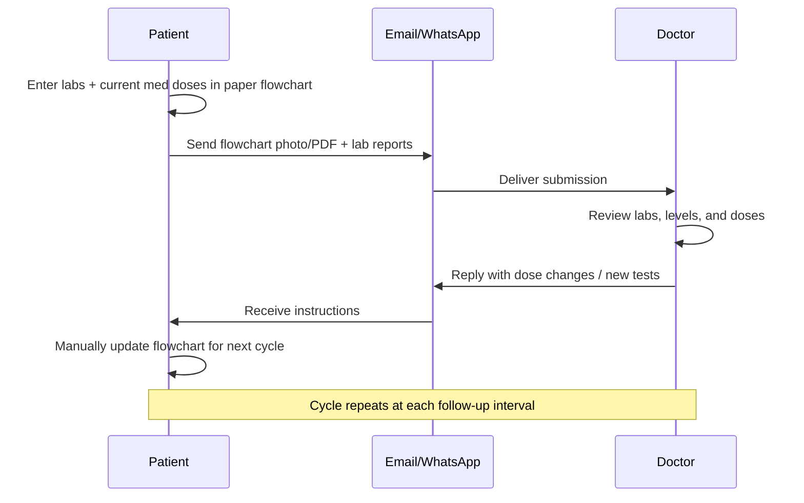
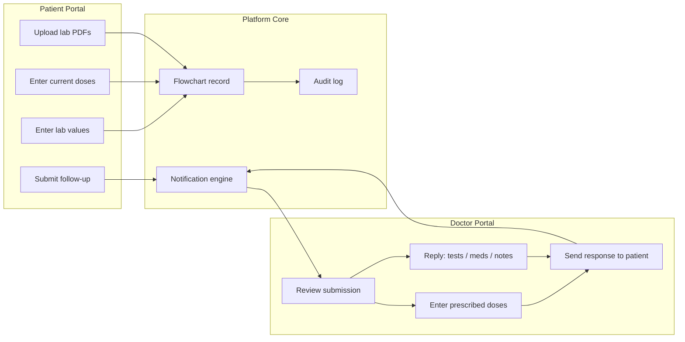
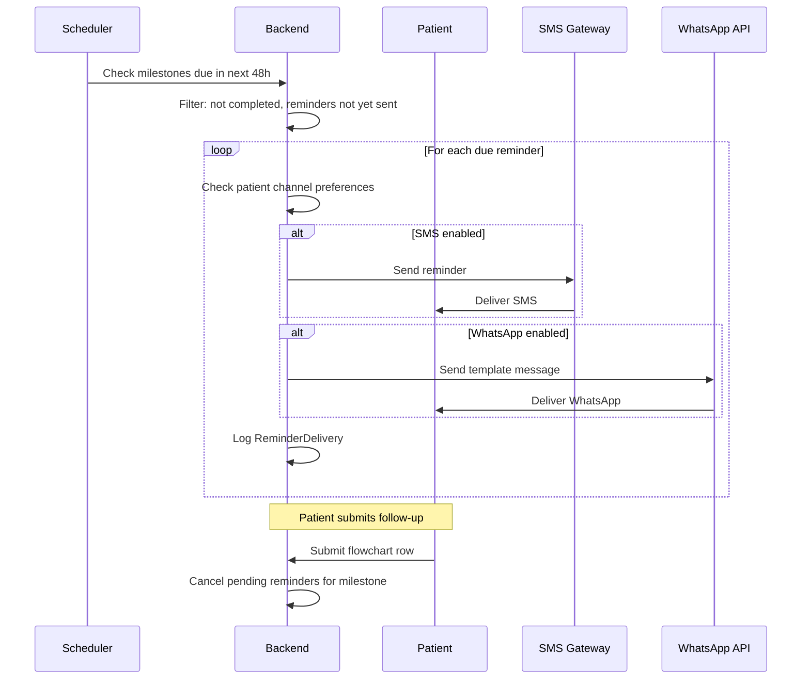
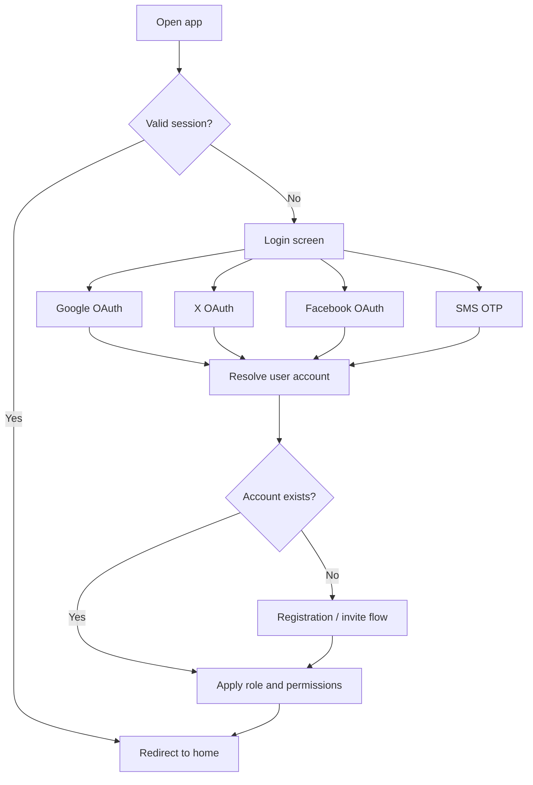
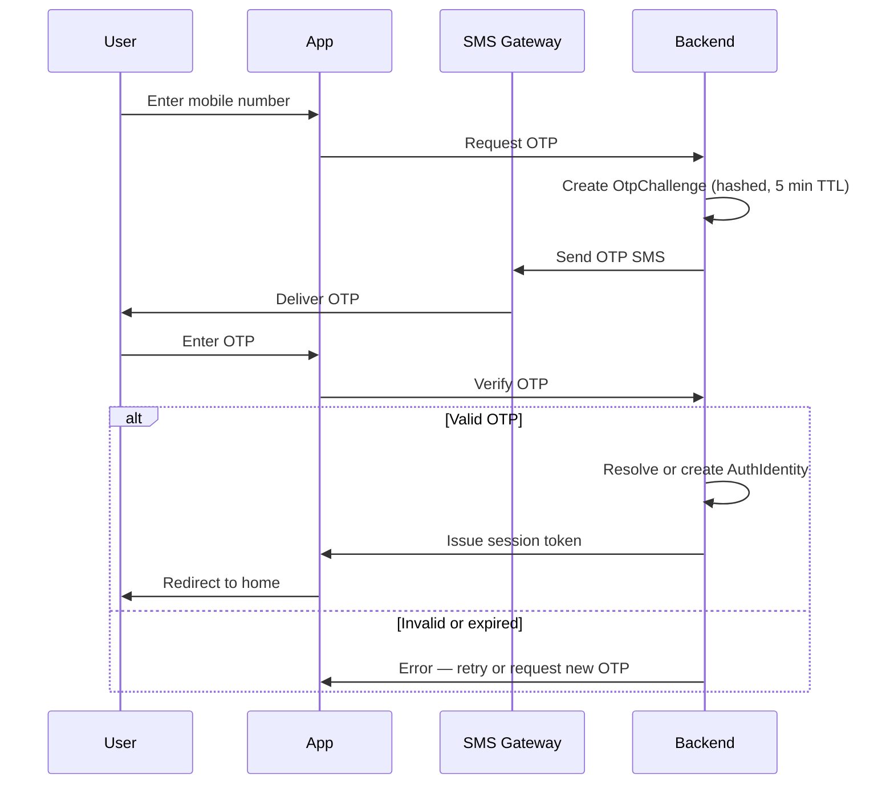
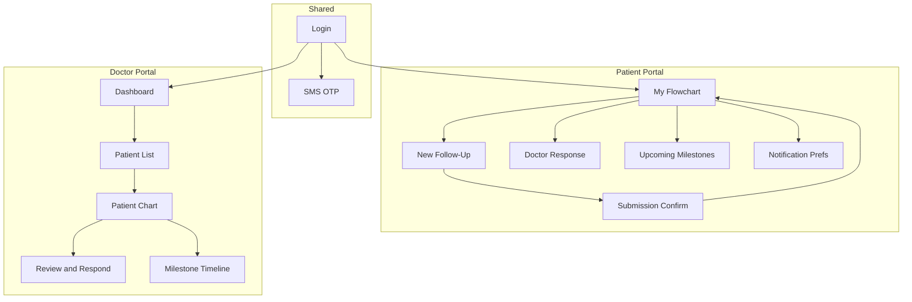

# Application Specification: Post-Operative Investigation Follow-Up Platform

## 1. Document Overview

| Field | Value |
|-------|-------|
| **Document title** | Post-Operative Investigation Flow Chart — Digital Follow-Up Platform |
| **Version** | 1.5 (Draft) |
| **Date** | August 16, 2026 |
| **Source inputs** | Google Doc ("Automate follow up"), sample flowchart (pediatric post-op liver patient) |

---

## 2. Problem Statement

Remote patients currently track post-operative lab results and immunosuppressant medication doses in a **paper flowchart**, then share updates with their doctor via **email or WhatsApp**. The doctor reviews the chart, adjusts medication doses (often annotating changes in a different color), and replies with instructions. The patient manually updates the chart and repeats the cycle at the next follow-up.

This workflow is error-prone, hard to audit, and inefficient for both patients and clinicians. The goal is to **digitize the flowchart and the doctor–patient follow-up loop** while preserving the familiar tabular format and clinical semantics.

---

## 3. Goals & Success Criteria

### Primary goals

1. Replace the paper flowchart with a structured digital record.
2. Let patients enter lab values and current medication doses remotely.
3. Let doctors review entries, prescribe/adjust doses, and respond in one place.
4. Deliver doctor responses back to the patient automatically (replacing manual email/WhatsApp for the core loop).
5. Maintain a longitudinal history of labs, drug levels, doses, and dose changes.
6. Send automated **SMS and WhatsApp reminders** for upcoming follow-up milestones so patients do not miss lab submissions.

### Success criteria

- A patient can submit a new follow-up row in under 5 minutes on mobile.
- A doctor can review a submission and send a dose adjustment in under 3 minutes.
- Every dose change is traceable (who changed it, when, prior vs new value).
- The digital chart mirrors the paper layout closely enough that existing users can adopt it without retraining.

---

## 4. Users & Personas

| Role | Description | Primary needs |
|------|-------------|---------------|
| **Patient / Caregiver** | Remote post-op patient (or parent/guardian for pediatric cases) | Simple data entry, view doctor instructions, upload lab reports |
| **Doctor** | Transplant/hepatology surgeon or consultant | Review trends, enter/adjust doses, request additional tests, reply to patient |
| **Care team member** (optional) | Additional doctors on the case (e.g., Dr. Rajesh Dey, Dr. Tejai B, Dr. Barun) | View patient chart, co-manage follow-ups |
| **Admin** (optional) | Clinic/hospital staff | Onboard patients, manage doctor accounts, configure templates |

---

## 5. Current Workflow (As-Is)



**Observed from sample flowchart:**

- Multiple dated rows track progress (e.g., 13/6/26 → 13/7/26).
- Lab columns cover hematology, liver function, renal function, electrolytes, and drug levels.
- Medication dose columns: **Neoral/Tac**, **Everolimus**, **Aza/MPA**, **Pred**.
- Drug level columns: **Tac level**, **EVO level** (Everolimus level).
- Dose adjustments are visually distinguished (e.g., red ink: `4/4` → `2/2`).
- Patient header includes diagnosis, surgery date, histopathology, and anastomosis details.
- Footer instructs: *"Enter further investigation reports in above table and send to drrajeshdey@gmail.com"*.

---

## 6. Proposed Solution (To-Be)

A **web/mobile application** with:

1. A **patient portal** — digital flowchart, new row entry, lab report upload.
2. A **doctor portal** — patient list, chart review, dose entry, clinical reply.
3. A **notification layer** — alerts when submissions arrive or doctor responds.
4. An **audit trail** — history of all entries and dose changes.



---

## 7. Functional Requirements

### 7.1 Patient profile & chart header

Each patient chart must store static header fields matching the paper form:

| Field | Example from sample | Required |
|-------|---------------------|----------|
| Patient name | Raghavendra S. Dyk | Yes |
| Age / sex | 4.5 yrs / M | Yes |
| Hospital / Max ID | SHMS.750590 | Yes |
| Date of operation | 26/05/2026 | Yes |
| Diagnosis | DCLD - ? AIH | Yes |
| Histopathology | Biliary Cirrhosis (PBC) | Yes |
| Type of biliary anastomosis | Free text | Yes |
| Patient photo | Passport-size image | Optional |
| Assigned doctors | Names + contact info | Yes |
| Primary reporting email | drrajeshdey@gmail.com | Yes |

### 7.2 Follow-up row (investigation table)

Each follow-up is one **dated row** in the flowchart. All columns below are captured on every submission unless marked optional.

#### 7.2.1 Complete field catalog

The following table is the **authoritative list** of flowchart fields. UI labels may use clinic-preferred abbreviations; the system stores values using the canonical field key.

| # | UI label | Canonical key | Category | Type | Unit / format | Required |
|---|----------|---------------|----------|------|---------------|----------|
| — | PP Date | `pp_date` | Meta | Date | DD/MM/YYYY | Yes |
| 1 | Hb | `hb` | Lab | Numeric | g/dL | No |
| 2 | TLC | `tlc` | Lab | Numeric | ×10³/µL | No |
| 3 | PLT | `plt` | Lab | Numeric | ×10³/µL | No |
| 4 | AFP | `afp` | Lab | Numeric | ng/mL | No |
| 5 | INR | `inr` | Lab | Numeric | ratio | No |
| 6 | PTT | `ptt` | Lab | Numeric | seconds | No |
| 7 | Bilirubin Total | `bilirubin_total` | Lab | Numeric | mg/dL | No |
| 8 | Bilirubin Direct | `bilirubin_direct` | Lab | Numeric | mg/dL | No |
| 9 | SGOT | `sgot` | Lab | Numeric | U/L | No |
| 10 | SGPT | `sgpt` | Lab | Numeric | U/L | No |
| 11 | ALK PHOS | `alk_phos` | Lab | Numeric | U/L | No |
| 12 | GGT | `ggt` | Lab | Numeric | U/L | No |
| 13 | Albumin | `albumin` | Lab | Numeric | g/dL | No |
| 14 | Na/K | `na_k` | Lab | Text or split numeric | e.g. `136/4.2` | No |
| 15 | Urea | `urea` | Lab | Numeric | mg/dL | No |
| 16 | Creatinine | `creatinine` | Lab | Numeric | mg/dL | No |
| 17 | HbA1c | `hba1c` | Lab | Numeric | % | No |
| 18 | Tac Level | `tac_level` | Drug level | Numeric | ng/mL (trough C0) | No |
| 19 | EVO level | `evo_level` | Drug level | Numeric | ng/mL | No |
| 20 | Neoral/Tac | `neoral_tac` | Medication dose | Dose notation | e.g. `4/4` | No |
| 21 | Everolimus | `everolimus` | Medication dose | Dose notation | e.g. `1/0` | No |
| 22 | Aza/MPA | `aza_mpa` | Medication dose | Dose notation | e.g. `1/1` | No |
| 23 | Pred | `pred` | Medication dose | Dose notation | e.g. `5` or `5/0` | No |
| 24 | Wt | `wt` | Clinical | Numeric | kg | No |
| 25 | Comments | `comments` | Notes | Text | Free text per row | No |

**Legacy / alias mapping** (paper form and earlier spec versions):

| Legacy label | Maps to |
|--------------|---------|
| Platelet count | PLT (`plt`) |
| Bil Total | Bilirubin Total (`bilirubin_total`) |
| Alb | Albumin (`albumin`) |
| Creat | Creatinine (`creatinine`) |
| Tac/C0 level, Tec Level | Tac Level (`tac_level`) |
| Everolimus level | EVO level (`evo_level`) |
| Tac/Cyclo, Neoral, Tacrolimus/Cyclosporine | Neoral/Tac (`neoral_tac`) |
| Wys, Wysolone, Prednisolone | Pred (`pred`) |

#### 7.2.2 Lab columns

All lab fields are optional on each row (partial entry allowed). Numeric validation applies where applicable.

| Column | Canonical key | Notes |
|--------|---------------|-------|
| Hb | `hb` | Hemoglobin |
| TLC | `tlc` | Total leukocyte count |
| PLT | `plt` | Platelet count |
| AFP | `afp` | Alpha-fetoprotein |
| INR | `inr` | International normalized ratio |
| PTT | `ptt` | Partial thromboplastin time |
| Bilirubin Total | `bilirubin_total` | Total bilirubin |
| Bilirubin Direct | `bilirubin_direct` | Direct (conjugated) bilirubin |
| SGOT | `sgot` | AST |
| SGPT | `sgpt` | ALT |
| ALK PHOS | `alk_phos` | Alkaline phosphatase |
| GGT | `ggt` | Gamma-glutamyl transferase |
| Albumin | `albumin` | Serum albumin |
| Na/K | `na_k` | Sodium/potassium — single field or split `na` + `k` |
| Urea | `urea` | Blood urea |
| Creatinine | `creatinine` | Serum creatinine |
| HbA1c | `hba1c` | Glycated hemoglobin |

#### 7.2.3 Drug level columns

| Column | Canonical key | Notes |
|--------|---------------|-------|
| Tac Level | `tac_level` | Tacrolimus trough (C0); supersedes legacy labels Tac/C0 level, Tec Level |
| EVO level | `evo_level` | Everolimus serum level; alias Everolimus level |

#### 7.2.4 Medication dose columns

Patient-entered on submit; doctor may override on review. Dose notation format to be confirmed with clinic (see §17 open questions).

| Column | Canonical key | Notes |
|--------|---------------|-------|
| Neoral/Tac | `neoral_tac` | Combined tacrolimus/cyclosporine (Neoral) dose; legacy label Tac/Cyclo |
| Everolimus | `everolimus` | Everolimus **dose** (distinct from EVO level) |
| Aza/MPA | `aza_mpa` | Azathioprine or mycophenolate dose |
| Pred | `pred` | Prednisolone / Wysolone dose; legacy label Wys |

#### 7.2.5 Weight, comments, and attachments

| Column | Canonical key | Notes |
|--------|---------------|-------|
| Wt | `wt` | Body weight in kg |
| Comments | `comments` | Free-text notes for the row (patient or doctor); visible in chart and exports |
| Attachments | `attachments[]` | Lab report PDFs/images (see §7.3 P-03); not a flowchart column but linked to the row |

**Business rules:**

- On **patient submission**, the patient fills lab values, drug levels, **current medication doses**, weight, and optional **Comments**.
- On **doctor review**, medication dose columns may appear **blank** until the doctor enters **prescribed doses** for the next interval; doctor may add or amend **Comments**.
- Doctor-entered doses must be visually distinct from patient-reported doses (replacing "red ink").
- Support **dose change history** per medication column (old value → new value, timestamp, prescribing doctor).
- **Comments** are append-only in the audit log when edited after review (original text retained).

### 7.3 Patient portal features

| ID | Requirement | Priority |
|----|-------------|----------|
| P-01 | View full digital flowchart (read-only history + editable new row) | Must |
| P-02 | Add a new follow-up row supporting all fields in §7.2.1 (labs, drug levels, doses, wt, comments) with numeric validation | Must |
| P-03 | Upload lab report files (PDF/image) linked to a follow-up date | Must |
| P-04 | Submit follow-up for doctor review | Must |
| P-05 | View doctor's latest response (dose changes, additional tests, free-text advice) | Must |
| P-06 | Receive notification when doctor responds | Must |
| P-07 | View dose change highlights on the chart | Must |
| P-08 | Optional: save draft row before submission | Should |
| P-09 | Optional: mobile-optimized layout | Should |

### 7.4 Doctor portal features

| ID | Requirement | Priority |
|----|-------------|----------|
| D-01 | Dashboard of patients with pending submissions | Must |
| D-02 | Open patient chart with tabular history and trend view | Must |
| D-03 | Review patient-entered labs, drug levels, and current doses | Must |
| D-04 | Enter prescribed doses in medication columns for the reviewed visit | Must |
| D-05 | Send structured response to patient | Must |
| D-06 | Free-text clinical reply (additional medications, lifestyle advice, etc.) | Must |
| D-07 | Request additional investigations (structured checklist + notes) | Must |
| D-08 | View uploaded lab reports inline or downloadable | Must |
| D-09 | See prior dose changes and who made them | Must |
| D-10 | Optional: flag out-of-range values (e.g., high Tac level, high EVO level) | Should |
| D-11 | Optional: multi-doctor access to same patient chart | Should |

### 7.5 Notifications & delivery

| Channel | Use case | Priority |
|---------|----------|----------|
| In-app | Submission received, doctor responded | Must |
| Email | Replace manual email loop for official record delivery | Must |
| SMS | Milestone reminders, doctor responses, OTP | Must |
| WhatsApp | Milestone reminders, doctor responses | Must |
| Push (mobile) | Time-sensitive doctor replies | Could |

**Notification events:**

- Patient submits new follow-up → notify assigned doctor(s).
- Doctor publishes response → notify patient/caregiver.
- Doctor requests additional tests → notify patient with explicit action items.
- **Upcoming milestone reached** → send automated SMS and/or WhatsApp reminder to patient (see §7.7).

### 7.6 Milestone reminders (SMS & WhatsApp)

Automated reminders notify patients and caregivers of **upcoming clinical milestones** so follow-up labs and submissions are not missed. Reminders are sent via **SMS** and **WhatsApp** based on patient contact preferences and milestone due dates.

#### 7.6.1 Milestone types

| Milestone type | Description | Typical trigger |
|----------------|-------------|-----------------|
| **Follow-up submission due** | Patient should submit a new flowchart row with latest labs | Protocol interval after last reviewed submission (e.g., every 7 or 14 days) |
| **Post-op protocol checkpoint** | Fixed interval from date of operation | e.g., Day 7, Day 14, Day 30, Day 90 post-op |
| **Drug level test due** | Tac level or EVO level should be drawn | Protocol or doctor order |
| **Doctor-ordered investigation** | Specific test requested in doctor reply | Due date set by doctor in response |
| **Overdue follow-up** | No submission received after milestone date | Escalation reminder if milestone passed without submission |

Milestones may be generated from a **protocol template** (per diagnosis/surgery type), from the **date of operation**, or **manually assigned by the doctor** when publishing a response.

#### 7.6.2 Reminder schedule

For each milestone, the system schedules one or more reminders:

| Reminder | Default timing | Message intent |
|----------|----------------|----------------|
| **Advance reminder** | 2 days before due date | Prepare labs / upcoming submission |
| **Due-day reminder** | Morning of due date | Action required today |
| **Overdue reminder** | 1 day after due date (if no submission) | Gentle nudge; link to submit |
| **Final overdue reminder** | 3 days after due date (optional) | Escalation; notify assigned doctor (optional) |

Doctors and admins may override default offsets per protocol or per patient.

#### 7.6.3 Functional requirements

| ID | Requirement | Priority |
|----|-------------|----------|
| M-01 | Auto-generate milestones from post-op protocol template based on date of operation | Must |
| M-02 | Auto-generate next follow-up milestone after each reviewed submission (rolling interval) | Must |
| M-03 | Doctor can set milestone due date when ordering additional investigations | Must |
| M-04 | Background scheduler evaluates upcoming milestones daily (and hourly for same-day reminders) | Must |
| M-05 | Send reminder via **SMS** to patient's verified mobile number | Must |
| M-06 | Send reminder via **WhatsApp** to patient's verified WhatsApp number | Must |
| M-07 | Patient/caregiver selects preferred reminder channel(s): SMS, WhatsApp, or both | Must |
| M-08 | Reminder message includes: milestone title, due date, brief action (e.g., "Submit labs"), deep link to app | Must |
| M-09 | Do not send duplicate reminders for the same milestone + reminder type | Must |
| M-10 | Cancel pending reminders when patient submits follow-up for that milestone | Must |
| M-11 | Mark milestone **completed** when linked submission is reviewed by doctor | Should |
| M-12 | Patient can view upcoming and completed milestones in portal | Should |
| M-13 | Doctor/admin can view milestone status on patient chart | Should |
| M-14 | Log every reminder sent (channel, timestamp, delivery status) | Must |
| M-15 | Honor opt-out: patient can disable non-critical reminders (not OTP) | Should |

#### 7.6.4 Reminder message content (no PHI in message body)

Messages must be concise and **must not include lab values, diagnosis, or medication details** in SMS/WhatsApp text. Example templates:

**SMS (advance reminder):**
> PostOp Care: Your follow-up lab submission is due on {date}. Please upload your reports in the app: {link}

**WhatsApp (due-day reminder):**
> Reminder: Today is your scheduled follow-up for post-operative investigations. Open the app to submit your latest labs and medication doses: {link}

**WhatsApp** may use approved message templates if required by the WhatsApp Business API provider.

#### 7.6.5 Milestone reminder flow



#### 7.6.6 Integration requirements

| Component | Requirement |
|-----------|-------------|
| **SMS gateway** | Same or separate provider from OTP; support transactional SMS and delivery receipts |
| **WhatsApp Business API** | Approved templates for reminder category; support India numbers if applicable |
| **Scheduler** | Cron or queue worker (e.g., daily at 08:00 local + hourly for same-day) |
| **Deep links** | Mobile-friendly URL opens login → flowchart → new submission form |
| **Timezone** | Reminders sent in patient's local timezone (default: Asia/Kolkata) |

### 7.7 Reporting & export

| ID | Requirement | Priority |
|----|-------------|----------|
| R-01 | Export chart as PDF matching paper layout | Should |
| R-02 | Print-friendly flowchart view | Should |
| R-03 | Export audit log of dose changes | Could |

---

## 8. User Flows

### 8.1 Patient follow-up submission

1. Patient logs in and opens their flowchart.
2. Patient taps **Add follow-up** and enters PP Date.
3. Patient enters lab values from latest reports.
4. Patient enters **current medication doses** (Neoral/Tac, Everolimus, Aza/MPA, Pred), weight, and optional comments.
5. Patient uploads lab report PDFs/images.
6. Patient submits → row status = **Pending doctor review**.
7. Patient sees confirmation and estimated review state.

### 8.2 Doctor review & response

1. Doctor receives notification of new submission.
2. Doctor opens patient chart; pending row is highlighted.
3. Doctor reviews labs, Tac/EVO drug levels, and patient-reported doses.
4. Doctor enters **prescribed doses** in the medication columns (may differ from patient-reported values).
5. Doctor adds reply:
   - Additional tests required (structured + notes).
   - Additional medications or instructions (free text).
6. Doctor publishes response → row status = **Reviewed**.
7. Patient is notified and sees:
   - Updated prescribed doses (highlighted if changed).
   - Doctor message and any test orders.

### 8.4 Automated milestone reminder

1. System creates milestones when a patient chart is onboarded (post-op protocol from date of operation).
2. After each doctor-reviewed submission, system schedules the **next follow-up milestone** based on protocol interval.
3. When doctor orders additional tests, system creates a milestone with the specified due date.
4. Scheduler runs daily (and hourly for same-day reminders) and identifies milestones entering reminder windows.
5. For each due reminder, system checks patient **SMS/WhatsApp preferences** and verified contact numbers.
6. System sends reminder(s) with due date and app deep link; logs delivery status.
7. If patient submits follow-up before due date → pending reminders for that milestone are **cancelled**.
8. If due date passes with no submission → **overdue** reminder sent; optional alert to assigned doctor.
9. Patient views upcoming milestones in portal and can update notification preferences.

---

## 9. Data Model (Conceptual)

```text
Patient
├── id, name, age, sex, max_id, photo_url
├── date_of_operation, diagnosis, histopathology, anastomosis_type
├── assigned_doctors[]
├── contact_email
├── phone_number (verified, E.164)
├── whatsapp_number (verified, optional — may match phone)
├── reminder_preferences { sms_enabled, whatsapp_enabled, timezone }
└── reminder_opt_out (non-critical reminders)

FollowUpProtocol
├── id, name, diagnosis_match (optional)
├── post_op_checkpoints[] (days_from_surgery, title)
└── default_follow_up_interval_days (rolling, after each review)

Milestone
├── id, patient_id, type [follow_up|post_op_checkpoint|drug_level|doctor_ordered|overdue]
├── title, description
├── due_date
├── status [scheduled|completed|cancelled|overdue]
├── source [protocol|doctor|system]
├── linked_follow_up_row_id (optional, set on submission)
├── doctor_response_id (optional, for doctor-ordered tests)
└── created_at, completed_at

ReminderSchedule
├── id, milestone_id
├── reminder_type [advance|due_day|overdue|final_overdue]
├── offset_days (negative = before due date, 0 = due day, positive = after)
├── scheduled_at (computed datetime)
├── status [pending|sent|cancelled|failed]
└── sent_at

ReminderDelivery
├── id, reminder_schedule_id, patient_id
├── channel [sms|whatsapp]
├── recipient_number
├── message_template_id
├── provider_message_id (external ref)
├── delivery_status [queued|sent|delivered|failed]
├── failure_reason (optional)
└── created_at

FollowUpRow
├── id, patient_id, pp_date, status [draft|pending|reviewed]
├── lab_values {
│     hb, tlc, plt, afp, inr, ptt,
│     bilirubin_total, bilirubin_direct,
│     sgot, sgpt, alk_phos, ggt, albumin,
│     na_k, urea, creatinine, hba1c
│   }
├── drug_levels { tac_level, evo_level }
├── patient_reported_doses { neoral_tac, everolimus, aza_mpa, pred }
├── doctor_prescribed_doses { neoral_tac, everolimus, aza_mpa, pred }
├── wt
├── comments
├── attachments[] (lab report files)
├── submitted_at, reviewed_at
└── reviewed_by (doctor_id)

DoseChange
├── follow_up_row_id, field_name
├── old_value, new_value
├── changed_by, changed_at
└── reason (optional)

DoctorResponse
├── follow_up_row_id, doctor_id
├── additional_tests[] (code + description)
├── additional_medications (text)
├── clinical_notes (text)
└── sent_at

Notification
├── user_id, event_type, payload, read_at

User
├── id, role [patient|caregiver|doctor|admin]
├── display_name, email (optional), phone (optional)
├── status [active|pending_verification|disabled]
├── linked_patient_id (for patient/caregiver accounts)
└── created_at, last_login_at

AuthIdentity
├── user_id
├── provider [google|x|facebook|sms]
├── provider_subject (OAuth sub or normalized phone number)
├── email_from_provider (optional)
└── linked_at

AuthSession
├── id, user_id, expires_at, revoked_at
└── device_info, ip_address (for audit)

OtpChallenge
├── id, phone_number, otp_hash, expires_at
├── attempts, verified_at
└── created_at
```

---

## 10. UI/UX Requirements

### 10.1 Flowchart view (core screen)

- **Landscape table** on desktop; **stacked/card row detail** on mobile.
- Fixed column headers aligned with paper chart nomenclature.
- Color coding:
  - Patient-entered doses: default/neutral.
  - Doctor-prescribed doses: distinct color (equivalent to red ink).
  - Changed doses: show old → new with indicator.
- Row status badges: Draft, Pending review, Reviewed.

### 10.2 Doctor review panel

- Side panel or modal showing:
  - Patient submission summary.
  - Dose entry fields (Neoral/Tac, Everolimus, Aza/MPA, Pred).
  - Reply composer (tests, meds, notes).
  - Attached lab reports viewer.

### 10.3 Accessibility & usability

- Large touch targets for caregivers on phones.
- Clear units beside each lab field.
- Inline validation (numeric ranges, required PP Date).
- Support for partial entry with clear "missing value" indicators.

---

## 11. Non-Functional Requirements

| Category | Requirement |
|----------|-------------|
| **Availability** | 99.5% uptime for patient submissions and doctor review |
| **Performance** | Chart load < 2s for up to 50 follow-up rows |
| **Security** | HTTPS, encrypted storage, role-based access control |
| **Privacy** | PHI handled per applicable healthcare regulations (HIPAA-like / local Indian healthcare data norms) |
| **Auditability** | Immutable log of dose changes and doctor responses |
| **Backup** | Daily encrypted backups; recovery RPO ≤ 24h |
| **Localization** | Date format DD/MM/YYYY; support for local clinical conventions |
| **Device support** | Responsive web; native mobile app optional in Phase 2 |

---

## 12. Authentication

### 12.1 Overview

All users authenticate before accessing the platform. The system supports **four sign-in methods**:

| Method | Provider | Typical users |
|--------|----------|---------------|
| **Google OAuth 2.0** | Google | Doctors, patients, caregivers |
| **X OAuth 2.0** | X (formerly Twitter) | Doctors, patients, caregivers |
| **Facebook Login** | Meta (Facebook) | Doctors, patients, caregivers |
| **SMS OTP** | Mobile phone number | Patients, caregivers (especially those without social login) |

Authentication is **identity-first**: the user proves who they are via one of the methods above. **Authorization** (patient vs doctor vs admin, and which charts they can access) is applied after login based on account role and clinic assignment.

**Design principles:**

- No passwords stored by the application.
- OAuth handled via standard authorization-code flow with PKCE (web/mobile).
- SMS OTP used only for verification at login; OTP codes are single-use and short-lived.
- A single user account may link multiple auth methods (e.g., Google + Facebook + phone).
- All auth events are written to an audit log.

### 12.2 Supported authentication methods

| ID | Requirement | Priority |
|----|-------------|----------|
| A-01 | Sign in with Google (OAuth 2.0 / OpenID Connect) | Must |
| A-02 | Sign in with X (OAuth 2.0) | Must |
| A-03 | Sign in with Facebook (Facebook Login / OAuth 2.0) | Must |
| A-04 | Sign in with mobile phone number + SMS OTP | Must |
| A-05 | Unified login screen offering all four options | Must |
| A-06 | Link additional auth methods to an existing account (Account → Security) | Should |
| A-07 | Sign out on current device | Must |
| A-08 | Session expiry after configurable idle timeout (default 30 days web, 90 days mobile) | Must |
| A-09 | Rate limiting and lockout on failed OTP attempts | Must |

### 12.3 Login screen flow (entry point)

1. User opens the application.
2. If a valid session exists and is not expired → redirect to role-appropriate home (flowchart or doctor dashboard).
3. Otherwise, show **Login** with four options:
   - **Continue with Google**
   - **Continue with X**
   - **Continue with Facebook**
   - **Continue with mobile number**
4. User selects one method and follows the corresponding flow below.
5. On successful authentication, the system resolves or creates the user account, assigns role, and redirects to the appropriate portal.



### 12.4 Google OAuth flow

**Prerequisites:** Google Cloud OAuth client configured with authorized redirect URIs.

| Step | Actor | Action |
|------|-------|--------|
| 1 | User | Taps **Continue with Google** |
| 2 | App | Redirects to Google authorization endpoint (scopes: `openid`, `email`, `profile`) |
| 3 | User | Selects Google account and grants consent |
| 4 | Google | Redirects back to app callback with authorization code |
| 5 | App backend | Exchanges code for tokens; validates ID token (issuer, audience, expiry) |
| 6 | App backend | Extracts `sub`, email, and name from ID token |
| 7 | App backend | Looks up `AuthIdentity` where `provider=google` and `provider_subject=sub` |
| 8a | App | If identity exists → create session → redirect to home |
| 8b | App | If new user → proceed to **Registration / account linking** (§12.8) |

### 12.5 Facebook OAuth flow

**Prerequisites:** Meta Developer App configured with Facebook Login; OAuth redirect URIs and app domains registered.

| Step | Actor | Action |
|------|-------|--------|
| 1 | User | Taps **Continue with Facebook** |
| 2 | App | Redirects to Facebook authorization endpoint (scopes: `email`, `public_profile`) |
| 3 | User | Logs in to Facebook (if needed) and grants consent |
| 4 | Facebook | Redirects back to app callback with authorization code |
| 5 | App backend | Exchanges code for access token |
| 6 | App backend | Calls Facebook Graph API (`/me?fields=id,name,email`) to obtain Facebook user ID, name, and email |
| 7 | App backend | Looks up `AuthIdentity` where `provider=facebook` and `provider_subject=facebook_user_id` |
| 8a | App | If identity exists → create session → redirect to home |
| 8b | App | If new user → proceed to **Registration / account linking** (§12.8) |

**Facebook-specific notes:**

- Email may be absent if the user denies the `email` permission or has no email on their Facebook account; fall back to invite matching by name + admin verification, or prompt user to link phone number.
- Facebook app must pass Meta app review if required for production login beyond test users.

### 12.6 X OAuth flow

**Prerequisites:** X Developer App with OAuth 2.0 enabled and callback URL registered.

| Step | Actor | Action |
|------|-------|--------|
| 1 | User | Taps **Continue with X** |
| 2 | App | Redirects to X authorization endpoint (scopes: read user identity) |
| 3 | User | Authorizes the application on X |
| 4 | X | Redirects back to app callback with authorization code |
| 5 | App backend | Exchanges code for access token |
| 6 | App backend | Calls X user-info endpoint to obtain user ID and display name |
| 7 | App backend | Looks up `AuthIdentity` where `provider=x` and `provider_subject=x_user_id` |
| 8a | App | If identity exists → create session → redirect to home |
| 8b | App | If new user → proceed to **Registration / account linking** (§12.8) |

### 12.7 SMS OTP flow

**Prerequisites:** SMS gateway integrated (e.g., Twilio, MSG91, or equivalent) for OTP delivery.

| Step | Actor | Action |
|------|-------|--------|
| 1 | User | Selects **Continue with mobile number** |
| 2 | User | Enters mobile number (E.164 format, e.g., `+91XXXXXXXXXX`) |
| 3 | App | Validates number format; applies rate limit (max 3 OTP requests per number per hour) |
| 4 | App backend | Generates 6-digit OTP; stores hashed OTP in `OtpChallenge` with 5-minute expiry |
| 5 | App backend | Sends OTP via SMS (message must not include PHI) |
| 6 | User | Enters OTP on verification screen |
| 7 | App backend | Validates OTP (max 5 attempts per challenge); on success marks challenge verified |
| 8 | App backend | Looks up `AuthIdentity` where `provider=sms` and `provider_subject=normalized_phone` |
| 9a | App | If identity exists → create session → redirect to home |
| 9b | App | If new user → proceed to **Registration / account linking** (§12.8) |

**SMS OTP rules:**

- OTP length: 6 digits.
- OTP validity: 5 minutes.
- Resend allowed after 60 seconds.
- After 5 failed attempts, invalidate challenge and require a new OTP request.
- Phone number must be verified on each new device unless "remember this device" is enabled (optional Phase 2).



### 12.8 Registration and account linking (first-time users)

After any auth method succeeds, if no matching `AuthIdentity` exists:

**Patients / caregivers**

1. System checks for a **pending invite** matching the authenticated email or phone (created by clinic admin when onboarding the patient).
2. If invite found → link identity to pre-created patient chart → role = `patient` or `caregiver`.
3. If no invite → show **Request access** screen: user enters Max ID / patient name / doctor name; submission goes to admin for approval (optional MVP: admin-only provisioning).

**Doctors / care team**

1. System checks allowlist of approved doctor emails or phone numbers (maintained by admin).
2. If on allowlist → create account with role = `doctor`.
3. If not on allowlist → show **Access pending** message; admin must approve before first login completes.

**Linking additional methods (existing users)**

1. Authenticated user opens **Account → Security**.
2. User chooses **Link Google**, **Link X**, **Link Facebook**, or **Link phone number**.
3. User completes the same OAuth or OTP flow.
4. System attaches new `AuthIdentity` to the same `User` record (prevent linking if identity already belongs to another user).

### 12.9 Session management

| Step | Description |
|------|-------------|
| 1 | On successful login, backend issues a **session token** (HTTP-only secure cookie on web, or secure storage on mobile). |
| 2 | Each API request validates session; expired or revoked sessions return `401 Unauthorized`. |
| 3 | **Sign out** revokes the current session server-side and clears client storage. |
| 4 | Optional (Phase 2): **Sign out all devices** revokes all sessions for the user. |
| 5 | Session metadata (IP, user agent, created_at) stored for security audit. |

### 12.10 Authorization after authentication

Authentication establishes identity; authorization controls access:

| Role | Access after login |
|------|-------------------|
| **Patient / Caregiver** | Own flowchart only |
| **Doctor** | Assigned patients' charts, review and reply |
| **Admin** | User management, patient onboarding, allowlists |

Every protected route and API endpoint must verify both **valid session** and **role-based permission** before returning PHI.

### 12.11 Authentication security requirements

| Requirement | Detail |
|-------------|--------|
| Transport | TLS 1.2+ for all auth endpoints |
| OAuth | Authorization code flow with PKCE; validate state parameter to prevent CSRF |
| Tokens | Store OAuth refresh tokens encrypted; never expose to client |
| OTP | Store OTP hash only (bcrypt/argon2); never log plaintext OTP |
| Rate limiting | OTP send, OTP verify, and OAuth callback endpoints rate-limited per IP and per identifier |
| Audit log | Record login success/failure, logout, OTP requests, account linking, role assignment |
| PHI in SMS | OTP messages contain only the code and app name — no patient or clinical data |

---

## 13. Security & Compliance Considerations

1. **Authentication:** See §12 — Google OAuth, X OAuth, Facebook Login, and SMS OTP; no application-managed passwords.
2. **Authorization:** Patients see only their chart; doctors see only assigned patients.
3. **Data retention:** Long-term storage of follow-up history (transplant patients require multi-year records).
4. **Consent:** Explicit consent for digital follow-up, electronic communication, and SMS/WhatsApp milestone reminders (with opt-out for non-critical reminders).
5. **Attachments:** Virus scan on uploaded lab reports; access restricted to care team and patient.
6. **Disclaimer:** System supports clinical workflow but does not replace emergency care pathways.

---

## 14. MVP Scope vs Later Phases

### Phase 1 — MVP (Must ship)

- Patient & doctor web portals
- Authentication: Google OAuth, X OAuth, Facebook Login, and SMS OTP (§12)
- Digital flowchart with exact column set from paper form
- Patient row submission + file upload
- Doctor dose entry + structured reply
- Email/in-app notifications
- **Automated milestone reminders via SMS and WhatsApp (§7.6)**
- Dose change highlighting and audit trail
- PDF export of chart

### Phase 2 — Enhancements

- Reference range alerts (e.g., high Tac level, high EVO level)
- Trend graphs for key labs and weight
- Multi-doctor collaboration
- Doctor escalation on repeated overdue milestones
- Native mobile apps
- Rich WhatsApp interactive messages (quick-reply buttons)

### Phase 3 — Advanced

- EHR/LIS integration (auto-import lab values)
- OCR from uploaded lab PDFs into row fields
- Analytics dashboard for clinic (aggregate outcomes)
- Telemedicine hook for video consult linked to a follow-up row

---

## 15. Sample Screen Inventory

| Screen | User | Purpose |
|--------|------|---------|
| Login | Both | Choose Google, X, Facebook, or mobile number sign-in |
| SMS OTP — enter phone | Both | Capture mobile number for OTP |
| SMS OTP — verify code | Both | Enter 6-digit OTP |
| OAuth callback / loading | Both | Handle Google/X/Facebook redirect and session creation |
| Registration / invite linking | Patient, Doctor | First-time account setup after auth |
| Account → Security | Both | Link additional auth methods, sign out |
| My flowchart | Patient | View history, add row |
| New follow-up form | Patient | Enter labs, doses, weight, attachments |
| Submission confirmation | Patient | Acknowledge pending review |
| Doctor response view | Patient | See prescribed doses and instructions |
| Upcoming milestones | Patient | View due dates and reminder history |
| Notification preferences | Patient | Enable/disable SMS and WhatsApp reminders |
| Milestone timeline | Doctor | See scheduled, completed, and overdue milestones |
| Protocol template admin | Admin | Configure post-op checkpoints and follow-up intervals |
| Patient dashboard | Doctor | Pending reviews, recent activity |
| Patient chart detail | Doctor | Full table + review panel |
| Dose & reply editor | Doctor | Enter doses, tests, notes, send |
| Patient profile admin | Admin | Create chart, assign doctors |
| Audit / history | Doctor, Admin | Dose change log |

See **§16 Mock Screens** for low-fidelity wireframes of all patient and doctor screens.

---

## 16. Mock Screens

Low-fidelity wireframes for MVP. Layout is **mobile-first** for patients; **desktop-first** for doctors. Color tokens referenced below are indicative only.

**Design tokens (indicative):**

| Token | Usage |
|-------|-------|
| Primary `#2563EB` | Primary actions (Submit, Send response) |
| Success `#16A34A` | Reviewed status, delivered reminders |
| Warning `#D97706` | Pending review, due today milestone |
| Danger `#DC2626` | Overdue milestone, dose change highlight |
| Neutral `#64748B` | Labels, secondary text |

### 16.1 Shared — Login

**Route:** `/login` · **Users:** Patient, Doctor

```
┌─────────────────────────────────────┐
│           PostOp Care               │
│   Post-Operative Follow-Up Portal   │
├─────────────────────────────────────┤
│                                     │
│   Sign in to continue               │
│                                     │
│  ┌─────────────────────────────┐    │
│  │  G  Continue with Google    │    │
│  └─────────────────────────────┘    │
│  ┌─────────────────────────────┐    │
│  │  X  Continue with X         │    │
│  └─────────────────────────────┘    │
│  ┌─────────────────────────────┐    │
│  │  f  Continue with Facebook  │    │
│  └─────────────────────────────┘    │
│  ┌─────────────────────────────┐    │
│  │  📱 Continue with mobile     │    │
│  └─────────────────────────────┘    │
│                                     │
│   By signing in you agree to the    │
│   Terms of Service and Privacy      │
│   Policy.                           │
└─────────────────────────────────────┘
```

### 16.2 Shared — SMS OTP (enter phone)

**Route:** `/login/phone` · **Users:** Patient, Doctor

```
┌─────────────────────────────────────┐
│  ← Back                             │
├─────────────────────────────────────┤
│   Enter mobile number               │
│                                     │
│   Country   ┌──────┐ ┌────────────┐ │
│             │ +91 ▼│ │ 9876543210 │ │
│             └──────┘ └────────────┘ │
│                                     │
│   We'll send a 6-digit code by SMS  │
│                                     │
│  ┌─────────────────────────────┐    │
│  │        Send OTP             │    │
│  └─────────────────────────────┘    │
└─────────────────────────────────────┘
```

### 16.3 Shared — SMS OTP (verify)

**Route:** `/login/phone/verify` · **Users:** Patient, Doctor

```
┌─────────────────────────────────────┐
│  ← Back                             │
├─────────────────────────────────────┤
│   Enter verification code           │
│   Sent to +91 98765 43210           │
│                                     │
│   ┌───┐ ┌───┐ ┌───┐ ┌───┐ ┌───┐ ┌───┐
│   │ 4 │ │ 8 │ │ 2 │ │ _ │ │ _ │ │ _ │
│   └───┘ └───┘ └───┘ └───┘ └───┘ └───┘
│                                     │
│   Resend code in 0:42               │
│                                     │
│  ┌─────────────────────────────┐    │
│  │         Verify              │    │
│  └─────────────────────────────┘    │
└─────────────────────────────────────┘
```

---

### 16.4 Patient — Home / My Flowchart

**Route:** `/patient/flowchart` · **Primary landing after login**

```
┌─────────────────────────────────────┐
│ ☰  PostOp Care          🔔  👤     │
├─────────────────────────────────────┤
│ ┌─────────────────────────────────┐ │
│ │ Raghavendra S. Dyk   4.5 yrs M │ │
│ │ Op: 26/05/2026  ·  SHMS.750590  │ │
│ │ DCLD · Biliary Cirrhosis (PBC)  │ │
│ └─────────────────────────────────┘ │
│                                     │
│ ⚠ Next follow-up due: 20 Aug 2026   │
│    [ View milestone ]               │
│                                     │
│  ┌─────────────────────────────┐    │
│  │  + Add new follow-up        │    │
│  └─────────────────────────────┘    │
│                                     │
│  Investigation history              │
│  ┌─────────────────────────────────┐│
│  │ PP Date │ Hb │ Bil T │ Tac lvl │… ││
│  ├─────────┼────┼─────┼────────┼──┤│
│  │ 13/7/26 │10.2│ 0.8 │  8.12  │▸ ││
│  │ 30/6/26 │ 9.8│ 1.1 │  9.45  │▸ ││
│  │ 22/6/26 │10.1│ 1.4 │ 15.37  │▸ ││
│  │ 13/6/26 │ 9.5│ 2.1 │  6.20  │▸ ││
│  └─────────────────────────────────┘│
│  ↔ Scroll for all columns           │
│                                     │
│  [ Export PDF ]                     │
├─────────────────────────────────────┤
│  Chart    Milestones    Account     │
└─────────────────────────────────────┘
```

**Row detail (tap ▸):** expands to show full lab panel, patient-reported doses, doctor-prescribed doses (red highlight if changed), and attached reports.

### 16.5 Patient — New Follow-Up Form

**Route:** `/patient/flowchart/new` · **Step 1 of 3 — Labs**

```
┌─────────────────────────────────────┐
│  ← Cancel          New follow-up    │
│                    Step 1 of 3      │
├─────────────────────────────────────┤
│  PP Date *                          │
│  ┌─────────────────────────────┐    │
│  │  16 / 08 / 2026         📅  │    │
│  └─────────────────────────────┘    │
│                                     │
│  Lab values                         │
│  Hb (g/dL)        ┌──────────┐      │
│                   │  10.2    │      │
│  Bilirubin Total  ┌──────────┐      │
│                   │  0.9     │      │
│  Bilirubin Direct ┌──────────┐      │
│  INR / PTT        ┌────┐ ┌────┐      │
│  SGOT / SGPT      ┌────┐ ┌────┐      │
│                   │ 45 │ │ 38 │      │
│  Tac Level        ┌──────────┐      │
│                   │  8.12    │      │
│  EVO level        ┌──────────┐      │
│  … (scroll for all §7.2.2 fields)   │
│                                     │
│  ┌─────────────────────────────┐    │
│  │      Next: Medications →    │    │
│  └─────────────────────────────┘    │
└─────────────────────────────────────┘
```

**Step 2 — Medications & weight**

```
┌─────────────────────────────────────┐
│  ← Back            Step 2 of 3      │
├─────────────────────────────────────┤
│  Current doses you are taking       │
│                                     │
│  Neoral/Tac *     ┌──────────┐      │
│                   │   2/2    │      │
│  Everolimus *     ┌──────────┐      │
│                   │   1/0    │      │
│  Aza / MPA *      ┌──────────┐      │
│                   │   1/1    │      │
│  Pred *           ┌──────────┐      │
│                   │    5     │      │
│  Weight (kg) *    ┌──────────┐      │
│                   │   5.4    │      │
│  Comments         ┌──────────┐      │
│                   │          │      │
│                                     │
│  ℹ Enter doses exactly as you       │
│    are taking them today.           │
│                                     │
│  ┌─────────────────────────────┐    │
│  │      Next: Attachments →    │    │
│  └─────────────────────────────┘    │
└─────────────────────────────────────┘
```

**Step 3 — Attachments & submit**

```
┌─────────────────────────────────────┐
│  ← Back            Step 3 of 3      │
├─────────────────────────────────────┤
│  Lab reports                        │
│                                     │
│  ┌ ─ ─ ─ ─ ─ ─ ─ ─ ─ ─ ─ ─ ─ ─ ┐  │
│  │     📎 Upload PDF or photo   │  │
│  │     Tap to add files         │  │
│  └ ─ ─ ─ ─ ─ ─ ─ ─ ─ ─ ─ ─ ─ ─ ┘  │
│                                     │
│  Attached:                          │
│  • lab_report_16aug.pdf      ✕      │
│  • tac_level_photo.jpg       ✕      │
│                                     │
│  Notes (optional)                   │
│  ┌─────────────────────────────┐    │
│  │ Fasting sample taken at 7am │    │
│  └─────────────────────────────┘    │
│                                     │
│  ┌─────────────────────────────┐    │
│  │   Submit for doctor review  │    │
│  └─────────────────────────────┘    │
│  Save as draft                      │
└─────────────────────────────────────┘
```

### 16.6 Patient — Submission Confirmation

**Route:** `/patient/flowchart/submitted/:id`

```
┌─────────────────────────────────────┐
│                                     │
│              ✓                      │
│   Follow-up submitted               │
│                                     │
│   Your submission for 16/08/2026    │
│   is pending doctor review.         │
│                                     │
│   ┌─────────────────────────────┐   │
│   │ Status:  Pending review  🟡 │   │
│   │ Submitted: 16 Aug, 10:42 AM │   │
│   └─────────────────────────────┘   │
│                                     │
│   Reminder for this milestone       │
│   has been cancelled.               │
│                                     │
│  ┌─────────────────────────────┐    │
│  │      Back to flowchart      │    │
│  └─────────────────────────────┘    │
└─────────────────────────────────────┘
```

### 16.7 Patient — Doctor Response View

**Route:** `/patient/flowchart/row/:id/response`

```
┌─────────────────────────────────────┐
│  ← Back to chart                    │
├─────────────────────────────────────┤
│  Doctor's response                  │
│  Reviewed by Dr. Rajesh Dey         │
│  17 Aug 2026, 9:15 AM               │
├─────────────────────────────────────┤
│  Prescribed doses                   │
│  ┌─────────────────────────────────┐│
│  │ Neoral/Tac  2/2  →  2/2  (same) ││
│  │ Everolimus  1/0  →  1/0  (same) ││
│  │ Aza/MPA     1/1  →  1/0  🔴 chg ││
│  │ Pred          5  →    5  (same) ││
│  └─────────────────────────────────┘│
│                                     │
│  Additional tests ordered           │
│  ☐ Repeat Tac level in 7 days       │
│  ☐ Liver function panel             │
│                                     │
│  Clinical notes                     │
│  ┌─────────────────────────────┐    │
│  │ Tac level improved. Continue│    │
│  │ current Tac dose. Reduce    │    │
│  │ Aza evening dose.           │    │
│  └─────────────────────────────┘    │
│                                     │
│  Next follow-up due: 30 Aug 2026    │
└─────────────────────────────────────┘
```

### 16.8 Patient — Upcoming Milestones

**Route:** `/patient/milestones`

```
┌─────────────────────────────────────┐
│  Milestones                         │
├─────────────────────────────────────┤
│  UPCOMING                           │
│  ┌─────────────────────────────┐    │
│  │ 🟡 Follow-up submission     │    │
│  │    Due: 20 Aug 2026 (2 days)│    │
│  │    Reminder: SMS + WhatsApp │    │
│  └─────────────────────────────┘    │
│  ┌─────────────────────────────┐    │
│  │    Post-op Day 90 checkpoint│    │
│  │    Due: 24 Aug 2026         │    │
│  └─────────────────────────────┘    │
│                                     │
│  COMPLETED                          │
│  ┌─────────────────────────────┐    │
│  │ ✓ Follow-up submission      │    │
│  │   Completed: 13 Jul 2026    │    │
│  └─────────────────────────────┘    │
│                                     │
│  REMINDER HISTORY                   │
│  18 Aug · WhatsApp · Delivered      │
│  18 Aug · SMS · Delivered           │
│  16 Aug · WhatsApp · Delivered      │
├─────────────────────────────────────┤
│  Chart    Milestones    Account     │
└─────────────────────────────────────┘
```

### 16.9 Patient — Notification Preferences

**Route:** `/patient/account/notifications`

```
┌─────────────────────────────────────┐
│  ← Account                          │
├─────────────────────────────────────┤
│  Notification preferences           │
│                                     │
│  Milestone reminders                │
│  ┌─────────────────────────────┐    │
│  │ SMS reminders        [ON]  │    │
│  │ +91 9876543210             │    │
│  └─────────────────────────────┘    │
│  ┌─────────────────────────────┐    │
│  │ WhatsApp reminders   [ON]  │    │
│  │ +91 9876543210             │    │
│  └─────────────────────────────┘    │
│                                     │
│  Doctor response alerts             │
│  ┌─────────────────────────────┐    │
│  │ In-app               [ON]  │    │
│  │ Email                [ON]  │    │
│  └─────────────────────────────┘    │
│                                     │
│  ☐ Pause non-critical reminders     │
│                                     │
│  Timezone: Asia/Kolkata (IST)       │
│                                     │
│  ┌─────────────────────────────┐    │
│  │          Save               │    │
│  └─────────────────────────────┘    │
└─────────────────────────────────────┘
```

---

### 16.10 Doctor — Dashboard

**Route:** `/doctor/dashboard` · **Primary landing after login**

```
┌──────────────────────────────────────────────────────────────────┐
│ PostOp Care · Doctor Portal          🔔 (3)    Dr. Rajesh Dey ▼ │
├──────────────┬───────────────────────────────────────────────────┤
│  Dashboard   │  Good morning, Dr. Dey                            │
│  Patients    │                                                   │
│  Account     │  ┌────────────┐ ┌────────────┐ ┌────────────┐     │
│              │  │ Pending    │ │ Overdue    │ │ Reviewed   │     │
│              │  │ review: 3  │ │ milestone:2│ │ today: 5   │     │
│              │  └────────────┘ └────────────┘ └────────────┘     │
│              │                                                   │
│              │  Pending reviews                                   │
│              │  ┌──────────────────────────────────────────────┐ │
│              │  │ Patient          Submitted    Tac lvl Status│ │
│              │  ├──────────────────────────────────────────────┤ │
│              │  │ Raghavendra S.   16 Aug 10:42  8.12   🟡 New│ │
│              │  │ Anita K.         15 Aug 18:20 12.40   🟡 New│ │
│              │  │ Mohan P.         14 Aug 09:05  6.88   🟡 New│ │
│              │  └──────────────────────────────────────────────┘ │
│              │                                                   │
│              │  Overdue milestones                                │
│              │  • Suresh R. — follow-up due 14 Aug (3 days ago)  │
│              │  • Priya M. — Tac level due 15 Aug                │
└──────────────┴───────────────────────────────────────────────────┘
```

### 16.11 Doctor — Patient Chart Detail

**Route:** `/doctor/patients/:id/chart`

```
┌──────────────────────────────────────────────────────────────────┐
│ ← Patients / Raghavendra S. Dyk                    [ Export PDF ]│
├──────────────────────────────────────────────────────────────────┤
│ 4.5 yrs M · Op 26/05/2026 · SHMS.750590 · DCLD · PBC            │
│ Assigned: Dr. Rajesh Dey, Dr. Tejai B                            │
├──────────────────────────────────────────────────────────────────┤
│ Milestones: 1 overdue · 2 upcoming          [ View timeline ]    │
├──────────────────────────────────────────────────────────────────┤
│ Investigation flowchart                                          │
│ ┌────────────────────────────────────────────────────────────────┐
│ │PP Date│ Hb │Bil T│ SGOT│Tac lvl│Neoral/Tac│ EVO │Aza│Pred│Wt│St│
│ ├───────┼────┼────┼─────┼───────┼───────────┼─────┼─────┼────┼──┤
│ │16/8/26│10.2│0.9 │  45 │  8.12 │   2/2     │ 1/1 │  5  │5.4 │🟡│
│ │13/7/26│10.1│0.8 │  42 │  8.00 │ 2/2       │ 1/0 │  5  │5.3 │✓ │
│ │30/6/26│ 9.8│1.1 │  58 │  9.45 │ 4/4→2/2🔴 │ 1/1 │  5  │5.2 │✓ │
│ └────────────────────────────────────────────────────────────────┘
│ 🟡 = pending review   🔴 = dose changed by doctor   ✓ = reviewed  │
├──────────────────────────────────────────────────────────────────┤
│ Pending row selected: 16/08/2026          [ Review & respond → ] │
└──────────────────────────────────────────────────────────────────┘
```

### 16.12 Doctor — Review & Respond (split panel)

**Route:** `/doctor/patients/:id/review/:rowId`

```
┌─────────────────────────────────────────────────────────────────────────────┐
│ Review submission · Raghavendra S. Dyk · 16/08/2026                         │
├────────────────────────────────────┬────────────────────────────────────────┤
│ PATIENT SUBMISSION                 │ PRESCRIBE & REPLY                      │
│                                    │                                        │
│ Lab values                         │ Prescribed doses                       │
│ Hb 10.2   Bil T 0.9  SGOT 45       │ Neoral/Tac [ 2/2 ]  (pt reported 2/2) │
│ SGPT 38   Tac lvl 8.12  Wt 5.4 kg  │ Everolimus [ 1/0 ]  (pt reported 1/0)│
│ [ View all labs ]                  │ Aza/MPA    [ 1/0 ]  (pt reported 1/1)🔴│
│                                    │ Pred       [  5  ]  (pt reported 5)    │
│                                    │                                        │
│ Patient-reported doses             │ Additional tests                       │
│ Neoral/Tac 2/2 · EVO dose 1/0     │ ☑ Repeat Tac level in 7 days Due:[date]│
│ Aza/MPA 1/1 · Pred 5              │ ☐ Liver function panel                 │
│ Comments: Fasting sample at 7am   │ ☐ Add custom test: [____________]      │
│                                    │                                        │
│ Attachments                        │
│ 📄 lab_report_16aug.pdf  [View]    │                                        │
│ 📷 tac_level_photo.jpg   [View]    │ Clinical notes                         │
│                                    │ ┌────────────────────────────────────┐ │
│ Prior dose history                 │ │ Tac level improved. Reduce Aza     │ │
│ 30/6: Neoral/Tac 4/4→2/2 (Tac 15.37)│ │ evening dose.                      │ │
│                                    │ └────────────────────────────────────┘ │
│                                    │                                        │
│                                    │ Next follow-up interval: [14 days ▼]   │
│                                    │                                        │
│                                    │ ┌────────────────────────────────────┐ │
│                                    │ │       Send response to patient     │ │
│                                    │ └────────────────────────────────────┘ │
└────────────────────────────────────┴────────────────────────────────────────┘
```

### 16.13 Doctor — Milestone Timeline

**Route:** `/doctor/patients/:id/milestones`

```
┌──────────────────────────────────────────────────────────────────┐
│ ← Raghavendra S. Dyk / Milestones                                │
├──────────────────────────────────────────────────────────────────┤
│  ┌────────────────────────────────────────────────────────────┐  │
│  │ Timeline                                                    │  │
│  │                                                             │  │
│  │  Aug 2026                                                   │  │
│  │  ├── 🟡 20 Aug  Follow-up submission due      [scheduled]  │  │
│  │  ├──    18 Aug  SMS + WhatsApp reminder sent               │  │
│  │  ├── ✓  16 Aug  Follow-up submitted by patient             │  │
│  │  ├── ✓  13 Jul  Follow-up reviewed by Dr. Dey              │  │
│  │  Jul 2026                                                   │  │
│  │  ├── ✓  13 Jul  Post-op Day 30 checkpoint                  │  │
│  │  Jun 2026                                                   │  │
│  │  ├── ✓  26 Jun  Post-op Day 14 checkpoint                  │  │
│  │  └── ✓  02 Jun  Post-op Day 7 checkpoint                   │  │
│  └────────────────────────────────────────────────────────────┘  │
│                                                                  │
│  [ + Add custom milestone ]                                      │
└──────────────────────────────────────────────────────────────────┘
```

### 16.14 Doctor — Patient List

**Route:** `/doctor/patients`

```
┌──────────────────────────────────────────────────────────────────┐
│ Patients                                    🔍 Search by name/ID │
├──────────────────────────────────────────────────────────────────┤
│ Filter: [ All ▼ ] [ Pending review ▼ ] [ Overdue ▼ ]              │
├──────────────────────────────────────────────────────────────────┤
│ Name              Max ID       Last submit   Next milestone  Act  │
├──────────────────────────────────────────────────────────────────┤
│ Raghavendra S.    SHMS.750590  16 Aug 2026  20 Aug 🟡       [→] │
│ Anita K.          SHMS.750612  15 Aug 2026  22 Aug          [→] │
│ Suresh R.         SHMS.750498  01 Aug 2026  14 Aug 🔴 ovrd  [→] │
│ Mohan P.          SHMS.750701  14 Aug 2026  28 Aug          [→] │
└──────────────────────────────────────────────────────────────────┘
```

### 16.15 Navigation map



---

## 17. Open Questions for Stakeholders

1. **Dose notation:** What exactly does `4/4` mean for Neoral/Tac — AM/PM, brand split, or mg split? Document canonical format.
2. **Column set:** Is the column list fixed for all patients, or configurable by diagnosis/protocol?
3. **Immunosuppression regimen:** Which patients use Everolimus dose + EVO level vs Neoral/Tac + Tac level only? Are both ever required on the same row?
4. **Who can submit:** Patient directly, caregiver only, or clinic staff on behalf of patient?
5. **WhatsApp templates:** Which pre-approved WhatsApp message templates are required by the clinic's API provider?
6. **Legal/regulatory:** Is this clinic-operated software or a regulated medical device in your jurisdiction?
7. **Emergency handling:** Should the app include escalation if critical lab values are entered?
8. **Multi-language:** Hindi/regional language support needed?
9. **SMS provider:** Which SMS gateway will be used for OTP delivery in production (MSG91, Twilio, etc.)?
10. **Doctor onboarding:** Should doctors self-register via Google/X/Facebook, or admin-provision only?
11. **WhatsApp provider:** Which WhatsApp Business API partner will be used (Meta Cloud API, Gupshup, etc.)?
12. **Default protocol:** What are the standard post-op checkpoint days and follow-up interval for this clinic (e.g., 7/14/30/90 days)?
13. **Overdue escalation:** Should the assigned doctor be notified automatically when a patient misses a milestone?

---

## 18. Acceptance Criteria (MVP)

The MVP is accepted when:

1. A patient can complete and submit a follow-up row that includes all fields defined in §7.2.1 (Hb through Comments).
2. A doctor can open the submission, enter prescribed doses, and send a reply with additional test requests.
3. The patient receives the doctor's response without using manual email for that transaction.
4. Dose changes are visibly distinguished and stored in an audit log.
5. The chart can be exported/printed in a layout recognizable to users of the paper form.
6. Only authorized users can access a given patient's PHI.
7. Users can sign in via **Google OAuth**, **X OAuth**, **Facebook Login**, or **SMS OTP** and reach the correct portal for their role.
8. Failed logins, OTP attempts, and sign-outs are recorded in the authentication audit log.
9. Milestones are auto-generated from the post-op protocol and rolling follow-up interval.
10. Patients receive automated **SMS and/or WhatsApp** reminders before and on milestone due dates, per their preferences.
11. Submitting a follow-up cancels pending reminders for that milestone; delivery status is logged for each reminder sent.
