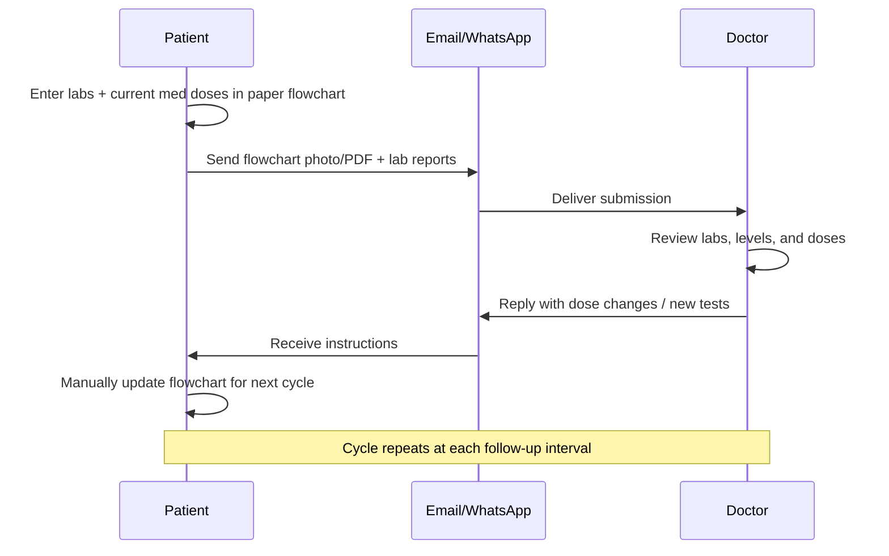
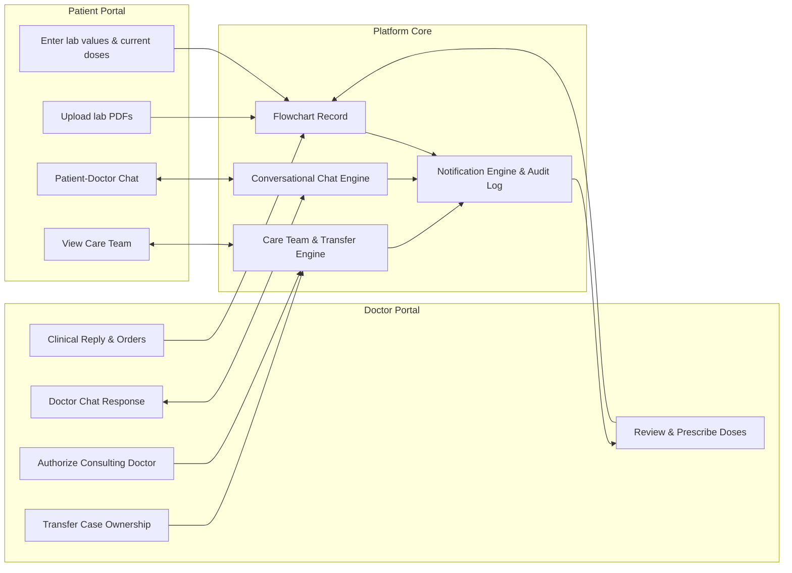
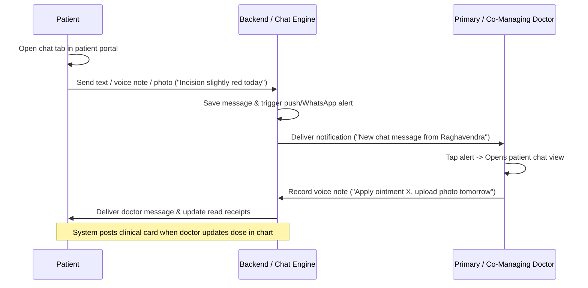
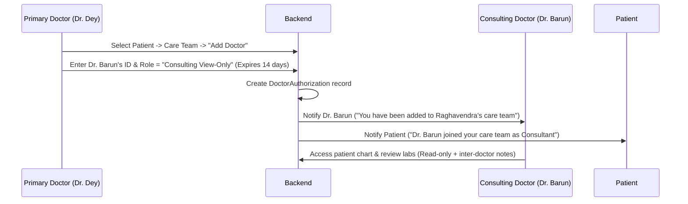
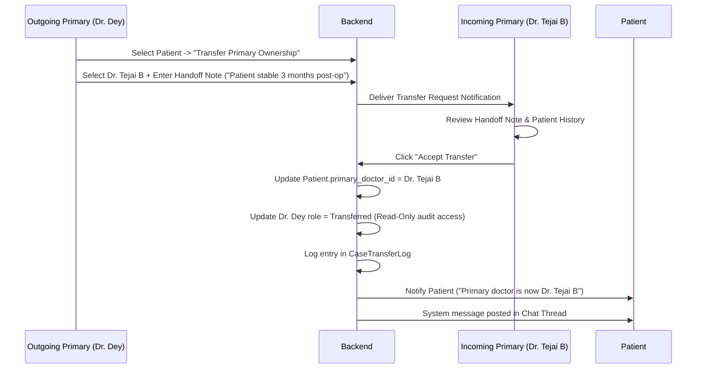

# Application Specification: Post-Operative Investigation Follow-Up Platform

## 1. Document Overview

| Field | Value |
|-------|-------|
| **Document title** | Post-Operative Investigation Flow Chart — Digital Follow-Up Platform |
| **Version** | 1.6 (Draft) |
| **Date** | August 23, 2026 |
| **Source inputs** | Google Doc ("Automate follow up"), sample flowchart (pediatric post-op liver patient), Requirement Update: Conversational Chat & Multi-Doctor Collaboration/Case Transfer |

---

## 2. Problem Statement

Remote patients recovering from major surgeries (specifically **Post-Operative Liver Transplant** and chronic liver disease face significant challenges tracking recurring lab reports, liver enzyme levels, immunosuppressant drug trough levels (Tacrolimus, Everolimus), vital signs, and complex medication regimens in paper charts or spreadsheets, sharing updates via unorganized email or WhatsApp.

Surgeons and hepatologists need to review longitudinal lab trends, adjust medication dosages (often annotating changes in red ink), request targeted follow-up tests, and collaborate with co-managing doctors and specialists. Additionally, patient care extends over years or decades, requiring seamless handoffs between primary transplant surgeons and consulting hepatologists or secondary specialists.

Remote patients currently track post-operative lab results and immunosuppressant medication doses in a **paper flowchart**, then share updates with their doctor via **email or WhatsApp**. The doctor reviews the chart, adjusts medication doses (often annotating changes in a different color), and replies with instructions. The patient manually updates the chart and repeats the cycle at the next follow-up.

Furthermore, between periodic lab updates, patients lack a secure, audited channel to ask quick questions or report emerging symptoms, forcing reliance on unorganized WhatsApp chats. Additionally, post-operative transplant care frequently involves multiple clinicians (surgeons, hepatologists, pediatricians). Currently, there is no structured way for a primary doctor to grant secondary doctors access to a patient's chart or formally transfer primary case ownership when duty shifts or clinical handoffs occur.

This workflow is error-prone, hard to audit, fragmented across un-encrypted channels, and inefficient for both patients and care teams. The goal is to **digitize the flowchart, automate the follow-up loop, provide integrated clinical chat, and enable multi-doctor collaboration and case transfer** while preserving the familiar tabular format and clinical semantics.

While **Release 1 is dedicated to Post-Operative Liver Transplant care**, the underlying platform is built on an **extensible, protocol-driven architecture** that allows seamless scaling to other long-term chronic conditions (such as Renal Transplant, Chronic Kidney Disease, Heart Failure, and Diabetes) without core codebase refactoring.

---

## 3. Goals & Success Criteria

### Primary goals

1. Replace the paper flowchart with a structured digital record.
2. Let patients enter lab values and current medication doses remotely.
3. Let doctors review entries, prescribe/adjust doses, and respond in one place.
4. Deliver doctor responses back to the patient automatically (replacing manual email/WhatsApp for the core loop).
5. **Provide secure, integrated conversational chat** between the patient/caregiver and authorized care team doctors, complete with media attachments, voice notes, and clinical event linking.
6. **Support multi-doctor participation**, enabling the primary doctor (or patient) to authorize secondary/consulting doctors with granular permissions (co-managing vs. view-only consult).
7. **Enable formal patient case transfer** allowing the primary doctor to transfer primary case ownership to another clinician with a full handoff audit trail.
8. Maintain a longitudinal history of labs, drug levels, doses, dose changes, chat logs, and doctor access grants.
9. Send automated **SMS and WhatsApp reminders** for upcoming follow-up milestones so patients do not miss lab submissions.

### Success criteria

- A patient can submit a new follow-up row in under 5 minutes on mobile.
- A doctor can review a submission and send a dose adjustment in under 3 minutes.
- Every dose change, chat message, authorization grant, and case transfer is fully traceable (who, when, prior vs new state).
- Primary doctors can grant consulting access or transfer a patient case to another doctor in under 1 minute with instant permission updates.
- Patients and doctors can send and view contextual chat messages directly tied to flowchart submissions and lab trends.
- The digital chart mirrors the paper layout closely enough that existing users can adopt it without retraining.

---

## 4. Users & Personas

| Role | Description | Primary needs |
|------|-------------|---------------|
| **Patient / Caregiver** | Remote post-op patient (or parent/guardian for pediatric cases) | Simple data entry, view doctor instructions, upload lab reports, message care team, view active care team doctors |
| **Primary Doctor** | Lead transplant/hepatology surgeon or consultant owning the case | Review trends, enter/adjust doses, request tests, reply to patient, chat with patient, authorize co-managing/consulting doctors, transfer case ownership |
| **Co-Managing Doctor** | Authorized care team doctor (e.g. Dr. Rajesh Dey, Dr. Tejai B, Dr. Barun) with edit/prescribe access | Review patient chart, co-prescribe doses, participate in patient chat, enter clinical notes |
| **Consulting Doctor** | Specialist called in for specific advice (e.g. Nephrologist, Infectious Disease specialist) | View-only chart access, review labs, add clinical recommendations/notes in consult thread |
| **Transferred (Former) Doctor** | Doctor who previously owned the patient case | Read-only audit access to historical entries recorded during their tenure as primary doctor |
| **Admin** | Clinic/hospital staff | Onboard patients, manage doctor accounts, execute administrative case transfers when required |

---

## 5. Current Workflow (As-Is)



**Observed from sample flowchart:**

- Multiple dated rows track progress (e.g., 13/6/26 → 13/7/26).
- Lab columns cover hematology, liver function, renal function, electrolytes, and drug levels.
- Medication dose columns: **Neoral/Tac**, **Everolimus**, **Aza/MPA**, **Pred**.
- Drug level columns: **Tac level**, **EVO level** (Everolimus level).
- Dose adjustments are visually distinguished (e.g., red ink: `4/4` → `2/2`).
- Patient header includes diagnosis, surgery date, histopathology, and anastomosis details.
- Footer instructs: *"Enter further investigation reports in above table and send to drrajeshdey@gmail.com"*.

---

## 6. Proposed Solution (To-Be)

A **web/mobile application** featuring:

1. A **Patient portal** — digital flowchart, row entry, lab upload, conversational chat, care team view.
2. A **Doctor portal** — dashboard, chart review, dose entry, clinical reply, care team chat, authorization delegation, case transfer dialog.
3. A **Conversational Chat Engine** — 1:1 and team messaging between patient and authorized doctors, complete with voice notes, attachments, and automated system event posts.
4. A **Care Team & Transfer Authorization Engine** — role-based access control for primary, co-managing, consulting, and transferred doctors.
5. A **Notification layer** — alerts for lab submissions, doctor replies, chat messages, consult invitations, and case transfers.
6. An **Audit trail** — immutable history of labs, dose edits, chat transcripts, permission grants, and case handovers.



---

## 7. Functional Requirements

### 7.1 Patient profile & chart header

Each patient chart stores static header fields matching the paper form:

| Field | Example from sample | Required |
|-------|---------------------|----------|
| Patient name | Raghavendra S. Dyk | Yes |
| Age / sex | 4.5 yrs / M | Yes |
| Hospital / Max ID | SHMS.750590 | Yes |
| Date of operation | 26/05/2026 | Yes |
| Diagnosis | DCLD - ? AIH | Yes |
| Histopathology | Biliary Cirrhosis (PBC) | Yes |
| Type of biliary anastomosis | Free text | Yes |
| Patient photo | Passport-size image | Optional |
| Primary Doctor | Dr. Rajesh Dey | Yes |
| Authorized Care Team | Dr. Tejai B (Co-Managing), Dr. Barun (Consultant) | Yes |
| Primary reporting email | drrajeshdey@gmail.com | Yes |

---

### 7.2 Follow-up row (investigation table)

Each follow-up is one **dated row** in the flowchart. All columns below are captured on every submission unless marked optional.

#### 7.2.1 Complete field catalog

The following table is the **authoritative list** of flowchart fields. UI labels may use clinic-preferred abbreviations; the system stores values using the canonical field key.

| # | UI label | Canonical key | Category | Type | Unit / format | Required |
|---|----------|---------------|----------|------|---------------|----------|
| — | PP Date | `pp_date` | Meta | Date | DD/MM/YYYY | Yes |
| 1 | Hb | `hb` | Lab | Numeric | g/dL | No |
| 2 | TLC | `tlc` | Lab | Numeric | ×10³/µL | No |
| 3 | PLT | `plt` | Lab | Numeric | ×10³/µL | No |
| 4 | AFP | `afp` | Lab | Numeric | ng/mL | No |
| 5 | INR | `inr` | Lab | Numeric | ratio | No |
| 6 | PTT | `ptt` | Lab | Numeric | seconds | No |
| 7 | Bilirubin Total | `bilirubin_total` | Lab | Numeric | mg/dL | No |
| 8 | Bilirubin Direct | `bilirubin_direct` | Lab | Numeric | mg/dL | No |
| 9 | SGOT | `sgot` | Lab | Numeric | U/L | No |
| 10 | SGPT | `sgpt` | Lab | Numeric | U/L | No |
| 11 | ALK PHOS | `alk_phos` | Lab | Numeric | U/L | No |
| 12 | GGT | `ggt` | Lab | Numeric | U/L | No |
| 13 | Albumin | `albumin` | Lab | Numeric | g/dL | No |
| 14 | Na/K | `na_k` | Lab | Text or split numeric | e.g. `136/4.2` | No |
| 15 | Urea | `urea` | Lab | Numeric | mg/dL | No |
| 16 | Creatinine | `creatinine` | Lab | Numeric | mg/dL | No |
| 17 | HbA1c | `hba1c` | Lab | Numeric | % | No |
| 18 | Tac Level | `tac_level` | Drug level | Numeric | ng/mL (trough C0) | No |
| 19 | EVO level | `evo_level` | Drug level | Numeric | ng/mL | No |
| 20 | Neoral/Tac | `neoral_tac` | Medication dose | Dose notation | e.g. `4/4` | No |
| 21 | Everolimus | `everolimus` | Medication dose | Dose notation | e.g. `1/0` | No |
| 22 | Aza/MPA | `aza_mpa` | Medication dose | Dose notation | e.g. `1/1` | No |
| 23 | Pred | `pred` | Medication dose | Dose notation | e.g. `5` or `5/0` | No |
| 24 | Wt | `wt` | Clinical | Numeric | kg | No |
| 25 | Comments | `comments` | Notes | Text | Free text per row | No |

**Legacy / alias mapping** (paper form and earlier spec versions):

| Legacy label | Maps to |
|--------------|---------|
| Platelet count | PLT (`plt`) |
| Bil Total | Bilirubin Total (`bilirubin_total`) |
| Alb | Albumin (`albumin`) |
| Creat | Creatinine (`creatinine`) |
| Tac/C0 level, Tec Level | Tac Level (`tac_level`) |
| Everolimus level | EVO level (`evo_level`) |
| Tac/Cyclo, Neoral, Tacrolimus/Cyclosporine | Neoral/Tac (`neoral_tac`) |
| Wys, Wysolone, Prednisolone | Pred (`pred`) |

#### 7.2.2 Lab columns

All lab fields are optional on each row (partial entry allowed). Numeric validation applies where applicable.

| Column | Canonical key | Notes |
|--------|---------------|-------|
| Hb | `hb` | Hemoglobin |
| TLC | `tlc` | Total leukocyte count |
| PLT | `plt` | Platelet count |
| AFP | `afp` | Alpha-fetoprotein |
| INR | `inr` | International normalized ratio |
| PTT | `ptt` | Partial thromboplastin time |
| Bilirubin Total | `bilirubin_total` | Total bilirubin |
| Bilirubin Direct | `bilirubin_direct` | Direct (conjugated) bilirubin |
| SGOT | `sgot` | AST |
| SGPT | `sgpt` | ALT |
| ALK PHOS | `alk_phos` | Alkaline phosphatase |
| GGT | `ggt` | Gamma-glutamyl transferase |
| Albumin | `albumin` | Serum albumin |
| Na/K | `na_k` | Sodium/potassium — single field or split `na` + `k` |
| Urea | `urea` | Blood urea |
| Creatinine | `creatinine` | Serum creatinine |
| HbA1c | `hba1c` | Glycated hemoglobin |

#### 7.2.3 Drug level columns

| Column | Canonical key | Notes |
|--------|---------------|-------|
| Tac Level | `tac_level` | Tacrolimus trough (C0); supersedes legacy labels Tac/C0 level, Tec Level |
| EVO level | `evo_level` | Everolimus serum level; alias Everolimus level |

#### 7.2.4 Medication dose columns

Patient-entered on submit; doctor may override on review. Dose notation format to be confirmed with clinic (see §17 open questions).

| Column | Canonical key | Notes |
|--------|---------------|-------|
| Neoral/Tac | `neoral_tac` | Combined tacrolimus/cyclosporine (Neoral) dose; legacy label Tac/Cyclo |
| Everolimus | `everolimus` | Everolimus **dose** (distinct from EVO level) |
| Aza/MPA | `aza_mpa` | Azathioprine or mycophenolate dose |
| Pred | `pred` | Prednisolone / Wysolone dose; legacy label Wys |

#### 7.2.5 Weight, comments, and attachments

| Column | Canonical key | Notes |
|--------|---------------|-------|
| Wt | `wt` | Body weight in kg |
| Comments | `comments` | Free-text notes for the row (patient or doctor); visible in chart and exports |
| Attachments | `attachments[]` | Lab report PDFs/images (see §7.3 P-03); not a flowchart column but linked to the row |

**Business rules:**

- On **patient submission**, the patient fills lab values, drug levels, **current medication doses**, weight, and optional **Comments**.
- On **doctor review**, medication dose columns may appear **blank** until the doctor enters **prescribed doses** for the next interval; doctor may add or amend **Comments**.
- Doctor-entered doses must be visually distinct from patient-reported doses (replacing "red ink").
- Support **dose change history** per medication column (old value → new value, timestamp, prescribing doctor).
- **Comments** are append-only in the audit log when edited after review (original text retained).

---

### 7.3 Patient portal features

| ID | Requirement | Priority |
|----|-------------|----------|
| P-01 | View full digital flowchart (read-only history + editable new row) | Must |
| P-02 | Add a new follow-up row supporting all lab, drug level, and medication dose fields | Must |
| P-03 | Upload lab report files (PDF/image) linked to a follow-up date | Must |
| P-04 | Submit follow-up for doctor review | Must |
| P-05 | View doctor's latest response (prescribed doses, additional tests, notes) | Must |
| P-06 | Receive notifications when doctor responds or messages in chat | Must |
| P-07 | View dose change highlights on the chart | Must |
| P-08 | **Conversational Chat**: Send text, voice notes, and image attachments to care team | Must |
| P-09 | **Care Team View**: View current primary doctor and authorized co-managing/consulting doctors | Must |

---

### 7.4 Doctor portal features

| ID | Requirement | Priority |
|----|-------------|----------|
| D-01 | Dashboard of patients with pending submissions and unread chat messages | Must |
| D-02 | Open patient chart with tabular history and trend view | Must |
| D-03 | Review patient-entered labs, drug levels, and current doses | Must |
| D-04 | Enter prescribed doses in medication columns for the reviewed visit | Must |
| D-05 | Send structured response to patient | Must |
| D-06 | Free-text clinical reply (additional medications, lifestyle advice, etc.) | Must |
| D-07 | Request additional investigations (structured checklist + notes) | Must |
| D-08 | View uploaded lab reports inline or downloadable | Must |
| D-09 | See prior dose changes and who made them | Must |
| D-10 | **Conversational Chat**: Reply to patient chat queries, send voice notes, attach files | Must |
| D-11 | **Care Team Delegation**: Authorize secondary doctors with specific permission levels | Must |
| D-12 | **Case Transfer**: Initiate and execute patient case transfer to another primary doctor | Must |

---

### 7.5 Notifications & delivery

| Channel | Use case | Priority |
|---------|----------|----------|
| In-app | Submission received, doctor responded, new chat message, case transfer notification | Must |
| Email | Official record delivery, consult invitation, case handoff summaries | Must |
| SMS | Milestone reminders, urgent chat alerts, OTP | Must |
| WhatsApp | Milestone reminders, doctor responses, chat message alerts | Must |
| Push (mobile) | Real-time chat messages, time-sensitive doctor replies | Must |

---

### 7.6 Milestone reminders (SMS & WhatsApp)

*(Retained as specified in Section 7.6).*

---

### 7.7 Reporting & export

| ID | Requirement | Priority |
|----|-------------|----------|
| R-01 | Export chart as PDF matching paper layout | Should |
| R-02 | Print-friendly flowchart view | Should |
| R-03 | Export audit log of dose changes, chat transcripts, and case transfer history | Could |

---

### 7.8 Conversational Chat (Doctor–Patient & Care Team)

The platform provides a secure, HIPAA/PHI-compliant messaging hub replacing informal WhatsApp/email communication.

#### 7.8.1 Chat Scope & Features

| ID | Requirement | Priority |
|----|-------------|----------|
| C-01 | **Patient-Care Team Thread**: Each patient chart has an active main chat thread connecting the patient/caregiver with all authorized doctors on their care team. | Must |
| C-02 | **Multi-Format Messages**: Support text messages, image attachments (photos of symptoms/incision), document attachments (PDFs), and recorded **voice notes**. | Must |
| C-03 | **Automated Clinical System Messages**: System posts automated event cards into the chat thread when key actions occur (e.g. *"Patient submitted labs for 23/08/2026"*, *"Dr. Dey updated Pred dose to 2.5mg"*, *"Case transferred to Dr. Tejai B"*). | Must |
| C-04 | **Contextual Item Linking**: Users can quote or link a specific message to a follow-up row ID, lab value, or dose change for clinical context. | Must |
| C-05 | **Read Receipts & Status Indicators**: Show message status (Sent, Delivered, Read by Doctor / Read by Patient) with timestamps. | Must |
| C-06 | **Non-Emergency Disclaimer Banner**: Permanent banner at top of chat: *"Chat is for non-urgent follow-up queries only. In case of medical emergency, contact ER immediately."* | Must |
| C-07 | **Urgency Triage Flag**: Patient can mark a message as "Routine Query" or "Symptom Concern"; symptom concerns highlight in doctor dashboard. | Should |
| C-08 | **Doctor-to-Doctor Internal Notes / Consult Thread**: Secondary thread on the same patient chart visible ONLY to authorized doctors (hidden from patient) for inter-specialist case discussions. | Should |
| C-09 | **Search & Filter**: Search chat history by key terms or filter by media/attachments. | Could |
| C-10 | **Immutable Audit Log**: Chat transcripts cannot be edited or deleted by users; retained as part of permanent electronic health record. | Must |

---

### 7.9 Multi-Doctor Participation, Authorization & Case Transfer

Post-operative care frequently requires collaboration between multiple doctors or transferring patient ownership due to shifts, sabbaticals, or specialty handovers.

#### 7.9.1 Doctor Roles & Access Hierarchy

| Role | Scope of Access & Permissions |
|------|------------------------------|
| **Primary Doctor** | Full control: view chart, prescribe/adjust doses, order labs, reply & chat with patient, invite/authorize secondary doctors, modify access levels, initiate case transfer. |
| **Co-Managing Doctor** | Full clinical care access: view chart, prescribe/adjust doses, order labs, reply & chat with patient. *Cannot authorize new doctors or transfer case ownership.* |
| **Consulting Doctor (View & Note)** | Specialist access: view chart, read patient chat, post clinical advice in inter-doctor consult thread. *Cannot adjust doses or prescribe directly unless authorized.* |
| **Transferred (Former) Primary Doctor** | Historical read-only access: view chart entries and chat logs recorded *up to the timestamp of transfer*. No access to post-transfer entries unless re-invited. |

#### 7.9.2 Authorization & Delegation Requirements

| ID | Requirement | Priority |
|----|-------------|----------|
| T-01 | **Grant Doctor Access**: Primary Doctor (or Admin) can invite another registered doctor to join the patient's care team by email or doctor ID. | Must |
| T-02 | **Access Level Specification**: Primary Doctor selects access role (`Co-Managing` vs `Consulting View-Only`) when adding a doctor. | Must |
| T-03 | **Time-Bound Access**: Primary Doctor can optionally set an expiration date for consulting access (e.g., 14-day consult). | Should |
| T-04 | **Revoke / Modify Access**: Primary Doctor can revoke access or adjust permissions of any secondary doctor at any time. | Must |
| T-05 | **Patient Care Team Visibility**: Patient portal displays active care team members with their names, photos, and clinical roles. | Must |
| T-06 | **Patient Notification**: Patient is notified via app/SMS/WhatsApp whenever a new doctor is authorized or added to their care team. | Must |

#### 7.9.3 Patient Case Transfer Requirements

| ID | Requirement | Priority |
|----|-------------|----------|
| T-07 | **Initiate Transfer**: Primary Doctor can select a target doctor and initiate a primary ownership transfer request. | Must |
| T-08 | **Handoff Summary**: Transfer dialog requires a structured handoff note (reason for transfer, current clinical status, key warnings). | Must |
| T-09 | **Transfer Acceptance Workflow**: Target doctor receives handoff notification and must accept (or decline with reason) to finalize transfer. | Must |
| T-10 | **Admin Override Transfer**: Clinic Admin can execute an immediate transfer without target acceptance (e.g. emergency doctor unavailability). | Must |
| T-11 | **Ownership Transition**: Upon transfer completion, target doctor becomes `Primary Doctor`; former doctor transitions to `Transferred (Read-Only)` or `Co-Managing` based on transfer settings. | Must |
| T-12 | **Patient & Team Notification**: System broadcasts automated notifications to patient, incoming primary doctor, outgoing primary doctor, and care team. | Must |
| T-13 | **System Chat Post**: Automated system message posted into patient chat documenting transfer: *"Primary care transferred from Dr. Rajesh Dey to Dr. Tejai B on [date]"*. | Must |
| T-14 | **Transfer Audit Trail**: Log full history of case transfers (from_doctor, to_doctor, initiated_by, handoff_note, accepted_at) in immutable audit log. | Must |

---

## 8. User Flows

*(Flows 8.1 to 8.4 retained from previous spec).*

### 8.5 Conversational Chat Flow



### 8.6 Multi-Doctor Authorization Flow



### 8.7 Patient Case Transfer Flow



---

## 9. Data Model (Conceptual)

```text
Patient
├── id, name, age, sex, max_id, photo_url
├── date_of_operation, diagnosis, histopathology, anastomosis_type
├── primary_doctor_id (FK to User where role=doctor)
├── assigned_doctors[] (computed list of active authorized doctors)
├── contact_email, phone_number, whatsapp_number
└── reminder_preferences { sms_enabled, whatsapp_enabled, timezone }

DoctorAuthorization
├── id, patient_id, primary_doctor_id
├── authorized_doctor_id (FK to User)
├── access_level [co_managing | consult_view]
├── granted_by (user_id), granted_at
├── expires_at (optional)
├── status [active | revoked | expired]
└── revoked_at, revoked_by

CaseTransferLog
├── id, patient_id
├── previous_primary_doctor_id
├── new_primary_doctor_id
├── initiated_by (user_id)
├── handoff_note (text)
├── status [pending | accepted | declined | admin_forced]
├── initiated_at, responded_at
└── decline_reason (optional)

ChatThread
├── id, patient_id
├── thread_type [patient_care_team | doctor_internal_consult]
├── title
├── created_at, updated_at
└── last_message_at

ChatMessage
├── id, thread_id, sender_id (user_id)
├── sender_role [patient | caregiver | primary_doctor | co_managing_doctor | consulting_doctor | system]
├── message_type [text | voice_note | attachment | clinical_event_card]
├── content (text body or transcribed voice note)
├── voice_note_url, voice_duration_seconds
├── linked_follow_up_row_id (optional FK)
├── linked_dose_change_id (optional FK)
├── urgency_flag [routine | symptom_concern]
├── read_by_user_ids[]
└── sent_at

ChatAttachment
├── id, message_id
├── file_url, file_type [image | pdf | audio]
├── file_name, file_size_bytes
└── uploaded_at

FollowUpRow
├── id, patient_id, pp_date, status [draft | pending | reviewed]
├── lab_values { hb, tlc, plt, afp, inr, ptt, bilirubin_total, bilirubin_direct, sgot, sgpt, alk_phos, ggt, albumin, na_k, urea, creatinine, hba1c }
├── drug_levels { tac_level, evo_level }
├── patient_reported_doses { neoral_tac, everolimus, aza_mpa, pred }
├── doctor_prescribed_doses { neoral_tac, everolimus, aza_mpa, pred }
├── wt, comments, attachments[]
├── submitted_at, reviewed_at
└── reviewed_by (doctor_id)

DoseChange
├── follow_up_row_id, field_name, old_value, new_value
├── changed_by (doctor_id), changed_at, reason

DoctorResponse
├── follow_up_row_id, doctor_id, additional_tests[], additional_medications, clinical_notes, sent_at

User
├── id, role [patient | caregiver | doctor | admin]
├── display_name, email, phone, medical_license_number (for doctors), profile_photo_url
└── status [active | disabled]
```

---

## 10. UI/UX Requirements

### 10.1 Chat Interface Design
- **Patient view**: Clean 1:1 style messaging UI showing messages from all care team members with clear doctor name & avatar labels. Dedicated voice record button and file upload clip.
- **Doctor view**: Integrated chat sidebar or tab next to patient chart. Includes filter for "Internal Doctor Notes" vs "Patient Chat". System event cards rendered in distinct neutral style.

### 10.2 Care Team & Authorization UI
- **Care Team Panel**: Modal/tab on patient chart displaying Primary Doctor and authorized co-managing/consulting doctors.
- **Add Doctor Dialog**: Doctor lookup search, role radio buttons (`Co-Managing` vs `Consulting View-Only`), optional expiration picker.

### 10.3 Case Transfer Dialog
- **Transfer Form**: Target doctor selector, handoff note text box, checkbox to keep outgoing doctor as co-managing or remove access.
- **Transfer Banner**: Incoming doctor sees prominent acceptance banner on dashboard: *"Pending Case Transfer: Raghavendra S. Dyk from Dr. Rajesh Dey. [Review Handoff & Accept]"*.

---

## 11. Non-Functional Requirements

*(Retained from previous spec, with addition of HIPAA/PHI compliant encrypted chat message storage and web socket real-time messaging latency < 1s).*

---

## 12. Authentication & Authorization

### 12.10 Granular Authorization Matrix

| User Role | View Chart History | Enter Patient Labs/Doses | Prescribe/Adjust Doses | Send Patient Chat | Post Doctor Internal Notes | Authorize Secondary Doctor | Transfer Case Ownership |
|-----------|--------------------|--------------------------|------------------------|-------------------|----------------------------|---------------------------|------------------------|
| **Patient / Caregiver** | Own chart only | Yes (New row) | No | Yes | No | No | No |
| **Primary Doctor** | Full | Yes | Yes | Yes | Yes | Yes | Yes |
| **Co-Managing Doctor** | Full | Yes | Yes | Yes | Yes | No | No |
| **Consulting Doctor** | Full | No | No | Read-only | Yes | No | No |
| **Transferred Doctor** | Historical only | No | No | No | Read-only | No | No |
| **Admin** | Full (Audit) | No | No | No | No | Yes | Yes (Force) |

---

## 13–14. Security, Compliance & Scope

- Phase 1 (MVP) includes: 1:1 Patient-Care Team Chat, Primary Doctor Authorization Grants, Primary Case Transfer, and Tabular Flowchart.
- Phase 2 includes: Voice Notes, Doctor-to-Doctor Internal Consult Thread, and Automated Audio Transcription.

---

## 15. Sample Screen Inventory

| Screen | User | Purpose |
|--------|------|---------|
| My Chat | Patient | Message care team, record voice notes, send photos |
| Patient Care Team | Patient | View primary doctor and authorized consulting doctors |
| Doctor Chat Hub | Doctor | View patient chat, send voice notes, view system event posts |
| Internal Consult Thread | Doctor | Private doctor-to-doctor discussion for complex cases |
| Care Team Management | Doctor, Admin | Invite secondary doctors, assign access roles, revoke access |
| Case Transfer Modal | Doctor, Admin | Select incoming doctor, assign access roles, execute transfer |
| Transfer Review Banner | Doctor | Incoming doctor accepts/declines pending case transfer |

---

## 16. Mock Screens

### 16.16 Patient — Conversational Chat

**Route:** `/patient/chat`

```
┌─────────────────────────────────────┐
│  ← Back         Care Team Chat  👤  │
├─────────────────────────────────────┤
│ ℹ Non-urgent chat. In emergency call│
│   112 / visit local hospital.       │
├─────────────────────────────────────┤
│                                     │
│  [16 Aug, 10:45 AM]                 │
│  ┌─────────────────────────────┐    │
│  │ System: Follow-up submitted │    │
│  │ for 16/08/2026.             │    │
│  └─────────────────────────────┘    │
│                                     │
│  ┌─────────────────────────────┐    │
│  │ Dr. Rajesh Dey      9:15 AM │    │
│  │ Tac level looks good. I have│    │
│  │ reduced Aza evening dose.   │    │
│  └─────────────────────────────┘    │
│                                     │
│ ┌─────────────────────────────┐     │
│ │ You                 10:30 AM│     │
│ │ Thank you doctor. Should we │     │
│ │ continue Prednisolone at 5mg│     │
│ │ photo attached.             │     │
│ │ 📷 rash_photo.jpg           │     │
│ └─────────────────────────────┘     │
│                                     │
│ ┌─────────────────────────────┐     │
│ │ Dr. Tejai B (Co-Managing)   │     │
│ │ 🔊 Voice Note (0:24) ▶ ━━━━ │     │
│ │ "Yes, continue Pred 5mg..." │     │
│ └─────────────────────────────┘     │
│                                     │
├─────────────────────────────────────┤
│ 🎙 📎 [ Type message...         ] ➔ │
└─────────────────────────────────────┘
```

### 16.17 Doctor — Integrated Chat & Consult View

**Route:** `/doctor/patients/:id/chat`

```
┌─────────────────────────────────────────────────────────────────────────────┐
│ Raghavendra S. Dyk · Chat Hub                                              │
├───────────────────────────────────────┬─────────────────────────────────────┤
│ PATIENT & CARE TEAM CHAT              │ DOCTOR INTERNAL CONSULT (Private)   │
│                                       │                                     │
│ [ System ] 16 Aug 10:45 AM            │ Dr. Rajesh Dey (16 Aug 11:00 AM):   │
│ Lab submission received for 16/08/26  │ @Dr.Barun could you review kidney   │
│                                       │ function trends? Creatinine is 0.9. │
│ Patient (16 Aug 10:30 AM):            │                                     │
│ "Should we continue Prednisolone?"    │ Dr. Barun (Nephrology Consult):     │
│ 📷 rash_photo.jpg [View]              │ "Creatinine is fine for age. No    │
│                                       │ adjustment needed for now."         │
│ Dr. Tejai B (16 Aug 11:15 AM):        │                                     │
│ 🔊 Voice note (0:24) [Play]           │                                     │
│                                       │                                     │
├───────────────────────────────────────┼─────────────────────────────────────┤
│ 🎙 📎 [ Reply to patient...    ] ➔    │ [ Add internal clinical note... ] ➔ │
└───────────────────────────────────────┴─────────────────────────────────────┘
```

### 16.18 Doctor — Care Team Management & Authorization Modal

**Route:** `/doctor/patients/:id/care-team`

```
┌──────────────────────────────────────────────────────────────────┐
│ Manage Care Team · Raghavendra S. Dyk                            │
├──────────────────────────────────────────────────────────────────┤
│ CURRENT CARE TEAM                                                │
│ • Dr. Rajesh Dey         Primary Doctor      [ Owner ]           │
│ • Dr. Tejai B            Co-Managing         [ Edit ] [ Revoke ] │
│ • Dr. Barun              Consulting (View)   [ Edit ] [ Revoke ] │
│                                                                  │
├──────────────────────────────────────────────────────────────────┤
│ AUTHORIZE NEW DOCTOR                                             │
│ Select Doctor:  [ Dr. Ananya Sharma (Pediatric Nephrology)  ▼ ] │
│                                                                  │
│ Access Level:   ( ) Co-Managing (Can prescribe & chat)           │
│                 (•) Consulting View-Only (Read chart + notes)   │
│                                                                  │
│ Access Duration: [ 14 Days (Temporary Consult)               ▼ ] │
│                                                                  │
│ ┌──────────────────────────────────────────────────────────────┐ │
│ │                  Grant Authorization                         │ │
│ └──────────────────────────────────────────────────────────────┘ │
└──────────────────────────────────────────────────────────────────┘
```

### 16.19 Doctor — Patient Case Transfer Modal

**Route:** `/doctor/patients/:id/transfer`

```
┌──────────────────────────────────────────────────────────────────┐
│ Transfer Primary Ownership · Raghavendra S. Dyk                  │
├──────────────────────────────────────────────────────────────────┤
│ Current Primary: Dr. Rajesh Dey                                  │
│                                                                  │
│ Select New Primary Doctor:                                       │
│ [ Dr. Tejai B (Transplant Surgery)                           ▼ ] │
│                                                                  │
│ Handoff Summary & Clinical Status (Required):                    │
│ ┌──────────────────────────────────────────────────────────────┐ │
│ │ Patient is 3 months post liver transplant. Tac level stable  │ │
│ │ at 8.1. Aza dose reduced. Transferring primary ownership as  │ │
│ │ Dr. Tejai B takes over post-op clinic rotations.             │ │
│ └──────────────────────────────────────────────────────────────┘ │
│                                                                  │
│ Outgoing Doctor Access:                                          │
│ [X] Retain Dr. Rajesh Dey as Co-Managing Doctor                  │
│ [ ] Transition Dr. Rajesh Dey to Historical Read-Only            │
│                                                                  │
│ ┌──────────────────────────────────────────────────────────────┐ │
│ │             Initiate Primary Ownership Transfer              │ │
│ └──────────────────────────────────────────────────────────────┘ │
└──────────────────────────────────────────────────────────────────┘
```

---

## 17. Open Questions for Stakeholders


1. **Dose notation:** What exactly does `4/4` mean for Neoral/Tac — AM/PM, brand split, or mg split? Document canonical format.
2. **Column set:** Is the column list fixed for all patients, or configurable by diagnosis/protocol?
3. **Immunosuppression regimen:** Which patients use Everolimus dose + EVO level vs Neoral/Tac + Tac level only? Are both ever required on the same row?
4. **Who can submit:** Patient directly, caregiver only, or clinic staff on behalf of patient?
5. **WhatsApp templates:** Which pre-approved WhatsApp message templates are required by the clinic's API provider?
6. **Legal/regulatory:** Is this clinic-operated software or a regulated medical device in your jurisdiction?
7. **Emergency handling:** Should the app include escalation if critical lab values are entered?
8. **Multi-language:** Hindi/regional language support needed?
9. **SMS provider:** Which SMS gateway will be used for OTP delivery in production (MSG91, Twilio, etc.)?
10. **Doctor onboarding:** Should doctors self-register via Google/X/Facebook, or admin-provision only?
11. **WhatsApp provider:** Which WhatsApp Business API partner will be used (Meta Cloud API, Gupshup, etc.)?
12. **Default protocol:** What are the standard post-op checkpoint days and follow-up interval for this clinic (e.g., 7/14/30/90 days)?
13. **Overdue escalation:** Should the assigned doctor be notified automatically when a patient misses a milestone?
14. **Voice Note Duration Limit**: Should voice recording be capped at 60 or 120 seconds to manage bandwidth and storage?
15. **Transfer Acceptance Policy**: Should primary case transfer take effect immediately upon initiation or require explicit click-to-accept by incoming doctor? (Recommendation: Require acceptance with admin override).
16. **Emergency Escalation**: Should high urgency chat flags send direct SMS/push alerts to the doctor on duty?

---

## 18. Acceptance Criteria (MVP)

The MVP is accepted when:

1. A patient can complete and submit a follow-up row that includes all fields defined in §7.2.1 (Hb through Comments).
2. A doctor can open the submission, enter prescribed doses, and send a reply with additional test requests.
3. The patient receives the doctor's response without using manual email for that transaction.
4. Dose changes are visibly distinguished and stored in an audit log.
5. The chart can be exported/printed in a layout recognizable to users of the paper form.
6. Only authorized users can access a given patient's PHI.
7. Users can sign in via **Google OAuth**, **X OAuth**, **Facebook Login**, or **SMS OTP** and reach the correct portal for their role.
8. Failed logins, OTP attempts, and sign-outs are recorded in the authentication audit log.
9. Milestones are auto-generated from the post-op protocol and rolling follow-up interval.
10. Patients receive automated **SMS and/or WhatsApp** reminders before and on milestone due dates, per their preferences.
11. Submitting a follow-up cancels pending reminders for that milestone; delivery status is logged for each reminder sent.
12. Patient and authorized doctors can exchange real-time text, voice notes, and image attachments in the patient chat thread.
13. System automatically posts clinical event cards in the chat whenever lab rows are submitted or dose changes are made.
14. Primary doctor can grant co-managing or consulting access to secondary doctors, and patient portal updates the care team display accordingly.
15. Primary doctor can initiate a case transfer with a mandatory handoff note, and upon acceptance, primary ownership is updated with complete audit log entries.
16. All flowchart entries, dose adjustments, notifications, and milestone reminders operate as specified in Sections 7–16.
