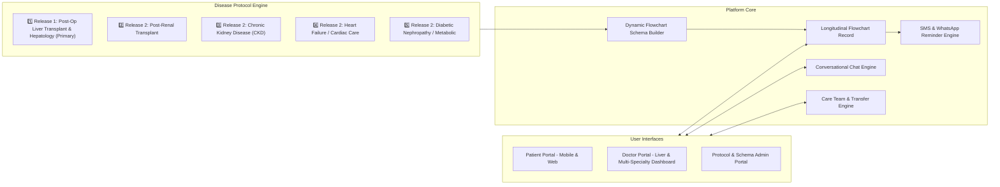
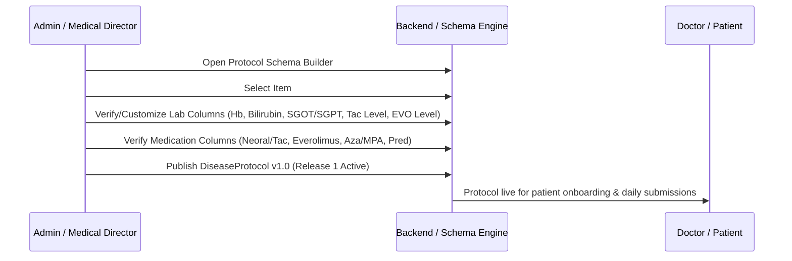

# Application Specification: Multi-Specialty Longitudinal Care & Post-Operative Follow-Up Platform

## 1. Document Overview

| Field | Value |
|-------|-------|
| **Document title** | Longitudinal Clinical Care & Post-Operative Flow Chart Platform |
| **Version** | 1.7 (Draft) |
| **Date** | August 23, 2026 |
| **Release Focus** | **Release 1 Focus: Post-Operative Liver Transplant & Chronic Liver Care** (Extensible architecture for Renal, Cardiac, and Metabolic care) |
| **Source inputs** | Google Doc ("Automate follow up"), sample flowchart (pediatric post-op liver patient), Requirement Updates: Conversational Chat, Multi-Doctor Collaboration/Transfer, and Extensible Long-Term Chronic Disease Engine |

---

## 2. Problem Statement

Remote patients recovering from major surgeries (specifically **Post-Operative Liver Transplant** and chronic liver disease in Release 1) face significant challenges tracking recurring lab reports, liver enzyme levels, immunosuppressant drug trough levels (Tacrolimus, Everolimus), vital signs, and complex medication regimens in paper charts or spreadsheets, sharing updates via unorganized email or WhatsApp.

Surgeons and hepatologists need to review longitudinal lab trends, adjust medication dosages (often annotating changes in red ink), request targeted follow-up tests, and collaborate with co-managing doctors and specialists. Additionally, patient care extends over years or decades, requiring seamless handoffs between primary transplant surgeons and consulting hepatologists or secondary specialists.

While **Release 1 is dedicated to Post-Operative Liver Transplant care**, the underlying platform is built on an **extensible, protocol-driven architecture** that allows seamless scaling to other long-term chronic conditions (such as Renal Transplant, Chronic Kidney Disease, Heart Failure, and Diabetes) without core codebase refactoring.

---

## 3. Goals & Success Criteria

### Primary goals

1. **Release 1 Primary Focus — Post-Op Liver & Hepatology**: Deliver a complete digital flowchart and follow-up suite for Post-Liver Transplant patients (pediatric and adult), tracking liver function panels, immunosuppression trough levels (Tacrolimus/Everolimus), dosages, and weight.
2. **Extensible Disease Protocol Engine**: Architect the platform using dynamic protocol schemas so that future releases can expand to Post-Renal Transplant, Chronic Kidney Disease, Heart Failure, and Metabolic Care.
3. **Structured Digital Flowcharts**: Replace paper flowcharts with dynamic, specialty-specific tabular records for lab values, drug levels, medication doses, and vitals.
4. **Doctor Review & Dose Management**: Let doctors review entries, prescribe/adjust doses, highlight changes (replacing red ink), and respond in one place.
5. **Integrated Conversational Chat**: Provide secure, HIPAA/PHI-compliant messaging (text, voice notes, media attachments) with automated clinical system event posts.
6. **Multi-Doctor Participation & Delegation**: Authorize secondary doctors with granular permission roles (Primary Transplant Surgeon, Co-Managing Hepatologist, Consulting Specialist).
7. **Patient Case Transfer**: Support formal primary care ownership transfer between clinicians with complete handoff audit trails.
8. **Longitudinal History & Care Timeline**: Maintain multi-year history of labs, drug levels, dose changes, chat logs, and cross-specialty consults.
9. **Automated Reminders**: Deliver SMS and WhatsApp reminders for disease-specific milestones and lab submissions.

### Success criteria

- **Release 1 MVP**: 100% of pediatric and adult Post-Liver Transplant paper flowchart fields (§7.2.1) are fully supported and operational for remote submissions and doctor dose reviews.
- Administrators or clinicians can configure new disease protocol templates (e.g., Post-Renal or CKD) in under 15 minutes via the admin schema builder.
- Patients can submit follow-up rows in under 5 minutes on mobile.
- Doctors can review lab trends, prescribe dose changes, and reply in under 3 minutes.
- Multi-doctor care teams can collaborate on shared patient records with clear permission boundaries.

---

## 4. Users & Personas

| Role | Description | Primary needs |
|------|-------------|---------------|
| **Patient / Caregiver** | Remote post-op liver transplant patient (or parent/guardian for pediatric cases like Biliary Cirrhosis/AIH) | Simple data entry for liver labs & current doses, view doctor instructions, upload lab reports, message care team |
| **Primary Doctor** | Lead Transplant Surgeon or Senior Consultant owning the liver case (e.g., Dr. Rajesh Dey) | Review longitudinal liver trends, enter/adjust doses, order labs, reply & chat with patient, authorize secondary doctors, transfer case ownership |
| **Co-Managing Doctor** | Authorized care team doctor (e.g., Associate Transplant Surgeon, Consultant Hepatologist like Dr. Tejai B) with edit/prescribe access | Review patient chart, co-prescribe doses, participate in patient chat, enter clinical notes |
| **Consulting Specialist** | Cross-specialty doctor invited for specific consults (e.g., Dr. Barun for Nephrology consult on a liver patient) | View-only chart access, review labs, post clinical recommendations in inter-doctor consult thread |
| **Transferred Doctor** | Former primary physician who owned the case during an earlier phase | Read-only audit access to historical entries recorded during their tenure |
| **Admin / Protocol Manager** | Clinic/hospital staff | Onboard patients, manage liver protocol templates, execute administrative transfers |

---

## 5. Extensible Architecture (To-Be)



---

## 6. Functional Requirements

### 6.1 Patient profile & chart header (Release 1 Primary Focus)

Stores core static header fields matching the liver transplant paper form:

| Field | Release 1 Primary Example (Post-Liver Transplant) | Release 2 Example (Chronic Kidney Disease) |
|-------|--------------------------------------------------|--------------------------------------------|
| Patient name | Raghavendra S. Dyk | Meera Mukherjee |
| Age / sex | 4.5 yrs / M | 58 yrs / F |
| Hospital / Max ID | SHMS.750590 | CKD.992814 |
| Date of Operation | 26/05/2026 | N/A |
| Primary Diagnosis | DCLD - ? AIH (Biliary Cirrhosis) | CKD Stage 4 (Diabetic Nephropathy) |
| Histopathology | Biliary Cirrhosis (PBC) | N/A |
| Anastomosis Type | Roux-en-Y Choledochojejunostomy | N/A |
| Active Protocol(s) | **Post-Liver Transplant Protocol (Item #1)** | Chronic Kidney Disease Protocol |
| Primary Doctor | Dr. Rajesh Dey (Transplant Surgeon) | Dr. S. K. Gupta (Nephrologist) |
| Care Team | Dr. Tejai B (Hepatology), Dr. Barun (Consultant) | Dr. Ananya Sharma (Endocrinology) |

---

### 7.10 Extensible Disease Protocol Engine & Multi-Specialty Support

To ensure Release 1 focuses on liver patients while laying the foundation for future long-term chronic conditions, the platform incorporates an extensible **Disease Protocol Engine**.

#### 7.10.1 Disease Protocol Priorities & Requirements

| ID | Requirement | Priority |
|----|-------------|----------|
| E-01 | **Release 1 Primary Focus — Post-Liver Protocol (Item #1)**: The system comes pre-configured with the complete Post-Op Liver Transplant protocol as its default primary workflow, supporting all hematology, LFT, renal, Tac/EVO level, and immunosuppressant dose columns (§7.2.1). | Must (Release 1) |
| E-02 | **Pre-Built Extensible Specialty Templates**: The protocol catalog is structured with itemized specialty templates: <br>**1. Post-Op Liver Transplant & Chronic Liver Disease (Release 1 Focus)** <br>2. Post-Renal Transplant (Phase 2) <br>3. Chronic Kidney Disease (CKD Stage 3-5) (Phase 2) <br>4. Heart Failure / Cardiac Care (Phase 2) <br>5. Diabetic Nephropathy & Metabolic Care (Phase 2) | Must |
| E-03 | **Dynamic Schema Configuration**: Admins can define custom disease protocols containing ordered columns for Labs, Drug Trough Levels, Medication Doses, Vitals, and Free Text Notes. | Must |
| E-04 | **Custom Field Types**: Schema supports numeric labs with units, ratio fields (e.g. Na/K, Bilirubin Direct/Total), split dose notation (e.g., `4/4` or `1/0/1`), dropdown selectors, and calculated fields (e.g., eGFR). | Must |
| E-05 | **Multi-Protocol Assignment**: A patient can have one or more active disease protocols simultaneously (e.g., Post-Liver Transplant + Renal Consult). | Must |
| E-06 | **Configurable Reference Ranges**: Each lab column definition includes age/sex-specific normal reference ranges and panic thresholds (e.g. high Tacrolimus trough > 15 ng/mL). | Must |
| E-07 | **Protocol-Based Milestone Rules**: Define recurring follow-up intervals per protocol (e.g., Liver Post-Op Day 1-30 = weekly, Year 1+ = monthly/quarterly). | Must |
| E-08 | **Custom Medication Regimen Schema**: Support dynamic medication columns per protocol (e.g., Liver: Neoral/Tac, Everolimus, Aza/MPA, Prednisolone). | Must |
| E-09 | **Cross-Specialty Consult Requests**: Primary doctor for Protocol 1 (Transplant Surgeon) can issue an inter-specialty consult request to a specialist in another domain (e.g. Nephrologist). | Must |
| E-10 | **Protocol Versioning**: Protocol template updates do not alter past historical records; past submissions remain bound to the schema version active on the submission date. | Must |

---

### 7.8 Conversational Chat (Doctor–Patient & Care Team)

*(Retained from v1.6 — text, voice notes, attachments, clinical event posts, urgent triage banners).*

---

### 7.9 Multi-Doctor Participation, Authorization & Case Transfer

*(Retained from v1.6 — Primary Doctor, Co-Managing Doctor, Consulting Doctor, Transferred Doctor roles, delegation, and handover audit trails).*

---

## 8. User Flows

### 8.8 Protocol Template & Schema Creation (Admin Flow)



---

## 9. Data Model (Conceptual)

```text
DiseaseProtocol
├── id, title [e.g. "1. Post-Op Liver Transplant", "2. Post-Renal Transplant", "3. Chronic Kidney Disease"]
├── category [release_1_liver_transplant | post_op_renal | chronic_nephrology | cardiology | metabolic]
├── is_release_1_primary (boolean, default=true for Liver Protocol)
├── version, status [active | archived]
├── default_follow_up_interval_days
├── created_by, created_at

ProtocolFieldDefinition
├── id, disease_protocol_id
├── field_key, ui_label, category [lab | drug_level | medication_dose | vital | notes]
├── data_type [numeric | ratio | split_dose | text | calculated]
├── unit (e.g. "g/dL", "mg/dL", "U/L", "ng/mL")
├── is_required (boolean), display_order (int)
├── normal_range_min, normal_range_max, panic_min, panic_max

PatientProtocolAssignment
├── id, patient_id, disease_protocol_id
├── primary_doctor_id (FK to User)
├── assigned_at, status [active | completed | paused]

Patient
├── id, name, age, sex, max_id, photo_url
├── date_of_operation, diagnosis, histopathology, anastomosis_type
├── primary_doctor_id (FK to User)
├── assigned_doctors[] (computed list across active protocols)
├── contact_email, phone_number, whatsapp_number

DoctorAuthorization
├── id, patient_id, primary_doctor_id, authorized_doctor_id
├── access_level [co_managing | consult_view]

CaseTransferLog
├── id, patient_id, disease_protocol_id, previous_primary_doctor_id, new_primary_doctor_id, handoff_note, status

ChatThread
├── id, patient_id, thread_type [patient_care_team | doctor_internal_consult]

ChatMessage
├── id, thread_id, sender_id, sender_role, message_type [text | voice_note | attachment | clinical_event_card]

FollowUpRow
├── id, patient_id, disease_protocol_id, pp_date, status [draft | pending | reviewed]
├── lab_values { hb, tlc, plt, afp, inr, ptt, bilirubin_total, bilirubin_direct, sgot, sgpt, alk_phos, ggt, albumin, na_k, urea, creatinine, hba1c }
├── drug_levels { tac_level, evo_level }
├── patient_reported_doses { neoral_tac, everolimus, aza_mpa, pred }
├── doctor_prescribed_doses { neoral_tac, everolimus, aza_mpa, pred }
├── wt, comments, attachments[], submitted_at, reviewed_at, reviewed_by
```

---

## 10–12. Authentication, Authorization & Security

Granular access hierarchy enforced for liver transplant care teams (Primary Doctor, Co-Managing Doctor, Consulting Doctor, Transferred Doctor, Admin).

---

## 15. Sample Screen Inventory

| Screen | User | Purpose |
|--------|------|---------|
| Patient Liver Flowchart | Patient | View and submit entries for Post-Op Liver Transplant (Release 1 Core) |
| Liver Transplant Dashboard | Doctor | Pending review queue for liver post-op patients (Labs, Tac levels, Doses) |
| Protocol Schema Builder | Admin | Configure Item #1 (Liver Protocol) and manage future specialty protocols |
| Care Team & Consult Hub | Doctor | Manage liver care team authorizations, secondary doctor permissions, and case transfers |

---

## 16. Mock Screens

### 16.20 Admin — Protocol Builder (Liver #1 Release Focus)

**Route:** `/admin/protocols/1`

```
┌──────────────────────────────────────────────────────────────────┐
│ Disease Protocol Builder · Release 1 Focus                       │
├──────────────────────────────────────────────────────────────────┤
│ Protocol Name:  [ 1. Post-Op Liver Transplant & Hepatology    ] │
│ Release Status: [ Release 1 Core Focus (Active Primary)      ▼ ] │
│ Follow-Up:      Default interval [ 14 ] days                     │
├──────────────────────────────────────────────────────────────────┤
│ CONFIGURE LIVER FLOWCHART COLUMNS                                │
│                                                                  │
│ Field Label     Category     Data Type    Unit     Order   Act   │
│ ┌─────────────┐ ┌──────────┐ ┌──────────┐ ┌──────┐ ┌─────┐       │
│ │ Hb          │ │ Lab      │ │ Numeric  │ │g/dL  │ │  1  │  [✕]  │
│ │ Bilirubin T │ │ Lab      │ │ Numeric  │ │mg/dL │ │  7  │  [✕]  │
│ │ SGOT / SGPT │ │ Lab      │ │ Numeric  │ │U/L   │ │  9  │  [✕]  │
│ │ Tac Level   │ │Drug Level│ │ Numeric  │ │ng/mL │ │ 18  │  [✕]  │
│ │ EVO Level   │ │Drug Level│ │ Numeric  │ │ng/mL │ │ 19  │  [✕]  │
│ │ Neoral / Tac│ │Med Dose  │ │ SplitDose│ │mg/day│ │ 20  │  [✕]  │
│ │ Everolimus  │ │Med Dose  │ │ SplitDose│ │mg/day│ │ 21  │  [✕]  │
│ │ Aza / MPA   │ │Med Dose  │ │ SplitDose│ │mg/day│ │ 22  │  [✕]  │
│ │ Prednisolone│ │Med Dose  │ │ SplitDose│ │mg/day│ │ 23  │  [✕]  │
│ └─────────────┘ └──────────┘ └──────────┘ └──────┘ └─────┘       │
│                                                                  │
│ [ + Add Custom Column ]                                          │
│                                                                  │
│ ┌──────────────────────────────────────────────────────────────┐ │
│ │             Save & Deploy Liver Protocol (Release 1)         │ │
│ └──────────────────────────────────────────────────────────────┘ │
└──────────────────────────────────────────────────────────────────┘
```

### 16.21 Patient — Post-Op Liver Flowchart View (Release 1 Landing)

**Route:** `/patient/flowchart`

```
┌─────────────────────────────────────┐
│ ☰  PostOp Liver Care       🔔  👤  │
├─────────────────────────────────────┤
│ ┌─────────────────────────────────┐ │
│ │ Raghavendra S. Dyk   4.5 yrs M  │ │
│ │ Op: 26/05/2026  ·  SHMS.750590  │ │
│ │ DCLD · Biliary Cirrhosis (PBC)  │ │
│ └─────────────────────────────────┘ │
│                                     │
│  PRIMARY PROTOCOL                   │
│  [ [1. Post-Op Liver Transplant] ]  │
│                                     │
│ ⚠ Next Liver follow-up due: 20 Aug │
│                                     │
│  ┌─────────────────────────────┐    │
│  │  + Add new follow-up row    │    │
│  └─────────────────────────────┘    │
│                                     │
│  Liver Investigation History        │
│  ┌─────────────────────────────────┐│
│  │ Date    │ Bil T │ SGOT │ TacLvl│…││
│  ├─────────┼───────┼──────┼───────┼─┤│
│  │ 13/7/26 │  0.8  │  42  │ 8.12  │▸││
│  │ 30/6/26 │  1.1  │  58  │ 9.45  │▸││
│  │ 22/6/26 │  1.4  │  65  │15.37  │▸││
│  └─────────────────────────────────┘│
├─────────────────────────────────────┤
│  Chart    Chat    Milestones  Acct  │
└─────────────────────────────────────┘
```

---

## 17. Open Questions for Stakeholders

1. **Phase 2 Expansion**: Should administrative controls allow clinicians to turn on renal/cardiac protocols during Phase 1 for select multi-organ transplant patients? (Recommendation: Keep disabled by default in UI for Release 1 to maintain clinical focus).
2. **Liver Specific Alerts**: Should high Tacrolimus trough levels (> 15 ng/mL) trigger an automatic alert in the doctor's review queue during Release 1? (Recommendation: Yes).

---

## 18. Acceptance Criteria (Release 1 & Extensibility)

The Release 1 MVP is accepted when:

1. **Item #1 (Post-Op Liver Transplant)** is fully deployed as the default active protocol, supporting all hematology, LFT, Tac/EVO level, immunosuppressant dose, weight, and PDF upload fields.
2. Patient and Doctor portals present the Post-Op Liver Transplant flowchart, integrated chat, multi-doctor care team delegation, case transfer, and milestone reminders seamlessly.
3. The underlying protocol engine architecture allows future addition of Item #2 (Renal), Item #3 (CKD), and Item #4 (Cardiac) via configuration.
